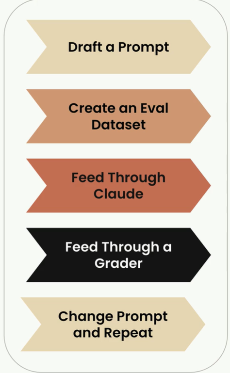
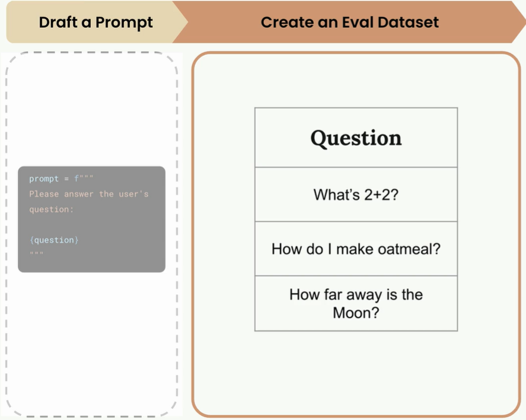
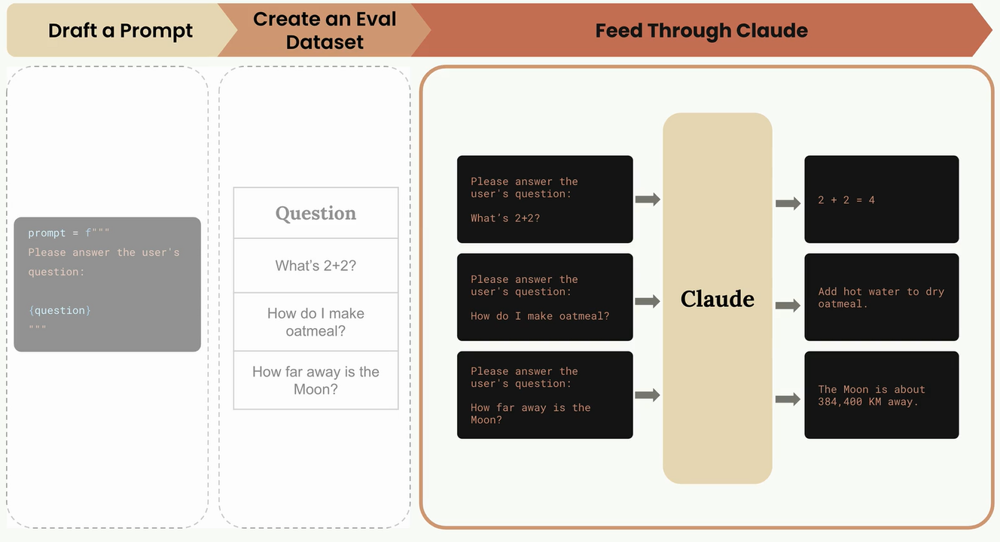
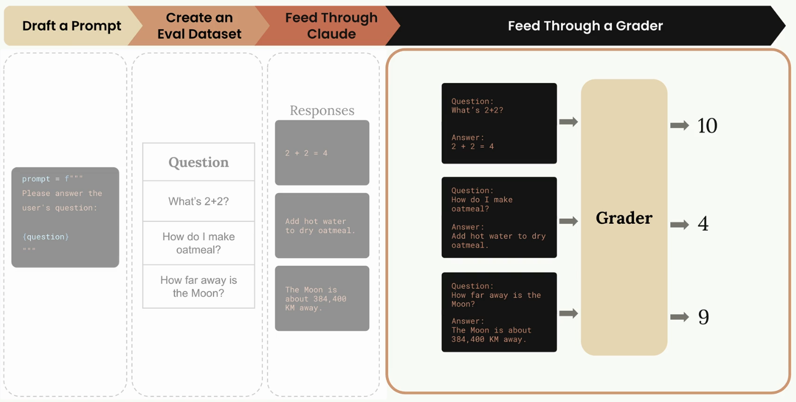
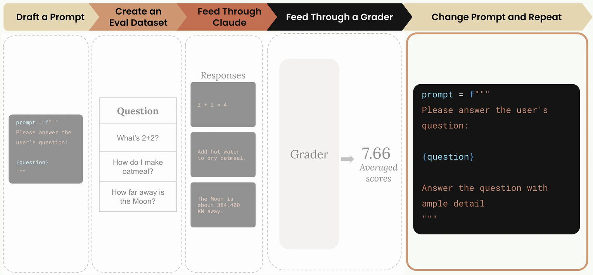

# Improving and Evaluating Prompts

Building effective prompts and testing how they perform 

- Prompt Engineering 
Set of best practices and guidance to **improve** your prompts. 
    - Mulitshot prompting
    - Structuring with XML tags
    - Many More!

- Prompt Evaluation 
Automated testing to **measure** how well your prompts work. 
    - Test against expected answers. 
    - Compare different versions of the same prompt. 
    - Review outputs for errors. 

# Prompt Eval Workflow 

- Many different ways to assemble a workflow 
- Many differnet open source and paid options
- We are going to assemble our own workflow in this module



## Step 1 : Initial Prompt Draft 

Will this be an effective prompt ? We won't know until we evaluate it with some objective methodology. 

```python
prompt = f"""
Please answe the user's question: 

{question}
"""
```

## Step 2 : Eval Dataset 

- Contains questions that we will merge with our prompt. 
- Can be assembled by hand or generated by claude. 



## Step 3 : Feed throud Claude




## Step 4 : Feed throug Grader 




## Step 5 : Change the Prompt




# Prompt Scoring 

- Get an objective measurement of the output of each prompt. 
- Use the version with the best score, or iterate again. 

## Pormpt V1 - Scored 7.66

```python
prompt = f"""
Please answe the user's question : 

{question}
"""
```

## Prompt V2 - Scored 8.7

```python
prompt = """
Pleas answe the user's question : 

{question}

Answer the question with ample detail
"""
```

# Generating Test Datasets 

## Goal 

- Write a prompt that will assist users in writing python code, JSON config, or regular Expressions focused on AWS-specific use cases. 
- Input 
    - User will request code for a specific task. 
- Output 
    - Python, JSON, or a regular expression without any explanation. 

### Prompt V1 

```python
prompt = f"""
Please provide a solution to the following task : 

{task}
"""
```

## Eval Dataset 

- Each object contains a "task" that we will merge into the prompt. 
- Can assemble by hand or with claude
    - If using Calude, consider Haiku!

```python
[
    {
        "task" : "Create a Python function to extract the AWS account ID from an ARN"
    }, 
    {
        "task" : "Write a JSON policy document that allows read-only access to a specific S3 bucket."
    }, 

    ...many more...
]

```