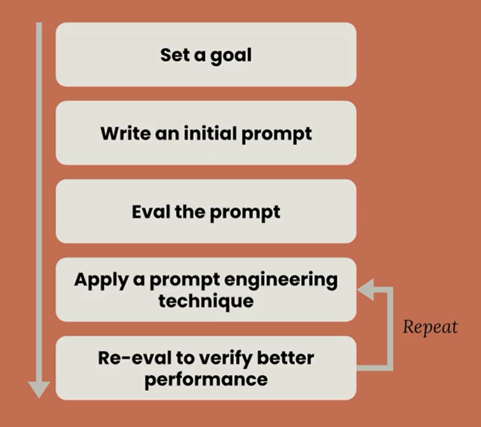
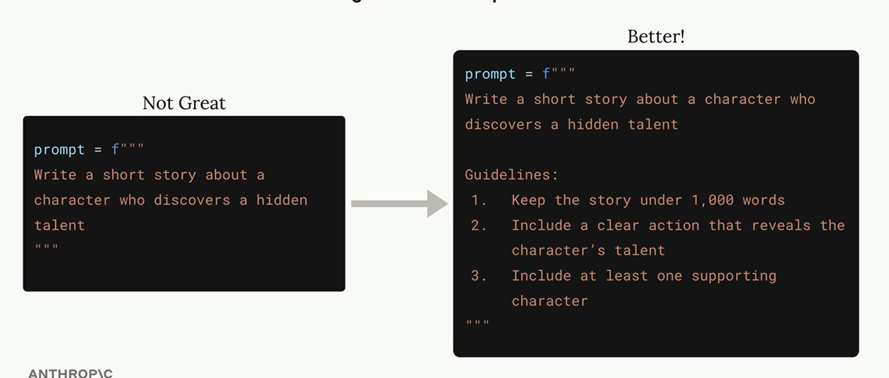
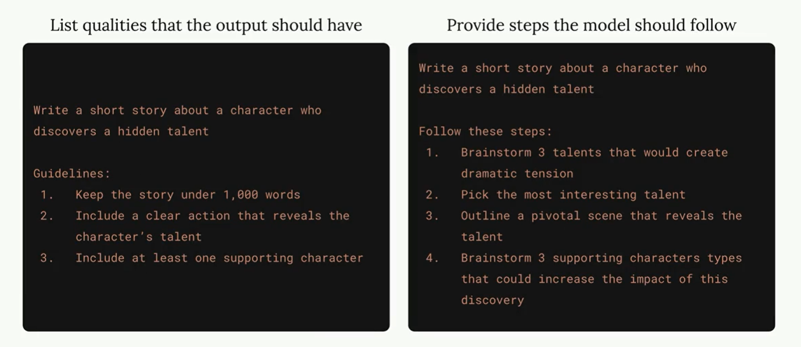
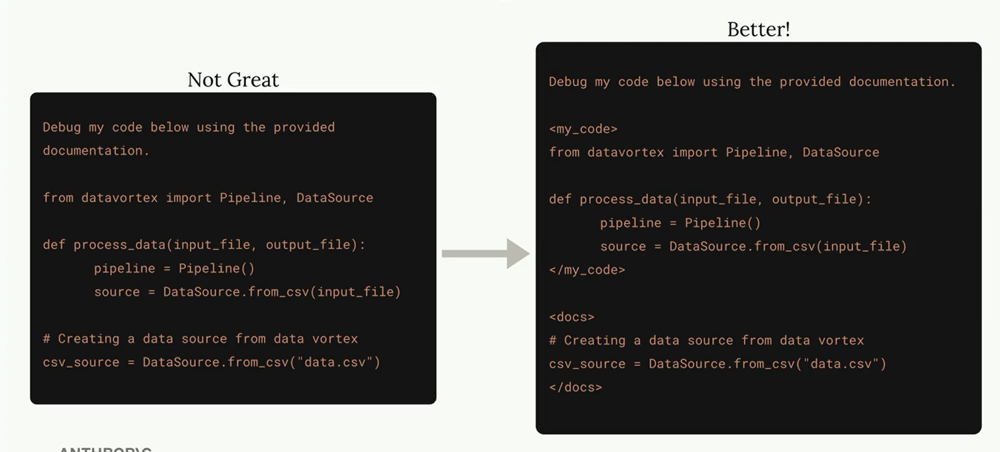
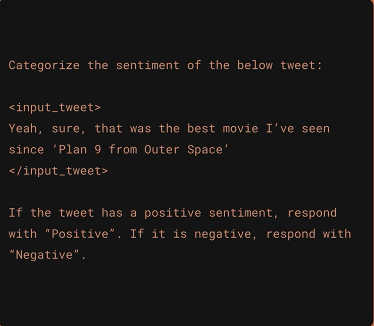
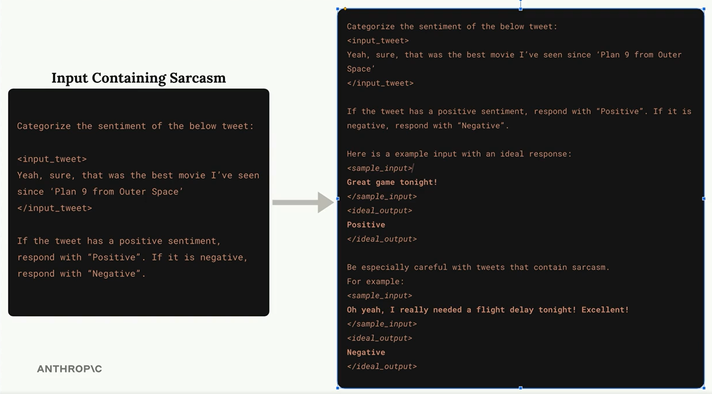

# Prompt Engineering

## Prompt Evaluation  ~~> Prompt Engineering

1. Prompt Evaluation 
Automated testing to `measure` how well your prompts work. 
    - Test against expected answers. 
    - Compare different versions of the same prompt 
    - Review outputs for errors. 

2. Prompt Engineering 
Set of best practices and guidance to `improve` your prompts.
    - Being clear
    - Being specific
    - Output formatting
    - Structuring with XML tags
    - Multshot prompting

## How We'll Learn Prompt Engineering

- We'll write an initial prompt, then improve it step by step while learning new techniques. 



## Goal : 

Write a prompt that generates a 1-day meal plan for an athlete based upon their height, weight, goal and dietary restrictions.

# Prompt Engineering Techniques 

## Being clear and specific 

Be clear and direct 

1. "Clear"  : 
    - Use simple language
    - State what you want explicitly
    - Lead your prompt with a simple statement of the model's task

`Instead of` : "I need to know about those things people put on their roofs that use sun - those solar panel things, I think they're called"

`Use` : "Write three paragraphs about how solar panels work"

2. "Direct" : 
    - Use instructions, not questions. 
    - Use direct, action vers ("write", "create", "generate")
    
`Instead of` : "I was reading about renewable energy and geothermal energy sounds neat. What countries use it ?" 

`Use` : "Identify three countries that use geothermal energy. Include generattion stats for each."

## Be specific 

Provide a list of guidelines or steps to direct the model.



### Guideline Types 



### When to Provide "Steps" 

Try listing steps for the model to follow with these kinds of prompts : 
- Troubleshooting hard problems 
- Decision making
- Critical thinking
- Anytime you want to force Claude to consider a "wider" view.


```code
Write a one page decision report to troubleshoot why a sales team numbers have dropped 30% last quarter. 

Follow these steps : 
1. Compare current v/s previous market metrics. 
2. Identify relevant industry changes. 
3. Analyze individual team member performance. 
4. Consider recent organizational changes 
5. Review customer feedback
```

## Providing Structure 

Use XML tags to separate distinct portions of the prompt 
- Most useful when including a lot of context. 
- Help serve as delimeters for Claude. 

```code 
Write a one page decision report to troubleshoot why a sales team numbers have dropped 30% last quarter. 

Here are the last 20 pages of our sales records : 
<sales_records>
{sales_records}
</sales_records>


Follow these steps : 
1. Compare current v/s previous market metrics. 
2. Identify relevant industry changes. 
3. Analyze individual team member performance. 
4. Consider recent organizational changes 
5. Review customer feedback
```



## Provide Examples 

Give Claude sample input/output paris 

- Useful for caputuring cases or complex output formats. 
- "One-Shot" : provide a single example 
- "Multi-Shot" : provide multiple examples 
- Highly recommend combining with XML tags for structure!



