# 📚 RAG: Retrieval Augmented Generation

> **Retrieval Augmented Generation (RAG)** is a technique that helps you work with large documents that are too big to fit into a single prompt. Instead of cramming everything into one massive prompt, RAG breaks documents into chunks and only includes the most relevant pieces when answering questions.

---

## 📋 Table of Contents

1. [The Problem with Large Documents](#1-the-problem-with-large-documents)
2. [Why RAG Matters](#2-why-rag-matters)
3. [Text Chunking Strategies](#3-text-chunking-strategies)
4. [Text Embeddings & Semantic Search](#4-text-embeddings--semantic-search)
5. [The Full RAG Flow](#5-the-full-rag-flow)
6. [RAG Implementation](#6-rag-implementation)
7. [BM25 Lexical Search](#7-bm25-lexical-search)
8. [Hybrid Search Pipeline](#8-hybrid-search-pipeline)
9. [Key Takeaways](#9-key-takeaways)

---

## 1. The Problem with Large Documents

Imagine you have an 800-page financial document and want to ask Claude specific questions about it, like "What risk factors does this company have?" You need to get the relevant information from the document to Claude somehow, but there are limits to how much text you can include in a prompt.

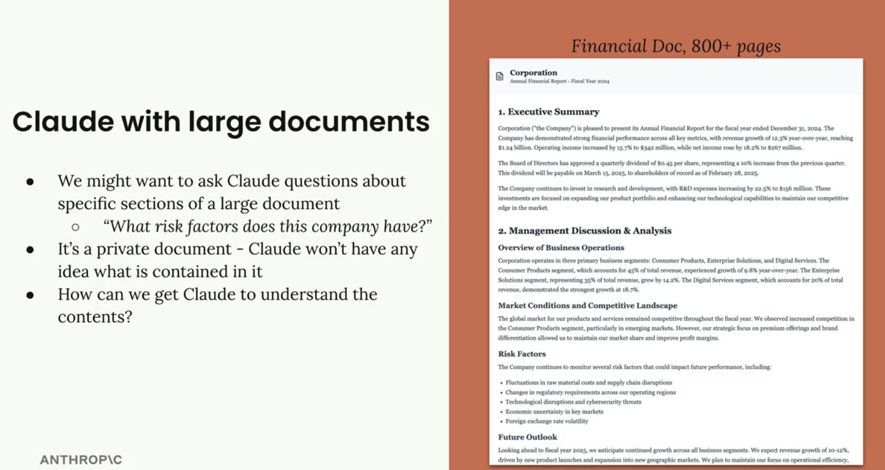

## 2. Why RAG Matters

### Option 1: Include Everything in the Prompt

The first approach is straightforward - extract all text from the document and stuff it into your prompt along with the user's question. Your prompt might look like this:

```html
Answer the user's question about the financial document. 

<user_question>
    {user_question}
</user_question>

<financial_document>
    {financial_document}
</financial_document>
```

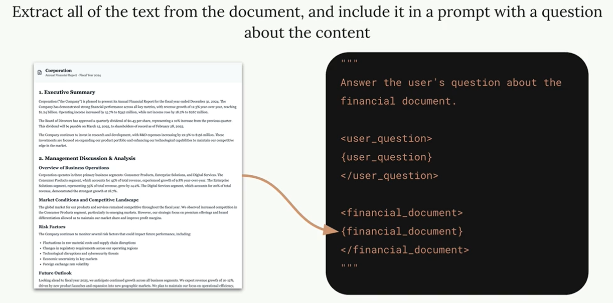

This approach has serious limitations:

- There's a hard limit on prompt length - your document might be too long
- Claude becomes less effective with very long prompts
- Larger prompts `cost more` to process
- Larger prompts `take longer to process`

### Option 2: Break Documents into Chunks

RAG takes a smarter approach. First, you break the document into smaller chunks during a preprocessing step. Then, when a user asks a question, you find the chunks most relevant to their question and only include those in your prompt.

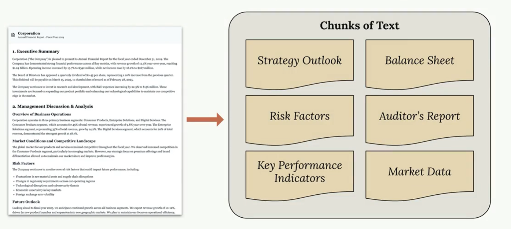

Here's how it works: if someone asks "What risks does this company face?" you'd search through your chunks, find the "Risk Factors" section, and include just that relevant chunk in your prompt.

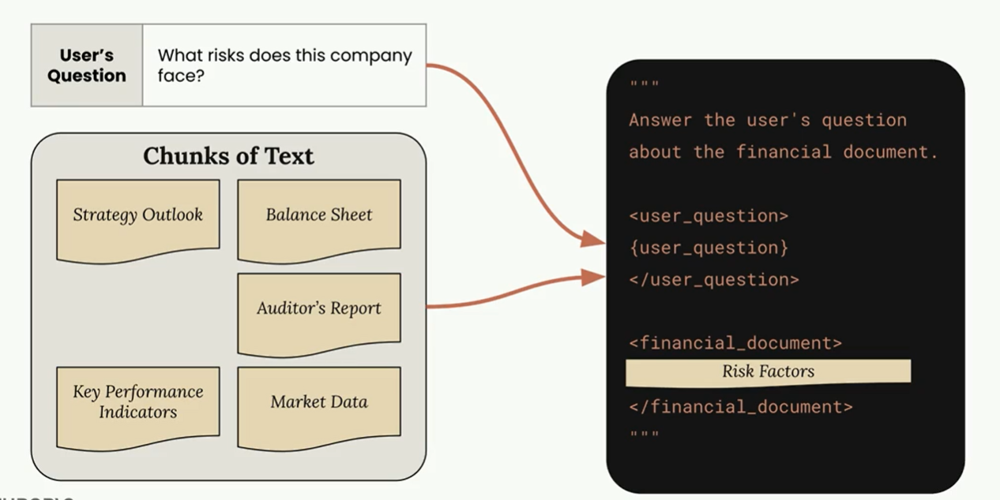

### Benefits of RAG

- Claude can focus on only the most relevant content
- Scales up to very large documents
- Works with multiple documents
- Smaller prompts cost less and run faster

### Challenges with RAG

- Requires a preprocessing step to chunk documents
- Need a search mechanism to find "relevant" chunks
- Included chunks might not contain all the context Claude needs
- Many ways to chunk text - which approach is best?

For example, you could split documents into equal-sized portions, or you could create chunks based on document structure like headers and sections. Each approach has trade-offs you'll need to evaluate for your specific use case.

## When to Use RAG

RAG involves many technical decisions and requires more work than simply including everything in a prompt. You'll need to analyze whether the benefits outweigh the complexity for your particular application. It's especially valuable when working with very large documents, multiple documents, or when you need to optimize for cost and performance.

The key insight is that RAG trades simplicity for scalability and efficiency. While it requires more upfront work to implement properly, it enables you to work with document collections that would be impossible to handle with simple prompt stuffing.

---

## How We'll Learn Retrieval Augmented Generation 

- We'll focus on implementing a basic RAG workflow. 
- Once complete, we'll add additional steps and features to increase the accuracy of our workflow

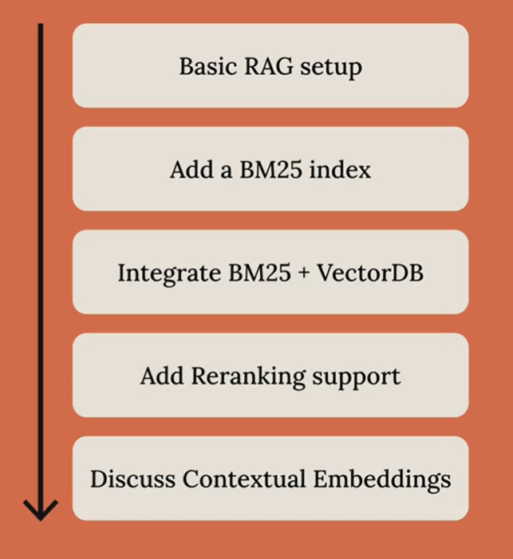

---

## 3. Text Chunking Strategies 

Text chunking is one of the most critical steps in building a RAG (Retrieval Augmented Generation) pipeline. How you break up your documents directly impacts the quality of your entire system. A poor chunking strategy can lead to irrelevant context being inserted into your prompts, causing your AI to give completely wrong answers.


Consider this example: you have a document with sections on medical research and software engineering. If you chunk poorly, a user asking "How many bugs did engineers fix this year?" might get information about medical research instead of software engineering, simply because the medical section happened to contain the word "bug" in a different context.


This is why choosing the right chunking strategy matters so much. Let's explore three main approaches.

## Types of Chunking Strategies : 

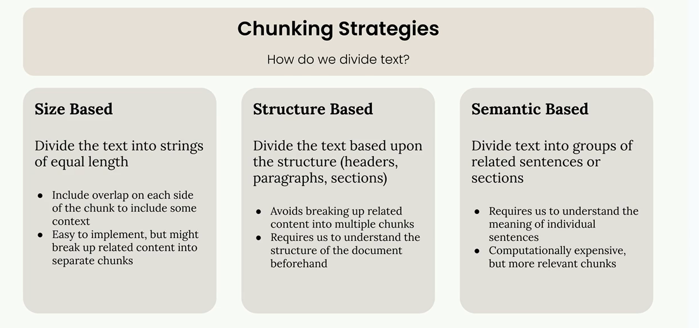

### 1. Size-Based Chunking

Size-based chunking is the simplest approach - you divide your text into strings of equal length. If you have a 325-character document, you might split it into three chunks of roughly 108 characters each.

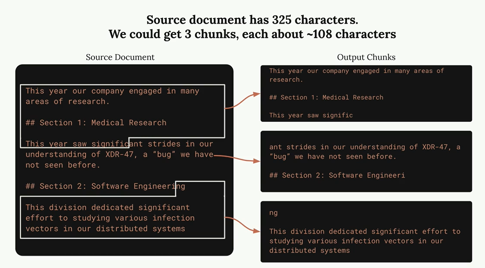

This method is easy to implement and works with any type of document, but it has clear downsides:

- Words get cut off mid-sentence
- Chunks lose important context from surrounding text
- Section headers might be separated from their content

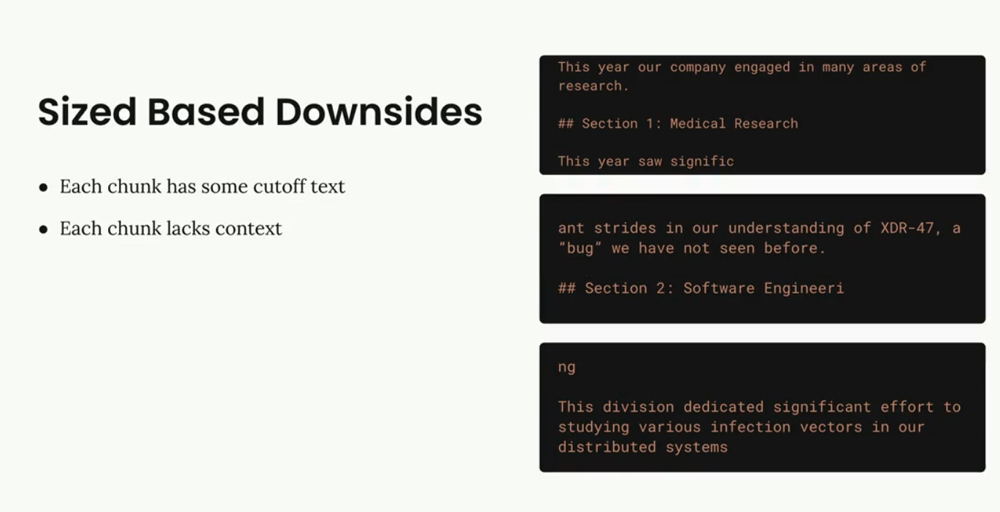

To address these issues, you can add overlap between chunks. This means each chunk includes some characters from the neighboring chunks, providing better context and ensuring complete words and sentences.

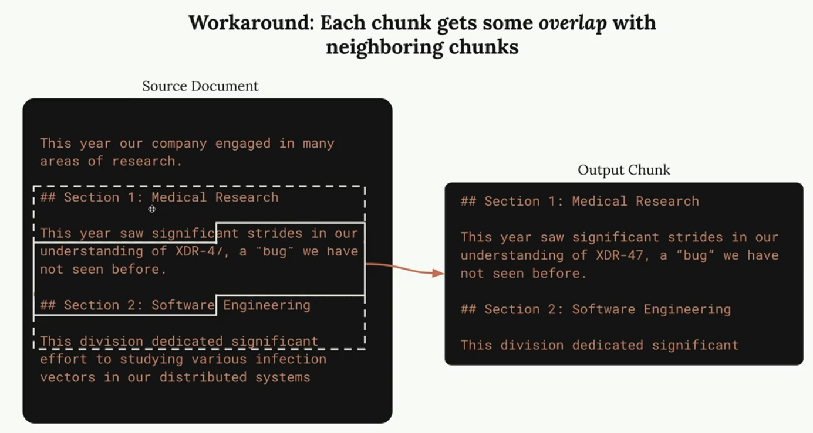

Here's is a basic implementation : 

```python
def chunk_by_char(text, chunk_size=150, chunk_overlap=20):
    chunks = []
    start_idx = 0
    
    while start_idx < len(text):
        end_idx = min(start_idx + chunk_size, len(text))
        chunk_text = text[start_idx:end_idx]
        chunks.append(chunk_text)
        
        start_idx = (
            end_idx - chunk_overlap if end_idx < len(text) else len(text)
        )
    
    return chunks
```

### 2. Structure-Based Chunking

Structure-based chunking divides text based on the document's natural structure - headers, paragraphs, and sections. This works great when you have well-formatted documents like Markdown files.

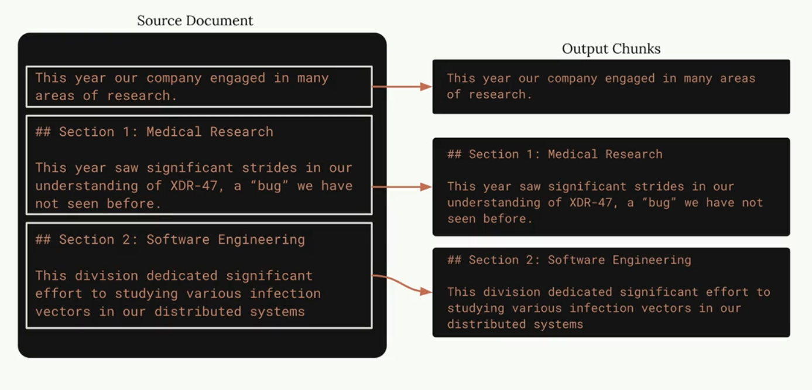

For a Markdown document, you can split on header markers:

```python
def chunk_by_section(document_text):
    pattern = r"\n## "
    return re.split(pattern, document_text)
``` 

This approach gives you the cleanest, most meaningful chunks because each one represents a complete section. However, it only works when you have guarantees about your document structure. Many real-world documents are plain text or PDFs without clear structural markers.

### 3. Semantic-Based Chunking

Semantic-based chunking is the most sophisticated approach. You divide text into sentences, then use natural language processing to determine how related consecutive sentences are. You build chunks from groups of related sentences.

This method is computationally expensive but produces the most relevant chunks. It requires understanding the meaning of individual sentences and is more complex to implement than the other strategies.

### 4. Sentence-Based Chunking

A practical middle ground is chunking by sentences. You split the text into individual sentences using regular expressions, then group them into chunks with optional overlap:

```python
def chunk_by_sentence(text, max_sentences_per_chunk=5, overlap_sentences=1):
    sentences = re.split(r"(?<=[.!?])\s+", text)
    
    chunks = []
    start_idx = 0
    
    while start_idx < len(sentences):
        end_idx = min(start_idx + max_sentences_per_chunk, len(sentences))
        current_chunk = sentences[start_idx:end_idx]
        chunks.append(" ".join(current_chunk))
        
        start_idx += max_sentences_per_chunk - overlap_sentences
        
        if start_idx < 0:
            start_idx = 0
    
    return chunks
```


## Choosing Your Strategy

Your choice depends entirely on your use case and document guarantees:

- Structure-based: Best results when you control document formatting (like internal company reports)
- Sentence-based: Good middle ground for most text documents
- Size-based: Most reliable fallback that works with any content type, including code

Size-based chunking with overlap is often the go-to choice in production because it's simple, reliable, and works with any document type. While it may not give perfect results, it consistently produces reasonable chunks that won't break your pipeline.

Remember: there's no single "best" chunking strategy. The right approach depends on your specific documents, use cases, and the trade-offs you're willing to make between implementation complexity and chunk quality.

---

## 4. Text Embeddings & Semantic Search 

After breaking a document into chunks, the next step in a RAG pipeline is finding which chunks are most relevant to a user's question. This is essentially a search problem - you need to look through all your text chunks and identify the ones that relate to what the user is asking about.

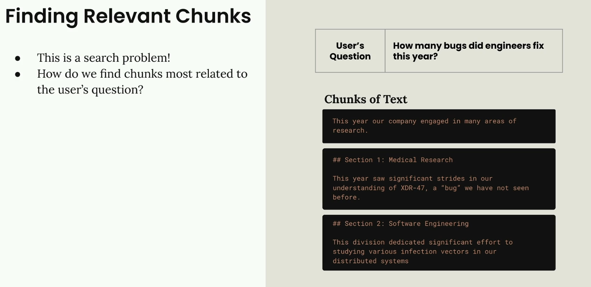

### Semantic Search 

The most common approach for finding relevant chunks is semantic search. Unlike keyword-based search that looks for exact word matches, semantic search uses text embeddings to understand the meaning and context of both the user's question and each text chunk.

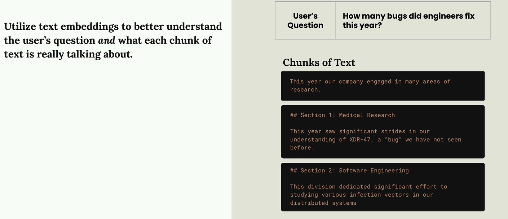

### Text Embeddings 

A text embedding is a numerical representation of the meaning contained in some text. Think of it as converting words and sentences into a format that computers can work with mathematically.

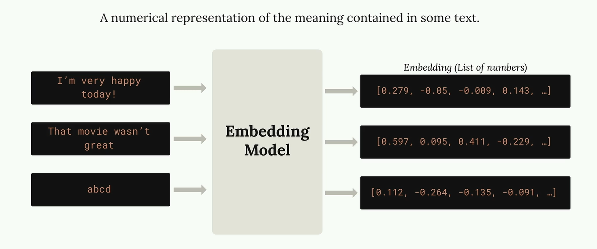

Here's how the process works:

- You feed text into an embedding model
- The model outputs a long list of numbers (the embedding)
- Each number ranges from -1 to +1
- These numbers represent different qualities or features of the input text

### Understanding the Numbers

Each number in an embedding is essentially a "score" for some quality of the input text. However, here's the important caveat: we don't know precisely what each number represents.

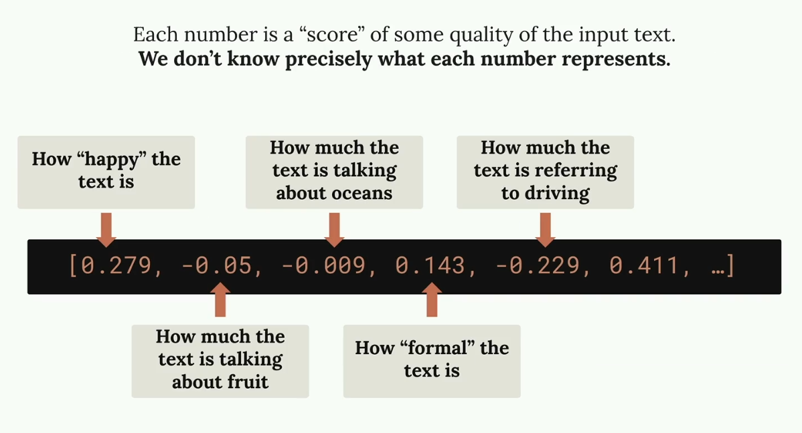

While it's helpful to imagine that one number might represent "how happy the text is" or "how much the text talks about oceans," these are just conceptual examples. The actual meaning of each dimension is learned by the model during training and isn't directly interpretable by humans.

### Generating Embeddings with VoyageAI 

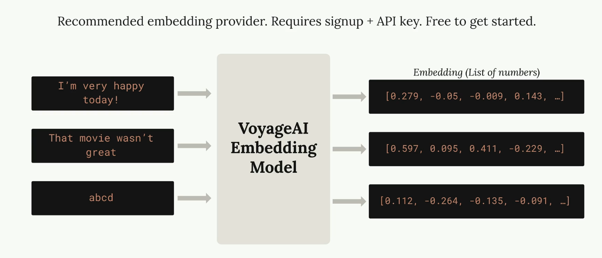

Since Anthropic doesn't currently provide embedding generation, the recommended provider is VoyageAI. You'll need to:

- Sign up for a separate VoyageAI account
- Get an API key (free to get started)
- Add the key to your environment variables


**Implementation**

- First, install the VoyageAI library.
- Then set up the client and create a function to generate embeddings. 

```python
from dotenv import load_dotenv
import voyageai

load_dotenv()
client = voyageai.Client()

def generate_embedding(text, model="voyage-3-large", input_type="query"):
    result = client.embed([text], model=model, input_type=input_type)
    return result.embeddings[0]
```

When you run this function on a text chunk, you'll get back a list of floating-point numbers representing the embedding. The process is quick and straightforward - the real challenge is understanding how to use these embeddings effectively in your RAG pipeline for finding the most relevant content.

The next step is learning how to compare embeddings to determine which chunks are most similar to a user's question, which forms the core of the semantic search process.

---

## 5. The Full RAG Flow 

Now that we've covered the basics of RAG, text chunking, and embeddings, let's walk through the complete RAG pipeline step by step. This example will show you exactly how all these pieces work together to retrieve relevant information and generate responses.

**Step 1: Chunk Your Source Text**

First, we take our source document and break it into manageable chunks. For this example, we'll use two simple text sections:
- Section 1: Medical Research - "This year saw significant strides in our understanding of XDR-47, a 'bug' we have not seen before."
- Section 2: Software Engineering - "This division dedicated significant effort to studying various infection vectors in our distributed systems"

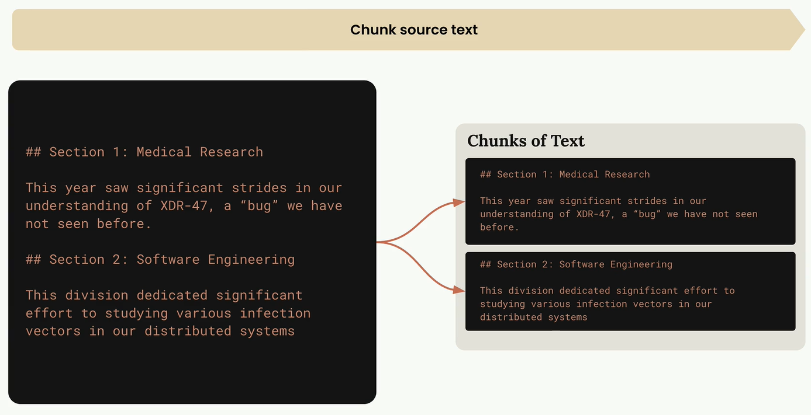

**Step 2: Generate Embeddings**

Next, we convert each text chunk into numerical embeddings using an embedding model. To make this easier to understand, let's imagine we have a perfect embedding model that always returns exactly two numbers, and we know what each number represents.

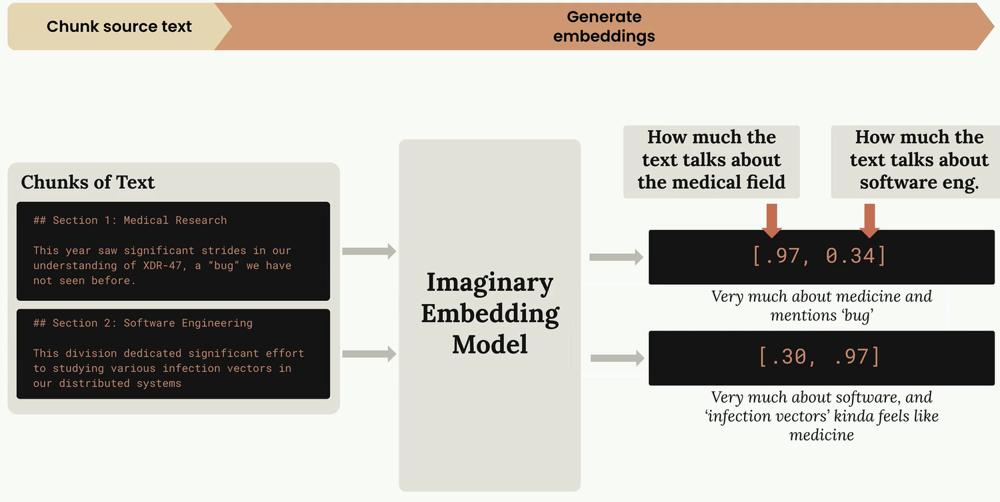

In our imaginary model:
- The first number represents how much the text talks about the medical field
- The second number represents how much the text talks about software engineering

For the medical research section, we might get [0.97, 0.34] - very medical-focused but with some software elements due to the word "bug". For the software engineering section, we get [0.30, 0.97] - heavily software-focused but with medical undertones from "infection vectors".

**Normalization**

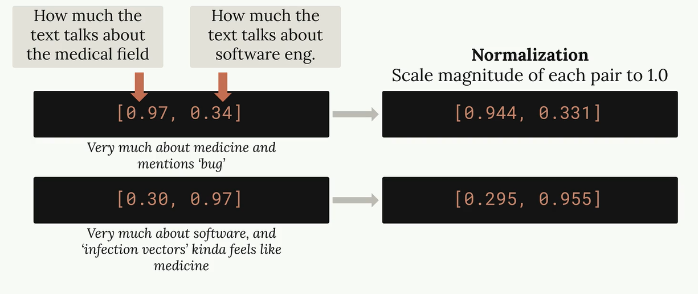

The embedding API typically performs a normalization step that scales each vector to have a magnitude of 1.0. You don't need to worry about the math here - it's handled automatically. This gives us normalized vectors like [0.944, 0.331] and [0.295, 0.955].

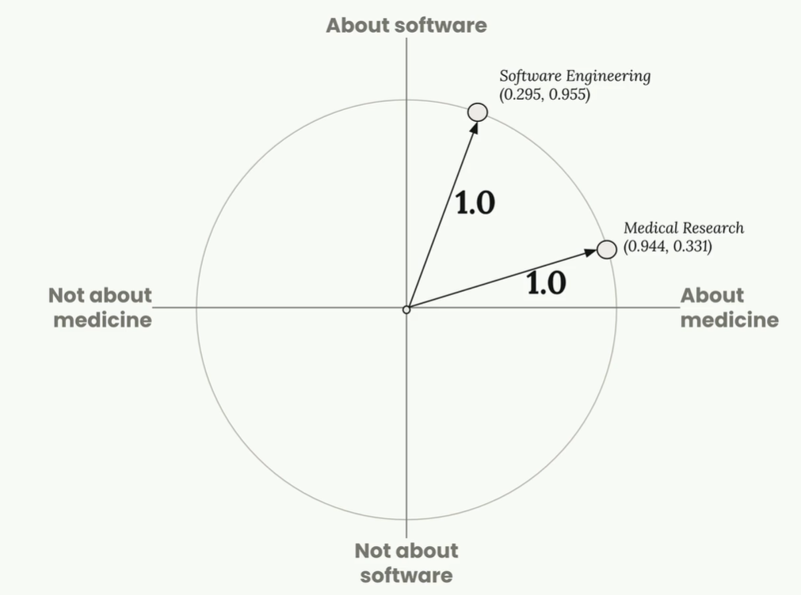

We can visualize these embeddings on a unit circle, where each point represents one of our text chunks.

**Step 3: Store in Vector Database**

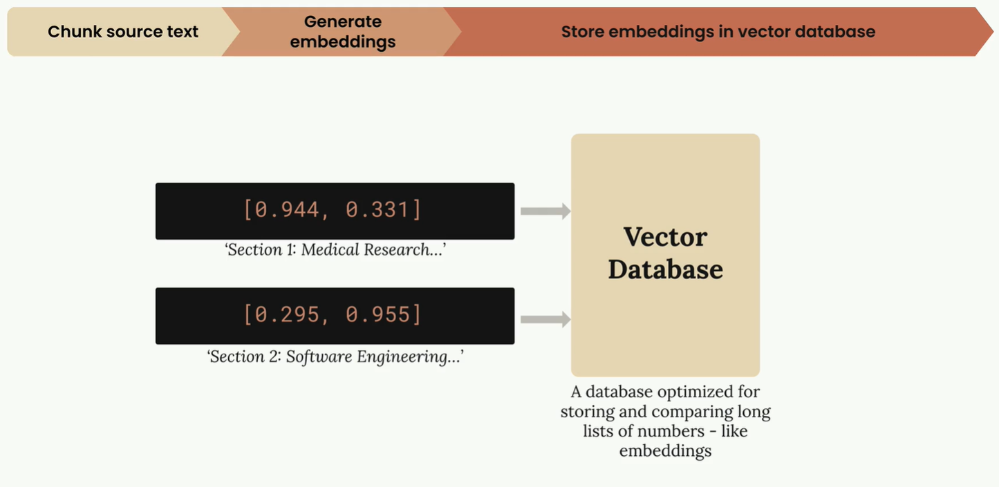

We store these embeddings in a vector database - a specialized database optimized for storing, comparing, and searching through long lists of numbers like our embeddings.

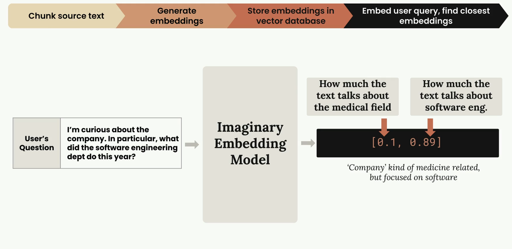

At this point, we pause. All the work so far has been preprocessing that happens ahead of time. Now we wait for a user to submit a query.

**Step 4: Process User Query**

When a user asks a question like "I'm curious about the company. In particular, what did the software engineering dept do this year?", we run their query through the same embedding model.

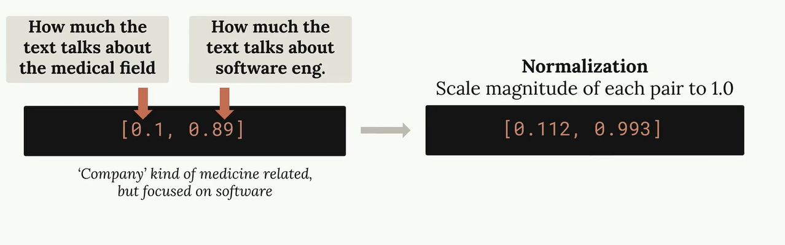

This query gets embedded as something like [0.1, 0.89] - low medical score, high software engineering score. After normalization, we get [0.112, 0.993].

**Step 5: Find Similar Embeddings**

We send the user's query embedding to our vector database and ask it to find the most similar stored embeddings.

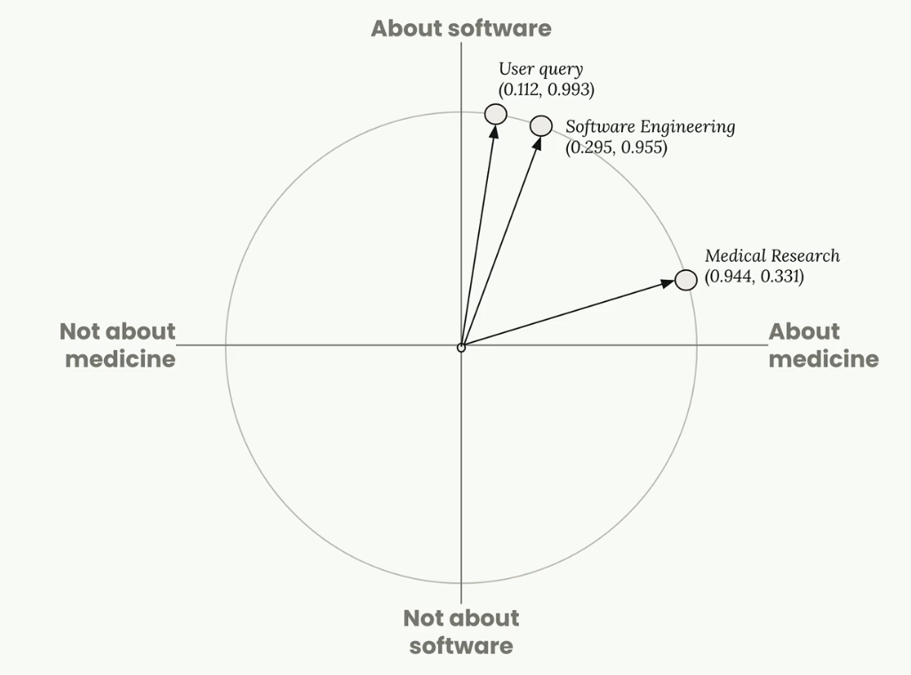

The database returns the software engineering section because it's the closest match to what the user asked about.

**How Similarity Works: Cosine Similarity**

The vector database uses cosine similarity to determine which embeddings are most similar. This measures the cosine of the angle between two vectors.

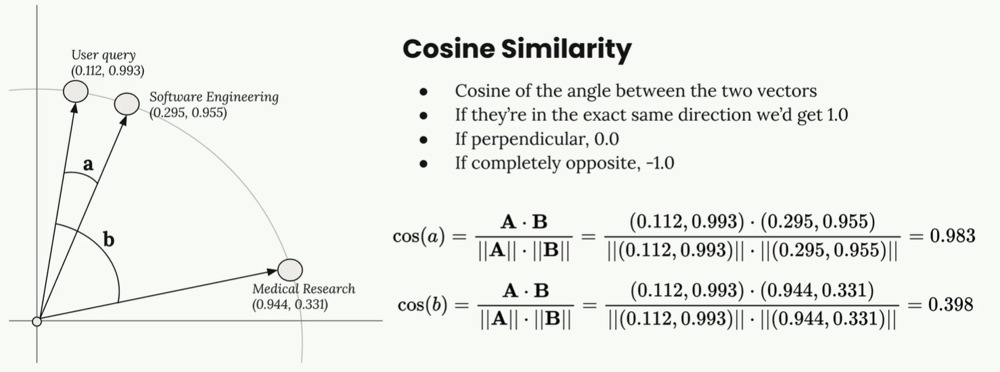

Key points about cosine similarity:

- Results range from -1 to 1
- Values close to 1 mean high similarity
- Values close to -1 mean very different
- 0 means perpendicular (no relationship)

In our example, the cosine similarity between the user query and the software engineering chunk is 0.983 - very high similarity. The similarity with the medical research chunk is only 0.398 - much lower.

**Cosine Distance**

You'll often see "cosine distance" in vector database documentation. This is simply calculated as (1 - cosine similarity). With cosine distance:

- Values close to 0 mean high similarity
- Larger values mean less similarity

This adjustment makes the numbers easier to interpret in many contexts.

**Step 6: Create the Final Prompt**

Finally, we take the user's question and the most relevant text chunk we found, combine them into a prompt, and send it to Claude for a response.

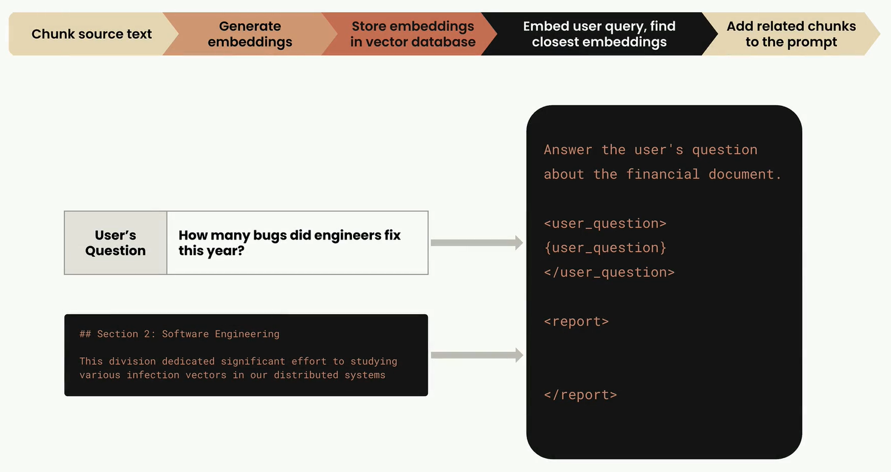

The prompt might look like : 
```html 
Answer the user's question about the financial document.

<user_question>
How many bugs did engineers fix this year?
</user_question>

<report>
## Section 2: Software Engineering
This division dedicated significant effort to studying various infection vectors in our distributed systems
</report>
```

And that's the complete RAG pipeline! The system successfully retrieved the most relevant information based on semantic similarity and provided it as context for generating an accurate response.

---

## 6. RAG Implementation 

Now that we understand the RAG flow conceptually, let's implement it step by step. We'll walk through a complete example that demonstrates how to chunk text, generate embeddings, store them in a vector database, and perform similarity searches.

### The Five-Step RAG Implementation

Our implementation follows the same five steps we discussed previously:

1. Chunk the text by section
2. Generate embeddings for each chunk
3. Create a vector store and add each embedding to it
4. Generate an embedding for the user's question
5. Search the store to find the most relevant chunks

### Understanding the Results

When we run our example query about the software engineering department, we get back:

Section 2: Software Engineering with a distance of 0.71 (closest match)
Methodology section with a distance of 0.72 (second closest)
Lower distance values indicate higher similarity, so Section 2 is the most relevant to our query.

### What's Next?

This implementation works well for basic cases, but there are scenarios where it doesn't perform as expected. In the next sections, we'll explore improvements to make our RAG system more robust and accurate.

The key takeaway is that RAG is fundamentally about converting text to numbers (embeddings), storing those numbers efficiently, and then using mathematical similarity to find relevant content when users ask questions.

---

## 7. BM25 Lexical Search 

When building RAG pipelines, you'll quickly discover that semantic search alone doesn't always return the best results. Sometimes you need exact term matches that semantic search might miss. The solution is to combine semantic search with lexical search using a technique called BM25.

### The Problem with Semantic Search Alone

Let's say you're searching for a specific incident ID like "INC-2023-Q4-011" in a document. While semantic search excels at understanding context and meaning, it might return sections that are semantically related but don't actually contain the exact term you're looking for.

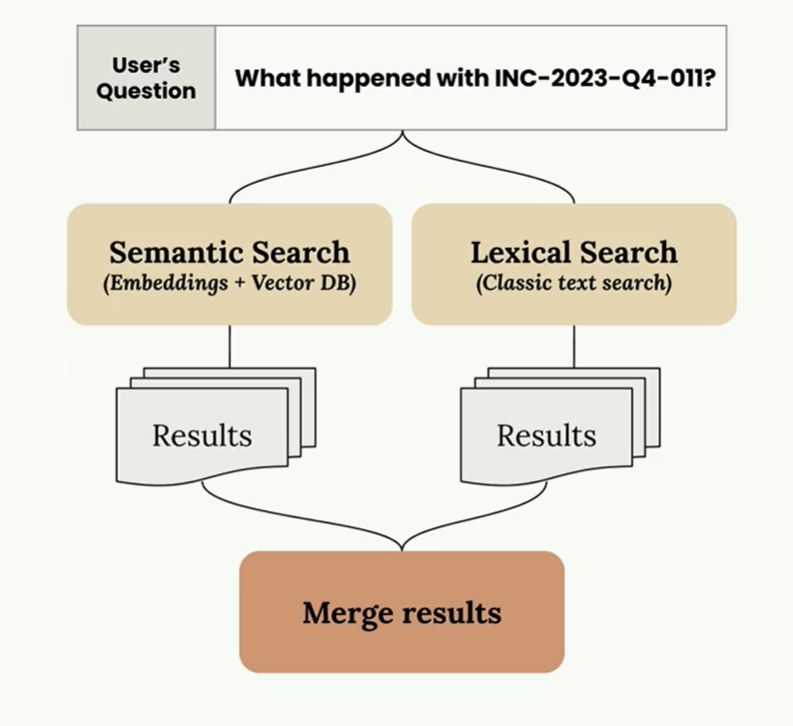

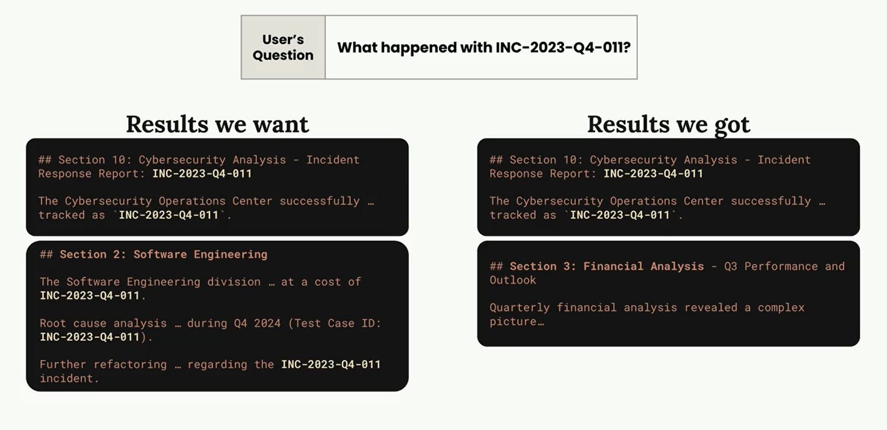

In the example above, semantic search returned the cybersecurity section (which does contain the incident ID) but also returned a financial analysis section that doesn't mention the incident at all. This happens because semantic search focuses on conceptual similarity rather than exact term matching.

### Hybrid Search Strategy

The solution is to run both semantic and lexical searches in parallel, then merge the results. This gives you the best of both worlds:


- Semantic search finds conceptually related content using embeddings
- Lexical search finds exact term matches using classic text search
- Merged results combine both approaches for better accuracy

### How Lexical Search : BM25 Works

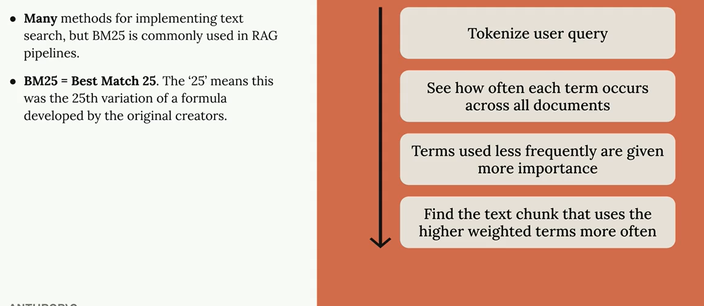

BM25 (Best Match 25) is a popular algorithm for lexical search in RAG systems. Here's how it processes a search query:

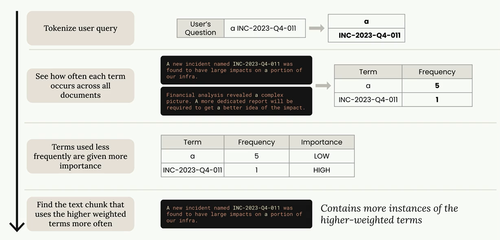

**Step 1: Tokenize the query**
Break the user's question into individual terms. For example, "a INC-2023-Q4-011" becomes ["a", "INC-2023-Q4-011"].

**Step 2: Count term frequency**
See how often each term appears across all your documents. Common words like "a" might appear 5 times, while specific terms like "INC-2023-Q4-011" might appear only once.

**Step 3: Weight terms by importance**
Terms that appear less frequently get higher importance scores. The word "a" gets low importance because it's common, while "INC-2023-Q4-011" gets high importance because it's rare.

**Step 4: Find best matches**
Return documents that contain more instances of the higher-weighted terms.

### Implementing BM25 Search

Here's how to set up a basic BM25 search system:

```python
# 1. Chunk your text by sections
chunks = chunk_by_section(text)

# 2. Create a BM25 store and add documents
store = BM25Index()
for chunk in chunks:
    store.add_document({"content": chunk})

# 3. Search the store
results = store.search("What happened with INC-2023-Q4-011?", 3)

# Print results
for doc, distance in results:
    print(distance, "\n", doc["content"][:200], "\n----\n")
```

When you run this search, you'll get much better results than semantic search alone. The BM25 algorithm prioritizes sections that actually contain your specific search terms, especially rare terms like incident IDs.

Notice how the results now properly prioritize the Software Engineering section and Cybersecurity section - both of which actually contain the incident ID you're searching for.

### Why This Works Better

BM25 excels at finding exact matches because it:

- Gives higher weight to rare, specific terms
- Ignores common words that don't add search value 
- Focuses on term frequency rather than semantic meaning
- Works especially well for technical terms, IDs, and specific phrases

The key insight is that both search methods have complementary strengths. Semantic search understands context and meaning, while lexical search ensures you don't miss exact term matches. By combining them, you create a more robust search system that handles both conceptual queries and specific lookups effectively.

---

## 8. Hybrid Search Pipeline

### The Multi-Index Architecture

Both our VectorIndex and BM25Index classes share nearly identical APIs - they both have add_document() and search() methods. This consistency makes it straightforward to wrap them together in a new class called Retriever.


The Retriever acts as a coordinator that forwards user queries to both indexes, collects their results, and merges them using a technique called reciprocal rank fusion.

### Understanding Reciprocal Rank Fusion

Merging results from different search methods isn't as simple as just concatenating lists. Each method uses different scoring systems, so we need a way to normalize and combine their rankings fairly.

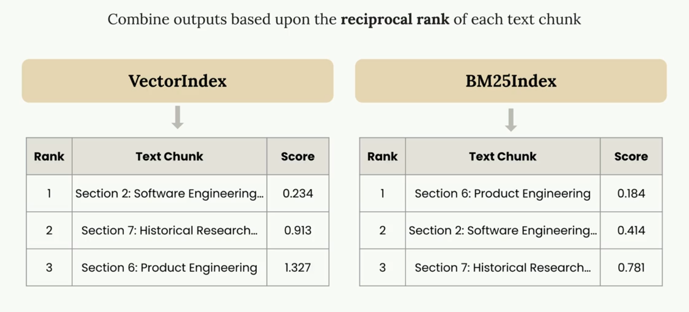

Here's how reciprocal rank fusion works with an example. Let's say we search for information about "INC-2023-Q4-011" and get these results:

- VectorIndex returns: Section 2 (rank 1), Section 7 (rank 2), Section 6 (rank 3)
- BM25Index returns: Section 6 (rank 1), Section 2 (rank 2), Section 7 (rank 3)

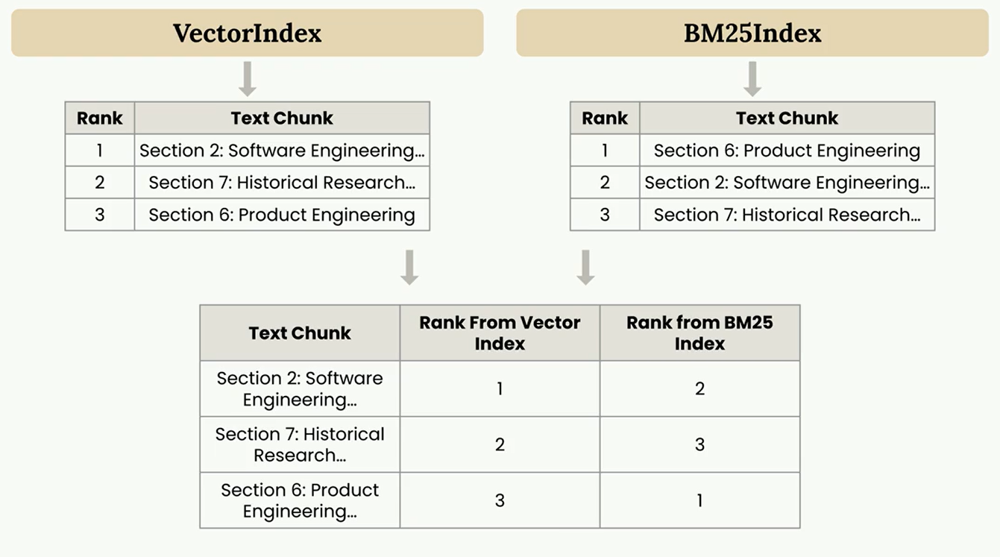

We combine these into a single table showing each text chunk's rank from both indexes, then apply the RRF formula:

```python
RRF_score(d) = Σ(1 / (k + rank_i(d)))
```

Where k is a constant (often 60, but we'll use 1 for clearer results) and rank_i(d) is the rank of document d in the i-th ranking.

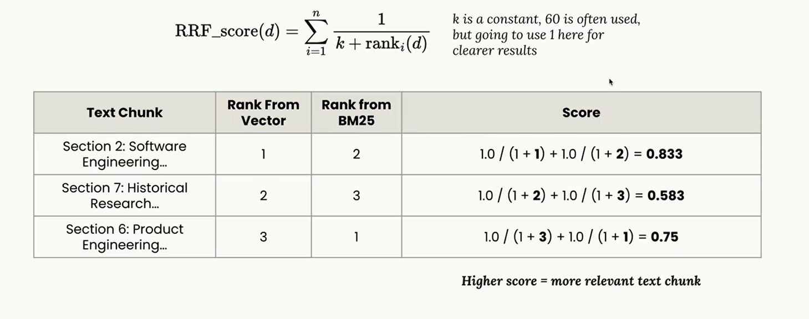

For our example:

- Section 2: 1.0/(1+1) + 1.0/(1+2) = 0.833
- Section 7: 1.0/(1+2) + 1.0/(1+3) = 0.583
- Section 6: 1.0/(1+3) + 1.0/(1+1) = 0.75

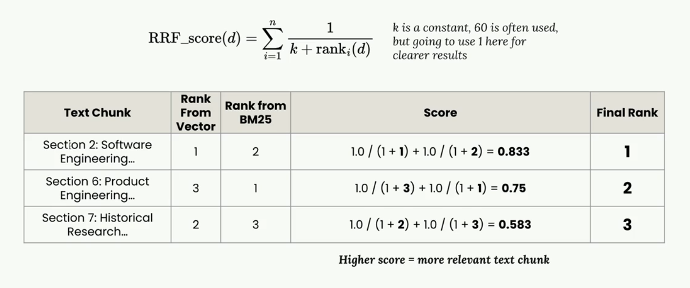

The final ranking becomes: Section 2 (0.833), Section 6 (0.75), Section 7 (0.583). This makes intuitive sense - Section 2 performed well in both indexes, so it rises to the top.

### Implementation Details

The Retriever class wraps multiple search indexes and provides a unified interface:

```python
class Retriever:
    def __init__(self, *indexes: SearchIndex):
        if len(indexes) == 0:
            raise ValueError("At least one index must be provided")
        self._indexes = list(indexes)
    
    def add_document(self, document: Dict[str, Any]):
        for index in self._indexes:
            index.add_document(document)
    
    def search(self, query_text: str, k: int = 1, k_rrf: int = 60):
        # Get results from all indexes
        all_results = []
        for idx, results in enumerate(all_results):
            for rank, (doc, _) in enumerate(results):
                # Track document ranks across indexes
                # Apply RRF scoring formula
        # Return merged and sorted results
```

The key insight is that by maintaining consistent APIs across different search implementations, we can easily combine them without tight coupling.

### Testing the Hybrid Approach

Remember our earlier problem where searching for "what happened with INC-2023-Q4-011?" returned unexpected results from the vector-only approach? The cybersecurity incident (Section 10) came first, but financial analysis (Section 3) came second instead of the more relevant software engineering section.

With our hybrid retriever, we now get much better results:

Section 10: Cybersecurity Analysis - Incident Response Report (most relevant)
Section 2: Software Engineering - Project Phoenix Stability Enhancements (second most relevant)
Section 5: Legal Developments (third)
This demonstrates how combining semantic and lexical search can overcome the limitations of either approach used alone.

### Extensibility

The beauty of this architecture is its extensibility. Since all indexes implement the same SearchIndex protocol with add_document() and search() methods, you can easily add new search methodologies:

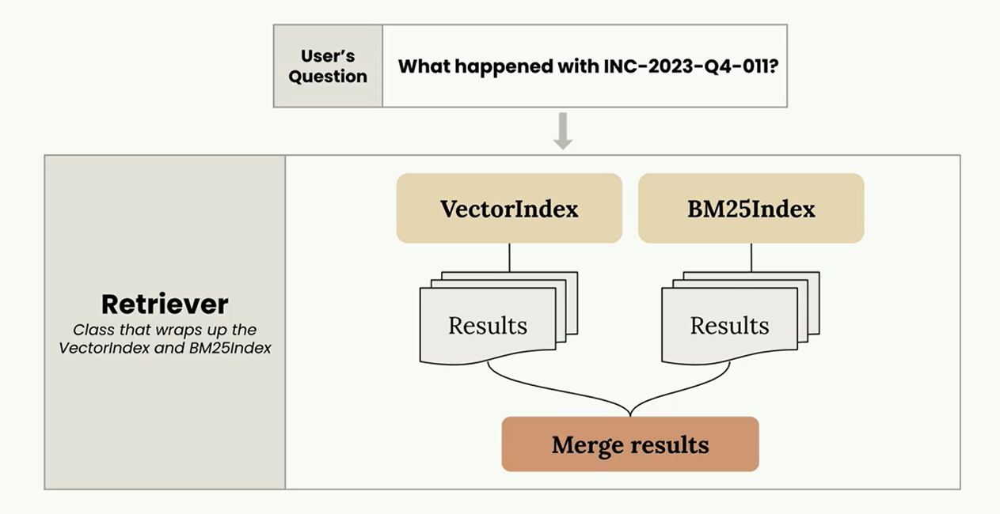

Want to add a keyword-based index? A graph-based search? A specialized domain index? Just implement the same interface and the Retriever will automatically incorporate it into the fusion process.

This modular approach keeps each search implementation focused and testable while providing a clean way to combine their strengths in the final system.

---

## 9. Key Takeaways

### Core Concepts

1. **RAG Solves Scale Problems**: RAG breaks large documents into manageable chunks, enabling you to work with documents that are too large for direct prompt inclusion.

2. **Chunking Matters**: Your choice of chunking strategy (size-based, structure-based, semantic, or sentence-based) directly impacts retrieval quality.

3. **Embeddings Enable Semantic Search**: Text embeddings convert meaning into numbers, allowing mathematical comparison of semantic similarity.

4. **Hybrid Search is Powerful**: Combining semantic search (meaning-based) with lexical search (exact matches) provides better results than either approach alone.

5. **Reciprocal Rank Fusion Works**: When merging results from multiple search methods, RRF provides a principled way to combine rankings fairly.

### Implementation Hierarchy

```
┌─────────────────────────────────────┐
│   User Query                        │
└──────────────┬──────────────────────┘
               │
      ┌────────▼────────┐
      │   Retriever     │
      └────────┬────────┘
               │
        ┌──────┴──────┐
        │             │
   ┌────▼────┐  ┌────▼────┐
   │Semantic │  │ Lexical  │
   │ (Vector)│  │ (BM25)   │
   └────┬────┘  └────┬────┘
        │             │
        └──────┬──────┘
               │
     ┌─────────▼─────────┐
     │ Reciprocal Rank   │
     │ Fusion (RRF)      │
     └─────────┬─────────┘
               │
     ┌─────────▼──────────┐
     │ Ranked Results     │
     │ for Claude         │
     └────────────────────┘
```

### When to Use Each Approach

| Scenario | Best Approach |
|----------|---------------|
| Looking for exact IDs or specific terms | BM25 Lexical Search |
| Understanding conceptual relationships | Semantic Search |
| Mixed queries with both specific and general needs | Hybrid Search |
| Small documents (< 5 pages) | Direct prompt inclusion |
| Large documents (> 50 pages) | RAG with hybrid search |

### Next Steps

Now that you understand RAG's fundamentals:

1. **Experiment with chunking strategies** on your own documents
2. **Try different embedding models** to see which works best for your domain
3. **Test both search approaches** separately before combining them
4. **Measure quality** by analyzing whether retrieved chunks actually help Claude answer questions
5. **Iterate and refine** your pipeline based on real-world usage

RAG is not a one-size-fits-all solution. Success comes from understanding your specific documents and use cases, then choosing the right combination of techniques.