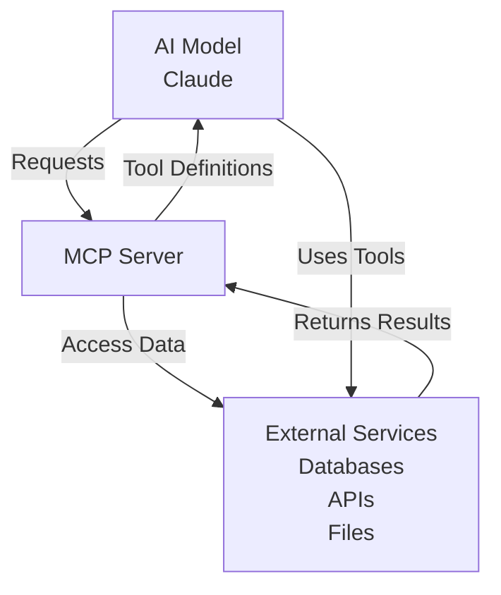
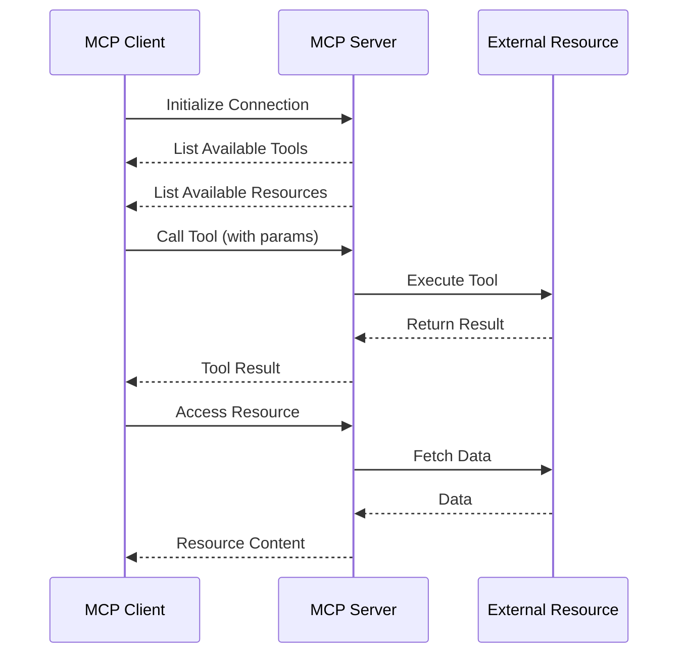
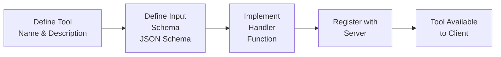
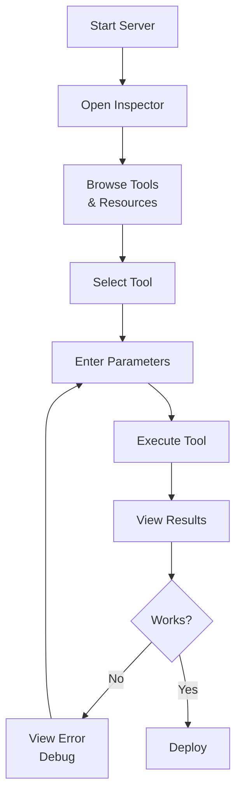
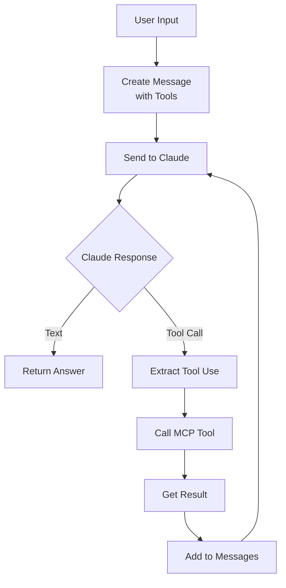
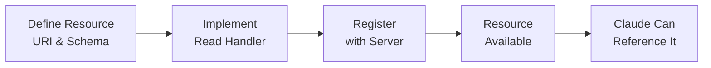
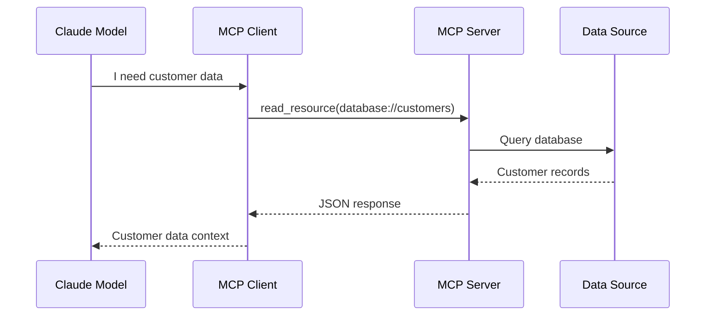
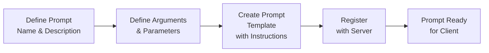
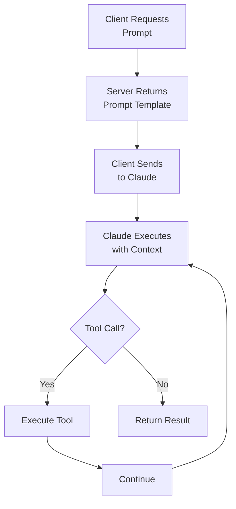
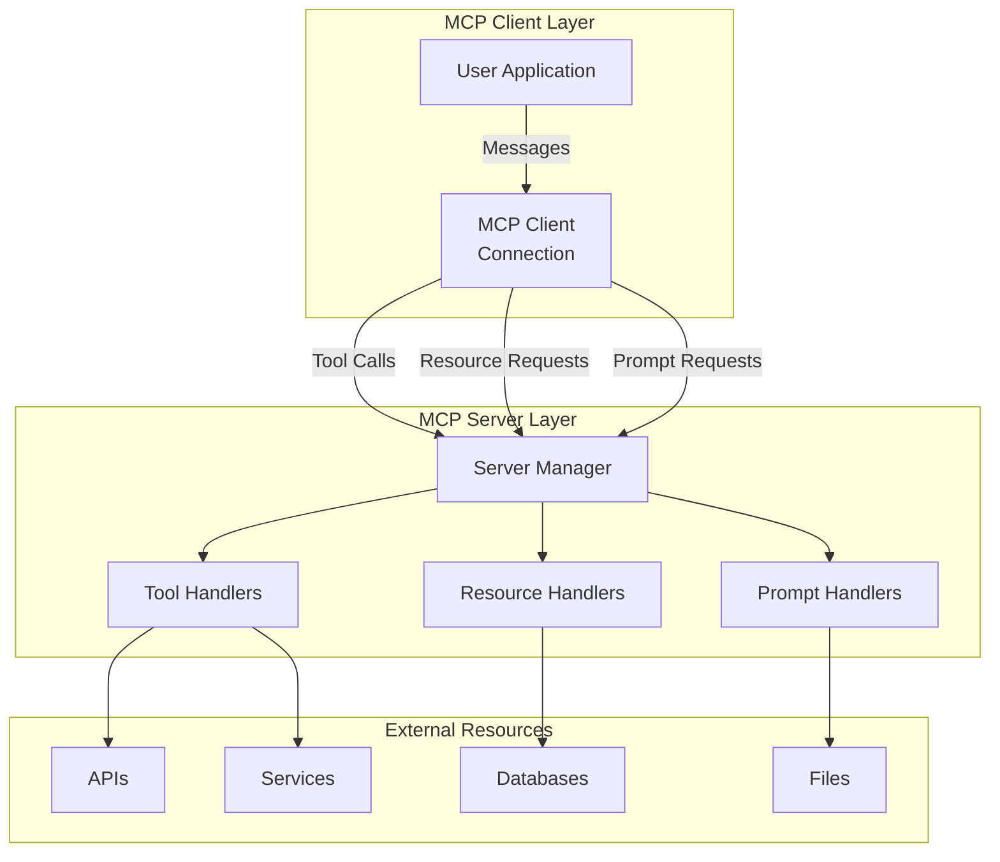

# Model Context Protocol (MCP)

## Learning Objectives 

- Introducing MCP
- MCP clients
- Project setup
- Defining tools with MCP
- The server inspector
- Implementing a client
- Defining resources
- Accessing resources
- Defining prompts
- Prompts in the client
- MCP review

---

## 1. Introducing MCP

### What is the Model Context Protocol?

The **Model Context Protocol (MCP)** is an open standard that enables AI models (like Claude) to interact safely and securely with external tools, services, and data sources. It provides a standardized way to:

- **Expose tools** to AI models
- **Share data** and resources
- **Define prompts** and templates
- **Manage security** and permissions

### Why MCP?



**Benefits:**
- **Standardized Integration**: Consistent way to connect AI models to tools
- **Security**: Controlled access to external resources
- **Flexibility**: Works with any AI client (Claude, other LLMs)
- **Scalability**: Easy to add new tools and resources

### Core Components of MCP

| Component | Purpose |
|-----------|---------|
| **MCP Server** | Exposes tools, resources, and prompts |
| **MCP Client** | Consumes the protocol (AI model application) |
| **Tools** | Functions that Claude can call |
| **Resources** | Data or files that can be shared |
| **Prompts** | Pre-built templates for common tasks |

---

## 2. MCP Clients

### Understanding MCP Clients

An **MCP Client** is any application that connects to an MCP Server to access its capabilities. Common clients include:

- **Claude Desktop App** (with MCP plugin support)
- **Custom Python/JavaScript applications**
- **IDE integrations**
- **Web applications**

### Client-Server Interaction Flow



### Key Client Responsibilities

1. **Discover** available tools and resources
2. **Call** tools with appropriate parameters
3. **Handle** responses and errors
4. **Manage** the connection lifecycle

---

## 3. Project Setup

### Prerequisites

```bash
# Required installations
- Python 3.8+
- pip (Python package manager)
- Node.js (optional, for JS-based MCP servers)
```

### Setting Up an MCP Project

#### Step 1: Create Project Directory
```bash
mkdir my-mcp-project
cd my-mcp-project
python -m venv venv

# Activate virtual environment
# Windows
venv\Scripts\activate
# macOS/Linux
source venv/bin/activate
```

#### Step 2: Install MCP SDK
```bash
pip install mcp
pip install anthropic python-dotenv
```

#### Step 3: Create Project Structure
```
my-mcp-project/
├── server.py              # MCP Server implementation
├── client.py              # MCP Client implementation
├── requirements.txt       # Dependencies
├── .env                   # Environment variables
└── tools/
    ├── __init__.py
    └── calculator.py      # Example tool module
```

#### Step 4: Create requirements.txt
```
mcp>=0.1.0
anthropic>=0.7.0
python-dotenv>=1.0.0
```

---

## 4. Defining Tools with MCP

### What are MCP Tools?

Tools are functions that Claude can invoke. They're defined with:
- **Name**: Unique identifier
- **Description**: What the tool does
- **Parameters**: Input schema (using JSON Schema)
- **Handler**: The function that executes

### Tool Definition Structure

```python
from mcp.server import Server
from mcp.types import Tool, TextContent
import json

# Initialize server
server = Server("my-mcp-server")

# Define a tool
calculator_tool: Tool = {
    "name": "calculate",
    "description": "Perform mathematical calculations",
    "inputSchema": {
        "type": "object",
        "properties": {
            "operation": {
                "type": "string",
                "enum": ["add", "subtract", "multiply", "divide"],
                "description": "The operation to perform"
            },
            "x": {
                "type": "number",
                "description": "First number"
            },
            "y": {
                "type": "number",
                "description": "Second number"
            }
        },
        "required": ["operation", "x", "y"]
    }
}

# Register tool handler
@server.call_tool()
async def handle_calculate(name: str, arguments: dict):
    if name != "calculate":
        raise ValueError(f"Unknown tool: {name}")
    
    operation = arguments.get("operation")
    x = arguments.get("x")
    y = arguments.get("y")
    
    if operation == "add":
        result = x + y
    elif operation == "subtract":
        result = x - y
    elif operation == "multiply":
        result = x * y
    elif operation == "divide":
        result = x / y if y != 0 else None
    
    return [TextContent(type="text", text=f"Result: {result}")]
```

### Tool Definition Workflow



### Best Practices for Tools

```python
# ✅ Good: Clear, descriptive tool definition
search_tool = {
    "name": "search_database",
    "description": "Search the customer database by name or email. Returns matching records with ID, name, email, and status.",
    "inputSchema": {
        "type": "object",
        "properties": {
            "query": {
                "type": "string",
                "description": "Search term (name or email)"
            },
            "limit": {
                "type": "integer",
                "description": "Maximum results to return (default: 10)",
                "default": 10
            }
        },
        "required": ["query"]
    }
}

# ❌ Avoid: Vague descriptions
bad_tool = {
    "name": "search",
    "description": "Search",  # Too vague!
    "inputSchema": {}  # Missing parameters
}
```

---

## 5. The Server Inspector

### What is the Server Inspector?

The **Server Inspector** is a development tool that helps you:
- Test MCP servers locally
- View available tools and resources
- Debug tool calls
- Verify server configuration

### Using the Server Inspector

```bash
# In VS Code or MCP-compatible environment
# The inspector provides:
# 1. Tool browser - see all available tools
# 2. Tool tester - call tools with test parameters
# 3. Response viewer - inspect tool results
# 4. Error diagnostics - debug issues
```

### Inspector Workflow



---

## 6. Implementing a Client

### Creating an MCP Client

An MCP Client connects to a server and calls its tools. Here's a complete implementation:

```python
from anthropic import Anthropic
from mcp import ClientSession
import json

class MCPClient:
    def __init__(self, server_script_path: str):
        self.client = Anthropic()
        self.session = None
        self.tools = []
        self.server_script_path = server_script_path
    
    async def connect(self):
        """Connect to MCP server"""
        # Initialize client session with server
        self.session = ClientSession(self.server_script_path)
        await self.session.connect()
        
        # Fetch available tools
        response = await self.session.call_tool("list_tools", {})
        self.tools = response.get("tools", [])
        print(f"Connected. Available tools: {len(self.tools)}")
    
    async def chat(self, user_message: str):
        """Send message and handle tool calls"""
        messages = [
            {"role": "user", "content": user_message}
        ]
        
        # Convert MCP tools to Claude tools format
        claude_tools = self._convert_tools()
        
        while True:
            response = self.client.messages.create(
                model="claude-3-5-sonnet-20241022",
                max_tokens=1024,
                tools=claude_tools,
                messages=messages
            )
            
            # Check if Claude wants to use a tool
            if response.stop_reason == "tool_use":
                # Process tool calls
                for block in response.content:
                    if block.type == "tool_use":
                        tool_result = await self._execute_tool(
                            block.name,
                            block.input
                        )
                        messages.append({
                            "role": "assistant",
                            "content": response.content
                        })
                        messages.append({
                            "role": "user",
                            "content": [
                                {
                                    "type": "tool_result",
                                    "tool_use_id": block.id,
                                    "content": tool_result
                                }
                            ]
                        })
            else:
                # Claude finished - return response
                return response.content[0].text
    
    async def _execute_tool(self, name: str, arguments: dict):
        """Call tool on MCP server"""
        result = await self.session.call_tool(name, arguments)
        return json.dumps(result)
    
    def _convert_tools(self):
        """Convert MCP tools to Claude tools format"""
        return [
            {
                "name": tool["name"],
                "description": tool["description"],
                "input_schema": tool.get("inputSchema", {})
            }
            for tool in self.tools
        ]
    
    async def disconnect(self):
        """Close server connection"""
        if self.session:
            await self.session.disconnect()
```

### Client Interaction Workflow



---

## 7. Defining Resources

### What are Resources?

Resources are data sources that Claude can read and reference. They include:
- Files and documents
- Database records
- API data
- Configuration files

### Defining Resources

```python
from mcp.server import Server
from mcp.types import Resource, TextContent

server = Server("my-resource-server")

# Define a resource
customer_database_resource: Resource = {
    "uri": "database://customers",
    "name": "Customer Database",
    "description": "Access to the company's customer database",
    "mimeType": "application/json"
}

# Register resource handler
@server.read_resource()
async def handle_read_resource(uri: str):
    if uri == "database://customers":
        # Fetch customer data
        customer_data = {
            "customers": [
                {"id": 1, "name": "Alice", "email": "alice@example.com"},
                {"id": 2, "name": "Bob", "email": "bob@example.com"}
            ]
        }
        return [TextContent(
            type="text",
            text=json.dumps(customer_data, indent=2)
        )]
    else:
        raise ValueError(f"Unknown resource: {uri}")
```

### Resource Definition Workflow



---

## 8. Accessing Resources

### How Claude Accesses Resources

```python
# When Claude needs data from a resource, it requests it
# The client handles the request:

async def access_resource(resource_uri: str):
    """Access a resource from MCP server"""
    response = await session.read_resource(resource_uri)
    return response[0].text

# Example usage:
customer_data = await access_resource("database://customers")
print(customer_data)  # Raw customer data as JSON
```

### Resource Access Flow



### Complete Resource Example

```python
from pathlib import Path
import json

# Define file-based resource
@server.list_resources()
async def handle_list_resources():
    return [
        {
            "uri": "file://docs/README.md",
            "name": "README",
            "description": "Project documentation"
        },
        {
            "uri": "file://config/settings.json",
            "name": "Settings",
            "description": "Application configuration"
        }
    ]

@server.read_resource()
async def handle_read_resource(uri: str):
    if uri.startswith("file://"):
        file_path = Path(uri.replace("file://", ""))
        if file_path.exists():
            content = file_path.read_text()
            return [TextContent(type="text", text=content)]
    
    raise ValueError(f"Resource not found: {uri}")
```

---

## 9. Defining Prompts

### What are Prompts?

Prompts are pre-built templates that help Claude perform specific tasks. They:
- Provide consistent instructions
- Include best practices
- Can reference tools and resources
- Are reusable across sessions

### Defining Prompts

```python
from mcp.server import Server
from mcp.types import Prompt

server = Server("my-prompt-server")

# Define a prompt
analysis_prompt: Prompt = {
    "name": "analyze_document",
    "description": "Analyze a document and extract key insights",
    "arguments": [
        {
            "name": "document_path",
            "description": "Path to the document to analyze",
            "required": True
        },
        {
            "name": "analysis_type",
            "description": "Type of analysis: summary, sentiment, entities",
            "required": False
        }
    ]
}

# Register prompt handler
@server.get_prompt()
async def handle_get_prompt(name: str, arguments: dict):
    if name == "analyze_document":
        doc_path = arguments.get("document_path")
        analysis_type = arguments.get("analysis_type", "summary")
        
        prompt_text = f"""
Analyze the document at {doc_path}.

Analysis Type: {analysis_type}

Instructions:
1. Read and understand the document
2. Extract key information
3. Provide insights based on the analysis type
4. Use the available tools to gather additional context if needed

Provide a structured analysis with clear sections.
        """
        
        return {
            "messages": [
                {
                    "role": "user",
                    "content": prompt_text
                }
            ]
        }
```

### Prompt Definition Workflow



---

## 10. Prompts in the Client

### Using Prompts in Client Applications

```python
class MCPClient:
    async def get_prompt(self, prompt_name: str, arguments: dict = None):
        """Retrieve a prompt from the MCP server"""
        if arguments is None:
            arguments = {}
        
        response = await self.session.get_prompt(prompt_name, arguments)
        return response["messages"]
    
    async def run_prompt(self, prompt_name: str, arguments: dict = None):
        """Run a prompt to get Claude's response"""
        messages = await self.get_prompt(prompt_name, arguments)
        
        response = self.client.messages.create(
            model="claude-3-5-sonnet-20241022",
            max_tokens=2048,
            messages=messages,
            tools=self._convert_tools()
        )
        
        return response.content[0].text

# Usage
client = MCPClient("server.py")
await client.connect()

# Run a prompt
result = await client.run_prompt(
    "analyze_document",
    {
        "document_path": "docs/report.pdf",
        "analysis_type": "summary"
    }
)
print(result)

await client.disconnect()
```

### Prompt Execution Flow



---

## 11. MCP Review

### Key Concepts Summary

| Concept | Purpose | Example |
|---------|---------|---------|
| **Server** | Exposes capabilities | Calculator MCP server |
| **Client** | Connects and uses capabilities | Claude app, Python script |
| **Tool** | Callable function | calculate, search_database |
| **Resource** | Readable data source | database://customers |
| **Prompt** | Pre-built instruction template | analyze_document |

### Complete MCP Architecture



### Best Practices Checklist

```
✅ Tool Definition
   □ Clear, descriptive names
   □ Detailed descriptions
   □ Well-defined input schemas
   □ Error handling
   □ Efficient implementations

✅ Resource Management
   □ Organized URI structure
   □ Meaningful names
   □ Clear descriptions
   □ Secure access controls
   □ Proper error messages

✅ Prompt Design
   □ Specific instructions
   □ Clear objectives
   □ Argument documentation
   □ Consistent formatting
   □ Error guidance

✅ Server Implementation
   □ Proper error handling
   □ Clear logging
   □ Resource cleanup
   □ Security considerations
   □ Performance optimization

✅ Client Implementation
   □ Connection management
   □ Tool call handling
   □ Error recovery
   □ Message context management
   □ Resource lifecycle
```

### Common Patterns

#### Pattern 1: Tool Chaining
```python
# Client chains multiple tool calls
# to accomplish a complex task

result1 = await client.call_tool("search", {"query": "users"})
result2 = await client.call_tool("analyze", {"data": result1})
result3 = await client.call_tool("report", {"analysis": result2})
```

#### Pattern 2: Resource-Backed Tools
```python
# Tool that reads from resource first
# then processes the data

@server.call_tool()
async def analyze_all_customers(name: str, arguments: dict):
    # Read resource
    customer_data = await read_resource("database://customers")
    
    # Process data
    analysis = perform_analysis(customer_data)
    
    return analysis
```

#### Pattern 3: Prompt-Guided Tool Use
```python
# Prompt guides Claude on which tools to use
# Client executes the guidance

prompt = await client.get_prompt("data_analysis")
# Prompt contains: "Use search_tool to find data, 
#                   then use analyze_tool to process"

response = await claude_with_tools(prompt, available_tools)
```

### Troubleshooting Guide

| Issue | Cause | Solution |
|-------|-------|----------|
| Tool not found | Tool not registered | Check `@server.call_tool()` decorator |
| Invalid parameters | Schema mismatch | Verify JSON schema matches usage |
| Resource not accessible | URI incorrect | Check resource URI format |
| Timeout | Long operation | Implement async handlers |
| Authentication fails | Missing credentials | Check .env and client config |

### Summary

MCP provides a powerful, standardized way to connect AI models to tools and data. By:

1. **Defining tools** for Claude to call
2. **Exposing resources** for context
3. **Creating prompts** for common tasks
4. **Implementing clients** that manage interactions

You build extensible, maintainable AI applications that can scale and adapt to new requirements.


## Common Questions About MCP 

1. **Who Authors MCP Servers?**
Anyone can create an MCP server implementation. Often, service providers themselves will make their own official MCP implementations. For example, AWS might release an official MCP server with tools for their various services.

2. **How is MCP Different from Direct API Calls?**
MCP servers provide tool schemas and functions already defined for you. If you call an API directly, you're responsible for authoring those tool definitions yourself. MCP saves you that implementation work.

3. **Isn't MCP Just Tool Use?**
This is a common misconception. MCP servers and tool use are complementary but different concepts. MCP is about who does the work of creating and maintaining the tools. With MCP, someone else has already written the tool functions and schemas for you - they're packaged inside the MCP server.

The key insight is that MCP servers provide tool schemas and functions already defined for you, eliminating the need to build and maintain complex integrations yourself.