# Model Context Protocol 
---

## Learning Objectives

By the end of this guide, you will be able to:

- **Understand** the Model Context Protocol and why it matters for AI applications
- **Recognize** the problem MCP solves compared to direct API calls and tool definitions
- **Explain** the architecture of MCP clients and servers
- **Implement** an MCP server using the Python SDK with tools, resources, and prompts
- **Build** an MCP client that communicates with MCP servers
- **Create** tools that Claude can use to interact with external services
- **Define** resources to expose data efficiently
- **Design** prompts that provide high-quality instructions to AI models
- **Test** MCP servers and clients using the MCP Inspector
- **Integrate** MCP into real-world applications

---

## 1. Introducing MCP 

Model Context Protocol (MCP) is a communication layer that provides Claude with context and tools without requiring you to write a bunch of tedious integration code. Think of it as a way to shift the burden of tool definitions and execution away from your server to specialized MCP servers.

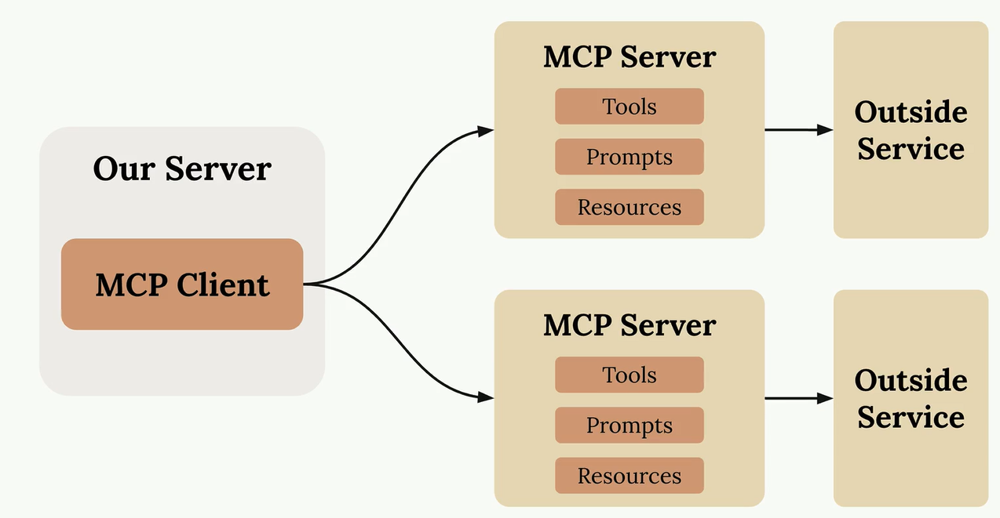

When you first encounter MCP, you'll see diagrams showing the basic architecture: an MCP Client (your server) connecting to MCP Servers that contain tools, prompts, and resources. Each MCP server acts as an interface to some outside service.

### 1.1 Understanding MCP Through a Real Example

Let's say you're building a chat interface where users can ask Claude about their GitHub data. A user might ask "What open pull requests are there across all my repositories?" To answer this, Claude needs tools to access GitHub's API.

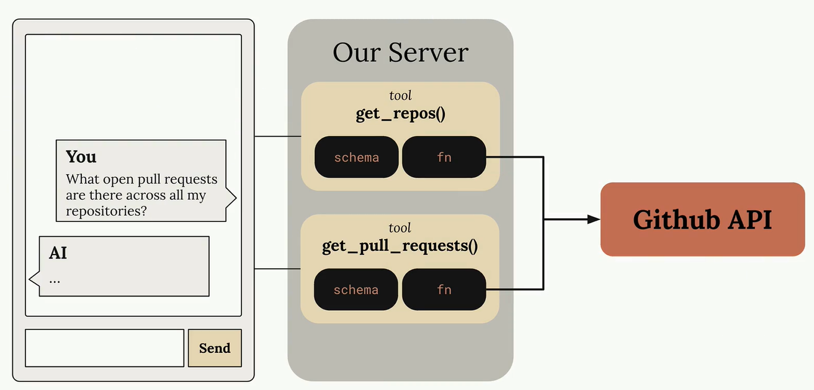

Without MCP, you'd need to create all the GitHub integration tools yourself. This means writing schemas and functions for every piece of GitHub functionality you want to support.

### 1.2 The Tool Function Problem

GitHub has massive functionality - repositories, pull requests, issues, projects, and much more. To build a complete GitHub chatbot, you'd need to author an incredible number of tools:

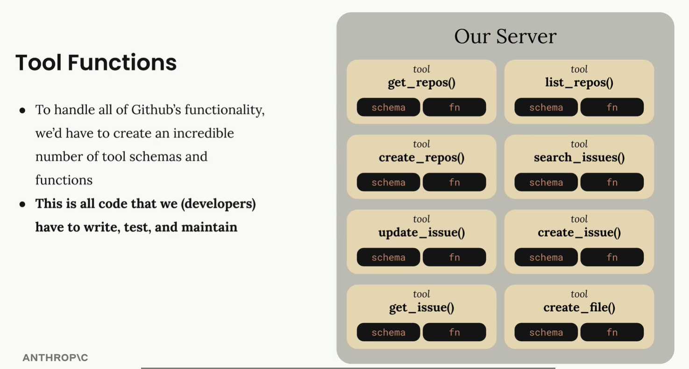

Each tool requires both a schema definition and a function implementation. This represents a lot of code that you have to write, test, and maintain as a developer.

### 1.3 How MCP Solves This

MCP shifts the burden of tool definitions and execution from your server to MCP servers. Instead of you writing all those GitHub tools, they're authored and executed inside a dedicated MCP server.

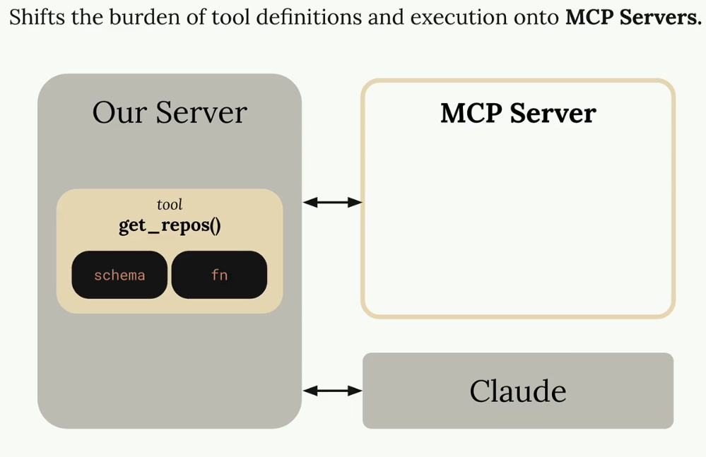

The MCP server acts as a wrapper around GitHub's functionality, providing pre-built tools that you can use without having to implement them yourself.

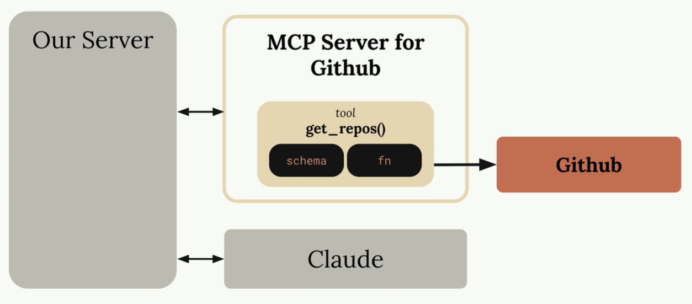

MCP servers provide access to data or functionality implemented by outside services. They package up complex integrations into reusable components that any application can connect to.

### 1.4 Common Questions About MCP

**1. Who Authors MCP Servers?**
Anyone can create an MCP server implementation. Often, service providers themselves will make their own official MCP implementations. For example, AWS might release an official MCP server with tools for their various services.

**2. How is MCP Different from Direct API Calls?**
MCP servers provide tool schemas and functions already defined for you. If you call an API directly, you're responsible for authoring those tool definitions yourself. MCP saves you that implementation work.

**3. Isn't MCP Just Tool Use?**
This is a common misconception. MCP servers and tool use are complementary but different concepts. MCP is about who does the work of creating and maintaining the tools. With MCP, someone else has already written the tool functions and schemas for you - they're packaged inside the MCP server.

The key insight is that MCP servers provide tool schemas and functions already defined for you, eliminating the need to build and maintain complex integrations yourself.

---

## 2. MCP Clients 

The MCP client serves as the communication bridge between your server and MCP servers. Think of it as your access point to all the tools that an MCP server provides. When you need to use external tools or services, the client handles all the message passing and protocol details for you.

### 2.1 Transport Agnostic Communication

One of MCP's key strengths is being transport agnostic - a fancy way of saying the client and server can talk to each other using different communication methods. The most common setup runs both the MCP client and server on the same machine, where they communicate through standard input/output.

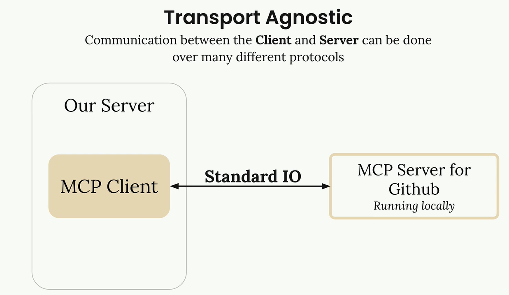

But you're not limited to that approach. MCP clients and servers can also connect over:

- HTTP
- WebSockets
- Various other network protocols

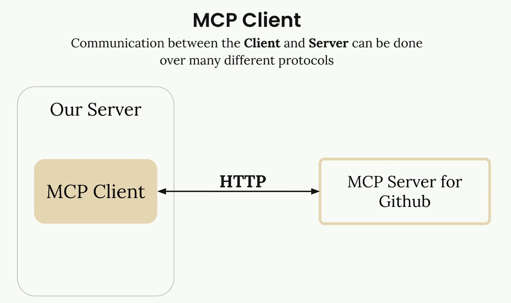

### 2.2 Message Types

Once connected, the client and server exchange specific message types defined in the MCP specification. The main message types you'll work with are:

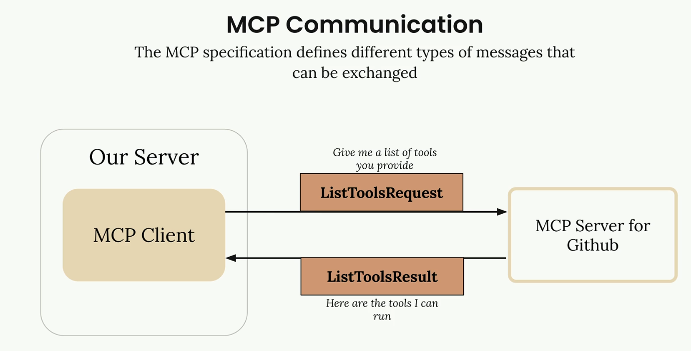

ListToolsRequest/ListToolsResult: The client asks the server "what tools do you provide?" and gets back a list of available tools.


CallToolRequest/CallToolResult: The client asks the server to run a specific tool with certain arguments, then receives the results.

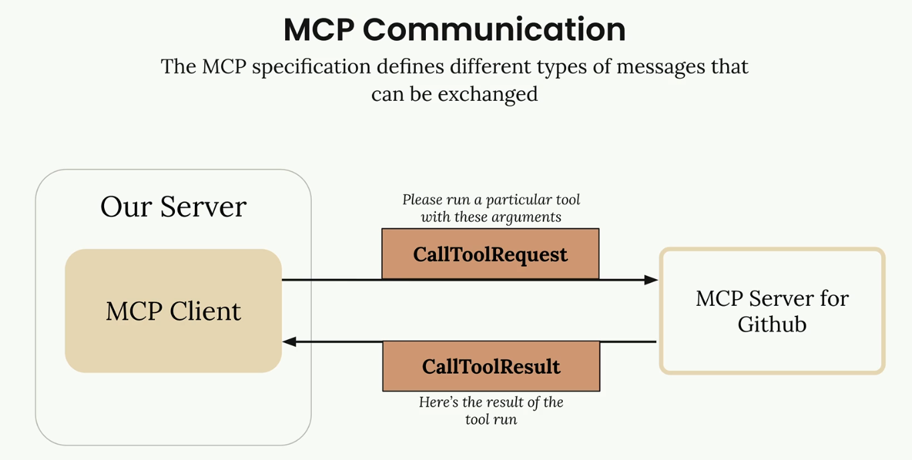

### 2.3 Complete Flow Example 

Here's how all the pieces work together in a real scenario. Let's say a user asks "What repositories do I have?" - here's the complete communication flow built step by step:

---

#### Step 1: User Submits Query

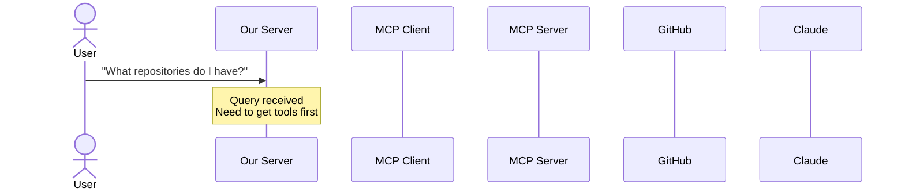
```mermaid
sequenceDiagram
    actor User
    participant Server as Our Server
    participant MCPClient as MCP Client
    participant MCPServer as MCP Server
    participant GitHub
    participant Claude
    
    User->>Server: "What repositories do I have?"
    Note over Server: Query received<br/>Need to get tools first
```

The process starts when a user submits a query to your server. Your server realizes it needs to provide Claude with a list of available tools before making the request.

---

#### Step 2: Discover Available Tools

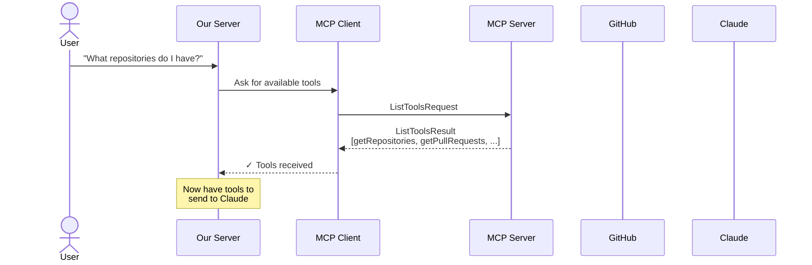
```mermaid
sequenceDiagram
    actor User
    participant Server as Our Server
    participant MCPClient as MCP Client
    participant MCPServer as MCP Server
    participant GitHub
    participant Claude
    
    User->>Server: "What repositories do I have?"
    Server->>MCPClient: Ask for available tools
    MCPClient->>MCPServer: ListToolsRequest
    MCPServer-->>MCPClient: ListToolsResult<br/>[getRepositories, getPullRequests, ...]
    MCPClient-->>Server: ✓ Tools received
    Note over Server: Now have tools to<br/>send to Claude
```

Your server asks the MCP client for tools, which sends a `ListToolsRequest` to the MCP server and receives a `ListToolsResult` back containing all available GitHub operations.

---

#### Step 3: Send Query & Tools to Claude

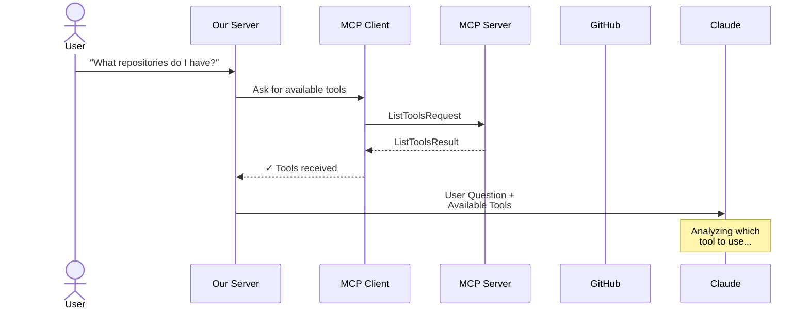
```mermaid
sequenceDiagram
    actor User
    participant Server as Our Server
    participant MCPClient as MCP Client
    participant MCPServer as MCP Server
    participant GitHub
    participant Claude
    
    User->>Server: "What repositories do I have?"
    Server->>MCPClient: Ask for available tools
    MCPClient->>MCPServer: ListToolsRequest
    MCPServer-->>MCPClient: ListToolsResult
    MCPClient-->>Server: ✓ Tools received
    
    Server->>Claude: User Question +<br/>Available Tools
    Note over Claude: Analyzing which<br/>tool to use...
```

Now your server has everything needed to make the initial request to Claude - both the user's question and the available tools. Claude receives this context and starts analyzing.

---

#### Step 4: Claude Decides to Use Tool

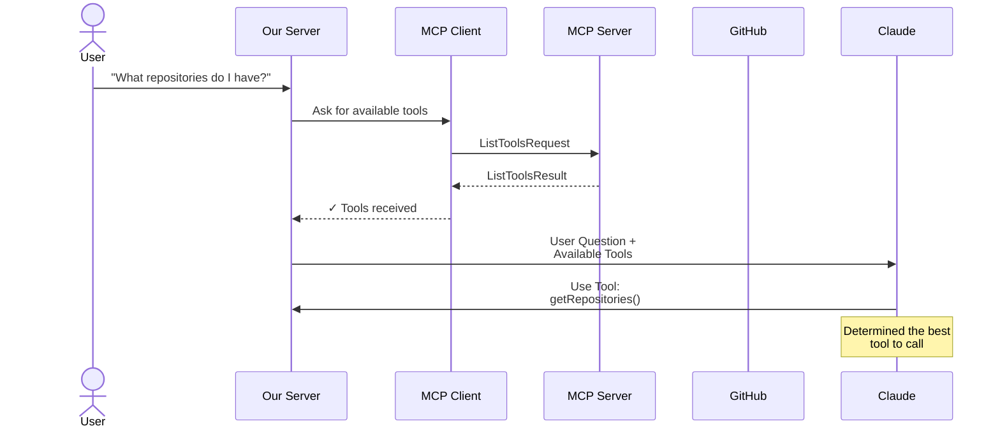
```mermaid
sequenceDiagram
    actor User
    participant Server as Our Server
    participant MCPClient as MCP Client
    participant MCPServer as MCP Server
    participant GitHub
    participant Claude
    
    User->>Server: "What repositories do I have?"
    Server->>MCPClient: Ask for available tools
    MCPClient->>MCPServer: ListToolsRequest
    MCPServer-->>MCPClient: ListToolsResult
    MCPClient-->>Server: ✓ Tools received
    
    Server->>Claude: User Question +<br/>Available Tools
    Claude->>Server: Use Tool:<br/>getRepositories()
    Note over Claude: Determined the best<br/>tool to call
```

Claude examines the tools and decides it needs to call the `getRepositories` tool to answer the question. It responds with a tool use request.

---

#### Step 5: Execute Tool Request

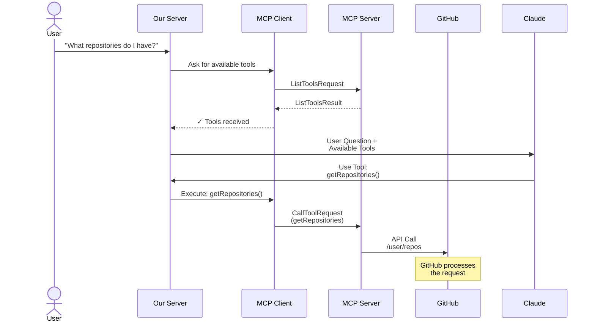
```mermaid
sequenceDiagram
    actor User
    participant Server as Our Server
    participant MCPClient as MCP Client
    participant MCPServer as MCP Server
    participant GitHub
    participant Claude
    
    User->>Server: "What repositories do I have?"
    Server->>MCPClient: Ask for available tools
    MCPClient->>MCPServer: ListToolsRequest
    MCPServer-->>MCPClient: ListToolsResult
    MCPClient-->>Server: ✓ Tools received
    
    Server->>Claude: User Question +<br/>Available Tools
    Claude->>Server: Use Tool:<br/>getRepositories()
    
    Server->>MCPClient: Execute: getRepositories()
    MCPClient->>MCPServer: CallToolRequest<br/>(getRepositories)
    MCPServer->>GitHub: API Call<br/>/user/repos
    Note over GitHub: GitHub processes<br/>the request
```

Your server asks the MCP client to execute the tool Claude requested. The MCP client sends a `CallToolRequest` to the MCP server, which then makes the actual request to the GitHub API.

---

#### Step 6: Tool Results Return

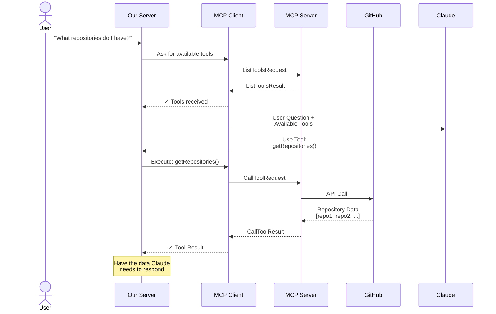
```mermaid
sequenceDiagram
    actor User
    participant Server as Our Server
    participant MCPClient as MCP Client
    participant MCPServer as MCP Server
    participant GitHub
    participant Claude
    
    User->>Server: "What repositories do I have?"
    Server->>MCPClient: Ask for available tools
    MCPClient->>MCPServer: ListToolsRequest
    MCPServer-->>MCPClient: ListToolsResult
    MCPClient-->>Server: ✓ Tools received
    
    Server->>Claude: User Question +<br/>Available Tools
    Claude->>Server: Use Tool:<br/>getRepositories()
    
    Server->>MCPClient: Execute: getRepositories()
    MCPClient->>MCPServer: CallToolRequest
    MCPServer->>GitHub: API Call
    GitHub-->>MCPServer: Repository Data<br/>[repo1, repo2, ...]
    MCPServer-->>MCPClient: CallToolResult
    MCPClient-->>Server: ✓ Tool Result
    Note over Server: Have the data Claude<br/>needs to respond
```

GitHub returns the repository data, which flows back through the MCP server as a `CallToolResult`, then to the MCP client, and finally to your server.

---

#### Step 7: Send Results Back to Claude

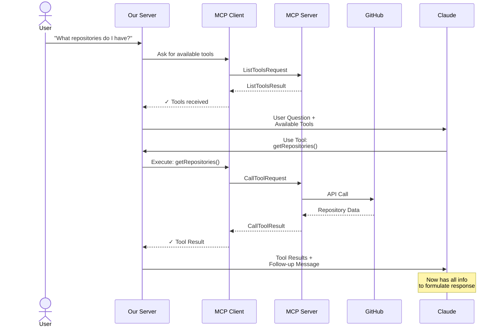
```mermaid
sequenceDiagram
    actor User
    participant Server as Our Server
    participant MCPClient as MCP Client
    participant MCPServer as MCP Server
    participant GitHub
    participant Claude
    
    User->>Server: "What repositories do I have?"
    Server->>MCPClient: Ask for available tools
    MCPClient->>MCPServer: ListToolsRequest
    MCPServer-->>MCPClient: ListToolsResult
    MCPClient-->>Server: ✓ Tools received
    
    Server->>Claude: User Question +<br/>Available Tools
    Claude->>Server: Use Tool:<br/>getRepositories()
    
    Server->>MCPClient: Execute: getRepositories()
    MCPClient->>MCPServer: CallToolRequest
    MCPServer->>GitHub: API Call
    GitHub-->>MCPServer: Repository Data
    MCPServer-->>MCPClient: CallToolResult
    MCPClient-->>Server: ✓ Tool Result
    
    Server->>Claude: Tool Results +<br/>Follow-up Message
    Note over Claude: Now has all info<br/>to formulate response
```

Your server sends the tool results back to Claude in a follow-up message. Claude now has all the information it needs to formulate a complete response.

---

#### Step 8: Final Response to User

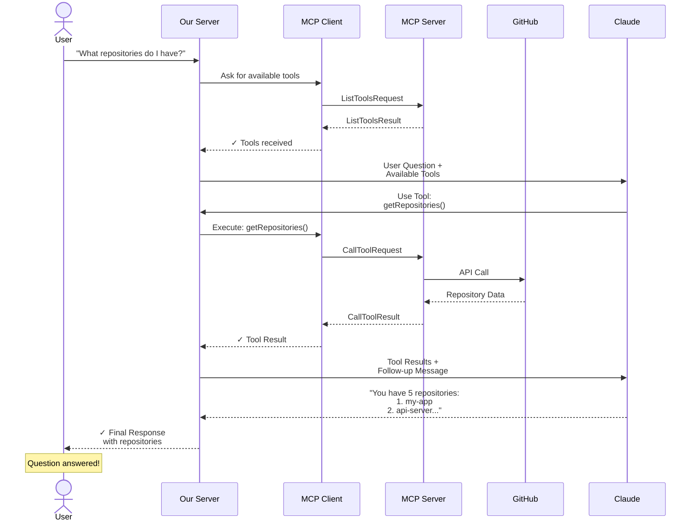
```mermaid
sequenceDiagram
    actor User
    participant Server as Our Server
    participant MCPClient as MCP Client
    participant MCPServer as MCP Server
    participant GitHub
    participant Claude
    
    User->>Server: "What repositories do I have?"
    Server->>MCPClient: Ask for available tools
    MCPClient->>MCPServer: ListToolsRequest
    MCPServer-->>MCPClient: ListToolsResult
    MCPClient-->>Server: ✓ Tools received
    
    Server->>Claude: User Question +<br/>Available Tools
    Claude->>Server: Use Tool:<br/>getRepositories()
    
    Server->>MCPClient: Execute: getRepositories()
    MCPClient->>MCPServer: CallToolRequest
    MCPServer->>GitHub: API Call
    GitHub-->>MCPServer: Repository Data
    MCPServer-->>MCPClient: CallToolResult
    MCPClient-->>Server: ✓ Tool Result
    
    Server->>Claude: Tool Results +<br/>Follow-up Message
    Claude-->>Server: "You have 5 repositories:<br/>1. my-app<br/>2. api-server..."
    Server-->>User: ✓ Final Response<br/>with repositories
    Note over User: Question answered!
```

Claude responds with the formatted answer, which your server passes back to the user.

---

### Summary of All Steps

| Step | From | To | Message | Purpose |
|------|------|-----|---------|---------|
| **1** | User | Server | Query | Ask the question |
| **2** | Server | MCP Server | ListToolsRequest | Discover available tools |
| **2b** | MCP Server | Server | ListToolsResult | Receive tool catalog |
| **3** | Server | Claude | Query + Tools | Provide context to Claude |
| **4** | Claude | Server | Tool Use Request | Claude decides which tool to use |
| **5** | Server | MCP Server | CallToolRequest | Execute the requested tool |
| **5b** | MCP Server | GitHub | API Call | Get data from external service |
| **5c** | GitHub | MCP Server | Data Response | Return the requested data |
| **5d** | MCP Server | Server | CallToolResult | Return tool execution result |
| **6** | Server | Claude | Tool Results | Give Claude the tool output |
| **7** | Claude | Server | Final Response | Claude formulates answer |
| **8** | Server | User | Answer | Return result to user |

---

Yes, this flow involves many steps, but each component has a clear responsibility. The MCP client abstracts away the complexity of server communication, letting you focus on building your application logic. As we implement our own MCP client and server, you'll see how each piece fits together in practice.

---

## 3. Project Setup 

We're going to build a CLI-based chatbot to better understand how MCP clients and servers work together. This hands-on project will give you practical experience with both sides of the MCP architecture.

### What We're Building

Our chatbot will allow users to interact with a collection of documents through a command-line interface. The system consists of two main components:

- An MCP client that handles user interactions
- A custom MCP server that manages document operations

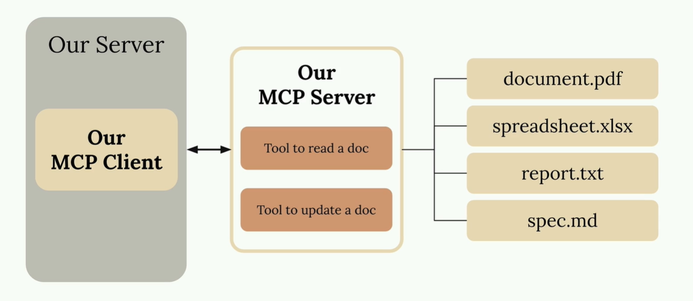

The server will provide two essential tools: one for reading document contents and another for updating them. All documents will be stored in memory for simplicity - no database required.

### 3.1 Important Architecture Note

In real-world projects, you typically implement either an MCP client or an MCP server, not both. You might create:

- An MCP server to expose your service to other developers
- An MCP client to connect to existing MCP servers

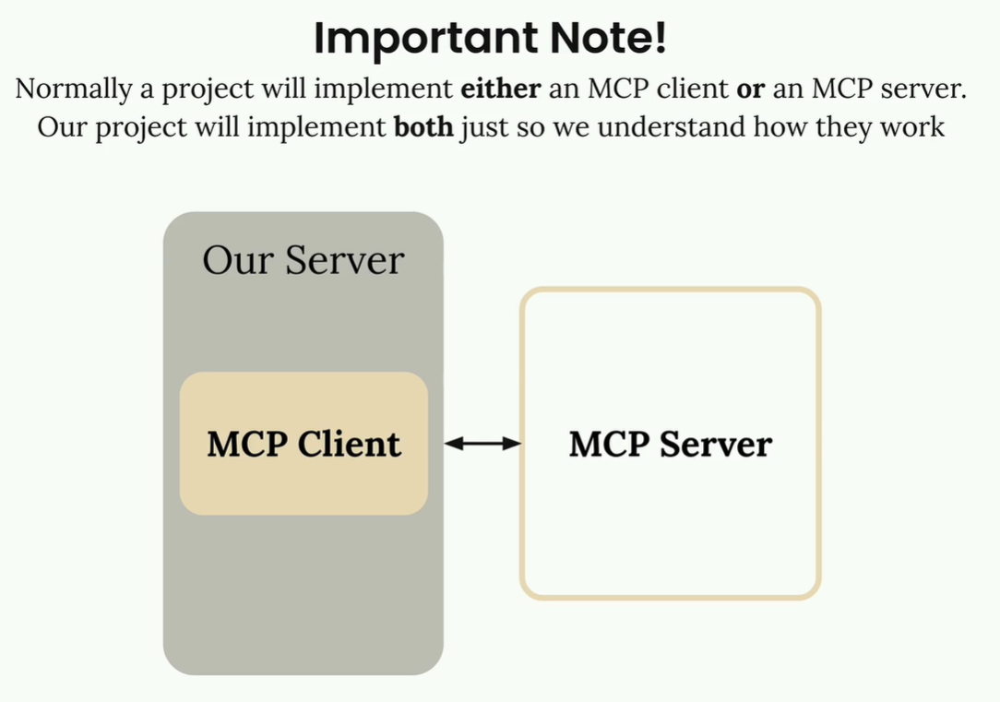

---

## 4. Defining Tools With 

Building an MCP server becomes much simpler when you use the official Python SDK. Instead of manually writing complex JSON schemas for tools, the SDK handles all that complexity for you with decorators and type hints.

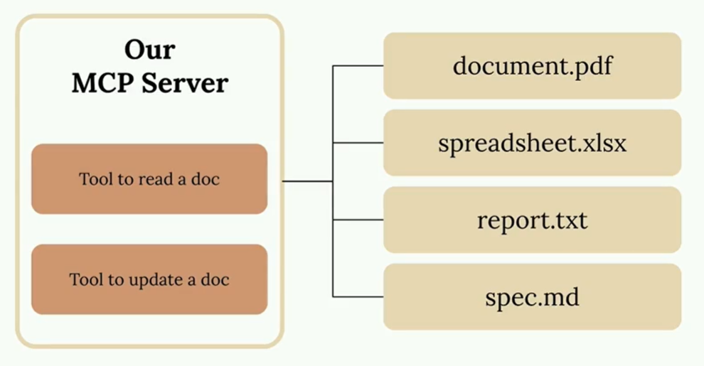

In this example, we're creating an MCP server that manages documents stored in memory. The server will provide two essential tools: one to read document contents and another to update them through find-and-replace operations.

### 4.1 Setting Up the MCP Server

The Python MCP SDK makes server creation incredibly straightforward. You can initialize a complete MCP server with just one line:

```python
from mcp.server.fastmcp import FastMCP

mcp = FastMCP("DocumentMCP", log_level="ERROR")
```

For this implementation, documents are stored in a simple Python dictionary where keys are document IDs and values contain the document content:

```python
docs = {
    "deposition.md": "This deposition covers the testimony of Angela Smith, P.E.",
    "report.pdf": "The report details the state of a 20m condenser tower.",
    "financials.docx": "These financials outline the project's budget and expenditure",
    "outlook.pdf": "This document presents the projected future performance of the",
    "plan.md": "The plan outlines the steps for the project's implementation.",
    "spec.txt": "These specifications define the technical requirements for the equipment"
}
``` 

### 4.2 Tool Definition with Decorators
The SDK transforms tool creation from a verbose process into something clean and readable. Instead of writing lengthy JSON schemas, you use Python decorators and type hints.

### 4.3 Creating the Document Reader Tool

The first tool allows Claude to read any document by its ID. Here's the complete implementation:

```python
@mcp.tool(
    name="read_doc_contents",
    description="Read the contents of a document and return it as a string."
)
def read_document(
    doc_id: str = Field(description="Id of the document to read")
):
    if doc_id not in docs:
        raise ValueError(f"Doc with id {doc_id} not found")
    
    return docs[doc_id]
``` 

The @mcp.tool decorator automatically generates the JSON schema that Claude needs. The Field class from Pydantic provides parameter descriptions that help Claude understand what each argument expects.

### 4.4 Building the Document Editor Tool

The second tool performs simple find-and-replace operations on documents:

```python
@mcp.tool(
    name="edit_document",
    description="Edit a document by replacing a string in the documents content with a new string."
)
def edit_document(
    doc_id: str = Field(description="Id of the document that will be edited"),
    old_str: str = Field(description="The text to replace. Must match exactly, including whitespace."),
    new_str: str = Field(description="The new text to insert in place of the old text.")
):
    if doc_id not in docs:
        raise ValueError(f"Doc with id {doc_id} not found")
    
    docs[doc_id] = docs[doc_id].replace(old_str, new_str)
``` 

This tool takes three parameters: the document ID, the text to find, and the replacement text. The implementation uses Python's built-in string replace() method for simplicity.

### 4.5 Error Handling

Both tools include basic error handling to manage cases where Claude requests a document that doesn't exist. When an invalid document ID is provided, the tools raise a ValueError with a descriptive message that Claude can understand and potentially act upon.

**Key Benefits of the SDK Approach** 

- Automatic JSON schema generation from Python type hints
- Clean, readable code that's easy to maintain
- Built-in parameter validation through Pydantic
- Reduced boilerplate compared to manual schema writing
- Type safety and IDE support for development

The MCP Python SDK transforms what used to be a complex process of writing tool definitions into something that feels natural for Python developers. You focus on the business logic while the SDK handles the protocol details.

---

## 5. The Server Inspector

When building MCP servers, you need a way to test your functionality without connecting to a full application. The Python MCP SDK includes a built-in browser-based inspector that lets you debug and test your server in real-time.

### 5.1 Starting the Inspector

First, make sure your Python environment is activated (check your project's README for the exact command). Then run the inspector with:

```
mcp dev mcp_server.py
```

This starts a development server on port 6277 and gives you a local URL to open in your browser. The inspector interface will load, showing the MCP Inspector dashboard.

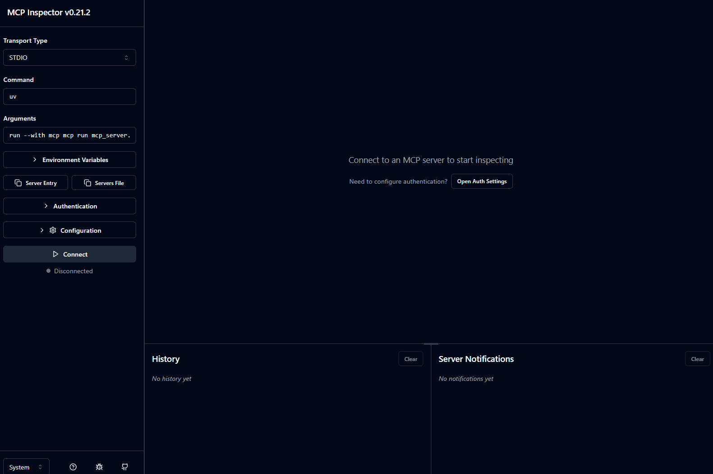

**Important Note About the Interface**

The MCP inspector is actively being developed, so the interface you see might look different from current screenshots. However, the core functionality for testing tools, resources, and prompts should remain similar.

### 5.2 Connecting and Testing Tools

Click the "Connect" button on the left side to start your MCP server. Once connected, you'll see a navigation bar with sections for Resources, Prompts, Tools, and other features.

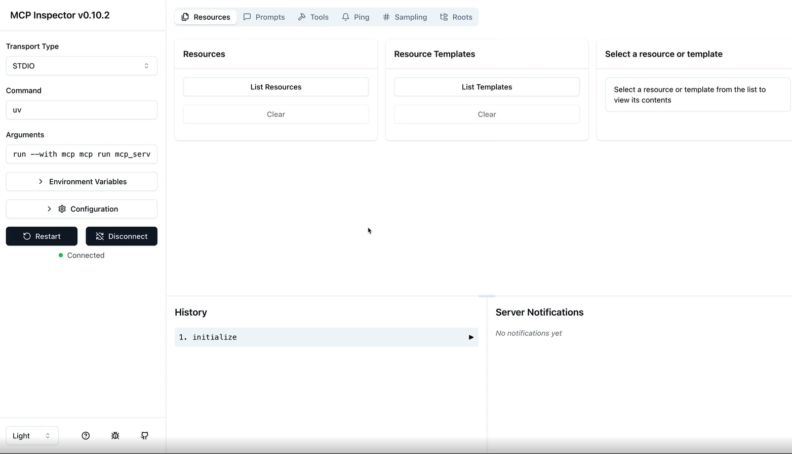

**To test your tools:**

- Navigate to the Tools section
- Click "List Tools" to see all available tools
- Select a tool to open its testing interface
- Fill in the required parameters
- Click "Run Tool" to execute and see results

### Testing Document Operations

For example, to test a document reading tool, you'd enter a document ID (like "deposition.md") and run the tool. The inspector shows the result, including any returned content or success messages.

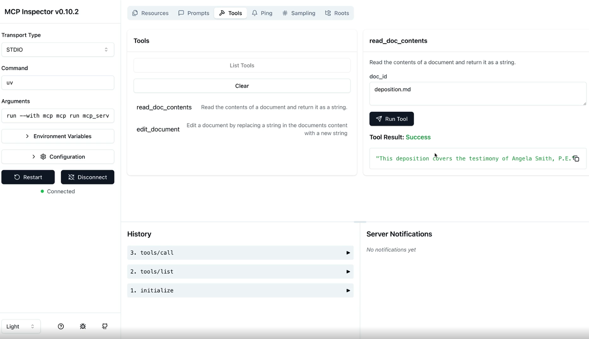

You can chain operations to verify functionality. For instance, after editing a document by replacing text, you can immediately run the read tool again to confirm the changes were applied correctly.

### 5.3 Development Workflow

The inspector creates an efficient development loop:

- Make changes to your MCP server code
- Test individual tools through the inspector
- Verify results without needing a full application setup
- Debug issues in isolation

This tool becomes essential as you build more complex MCP servers. It eliminates the need to wire up your server to Claude or another application just to test basic functionality, making development much faster and more focused.

---

## 6. Implementing a Client 

Now that we have our MCP server working, it's time to build the client side. The client is what allows our application to communicate with the MCP server and access its functionality.

### 6.1 Understanding the Client Architecture

In most real-world projects, you'll either implement an MCP client OR an MCP server - not both. We're building both in this project just so you can see how they work together.


The MCP client consists of two main components:

- MCP Client - A custom class we create to make using the session easier
- Client Session - The actual connection to the server (part of the MCP Python SDK)

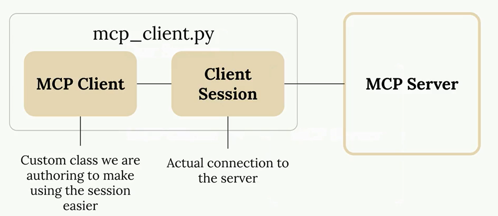

The client session requires proper resource cleanup when we're done with it. That's why we wrap it in our custom MCP Client class - to handle all that cleanup automatically.

### 6.2 How the Client Fits Into Our Application

Remember our application flow? Our CLI code needs to do two main things with the MCP server:

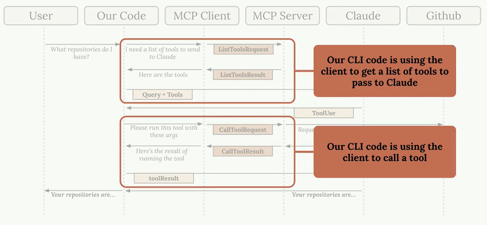

1. Get a list of available tools to send to Claude
2. Execute tools when Claude requests them
The MCP client provides these capabilities through simple method calls that our application code can use.

### 6.3 Implementing the Core Methods

We need to implement two key methods in our client: list_tools() and call_tool().

**List Tools Method**
This method gets all available tools from the server:

```python
async def list_tools(self) -> list[types.Tool]:
    result = await self.session().list_tools()
    return result.tools
```

It's straightforward - we access our session (the connection to the server), call the built-in list_tools() function, and return the tools from the result.

**Call Tool Method**
This method executes a specific tool on the server:

```python
async def call_tool(
    self, tool_name: str, tool_input: dict
) -> types.CallToolResult | None:
    return await self.session().call_tool(tool_name, tool_input)
```

We pass the tool name and input parameters (provided by Claude) to the server and return the result.

### 6.4 Testing the Client

To test our implementation, we can run the client directly. The file includes a testing harness that connects to our MCP server and calls our methods:

```python
async with MCPClient(
    command="uv", args=["run", "mcp_server.py"]
) as client:
    result = await client.list_tools()
    print(result)
```

When we run this test, we should see our tool definitions printed out, including the read_doc_contents and edit_document tools we created earlier.

### 6.5 Putting It All Together

Now that our client can list tools and call them, we can test the complete flow. When we run our main application and ask Claude about a document:

1. Our code uses the client to get available tools
2. These tools are sent to Claude along with the user's question
3. Claude decides to use the read_doc_contents tool
4. Our code uses the client to execute that tool
5. The result is sent back to Claude, who then responds to the user

For example, asking "What is the contents of the report.pdf document?" will trigger Claude to use our document reading tool, and we'll get back information about the 20m condenser tower document we set up in our server.

The client acts as the bridge between our application logic and the MCP server, making it easy to access server functionality without worrying about the underlying connection details.

---

## 7. Defining Resources

Resources in MCP servers allow you to expose data to clients, similar to GET request handlers in a typical HTTP server. They're perfect for scenarios where you need to fetch information rather than perform actions.

### 7.1 Understanding Resources Through an Example

Let's say you want to build a document mention feature where users can type @document_name to reference files. This requires two operations:

- Getting a list of all available documents (for autocomplete)
- Fetching the contents of a specific document (when mentioned)

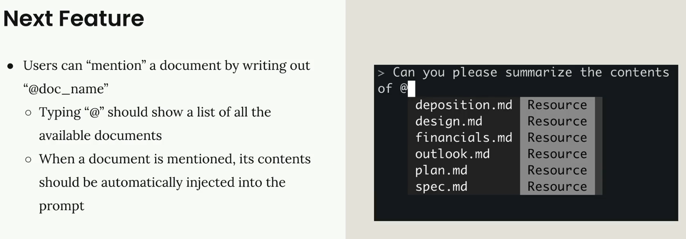

When a user types @, you need to show available documents. When they submit a message with a mention, you automatically inject that document's content into the prompt sent to Claude.

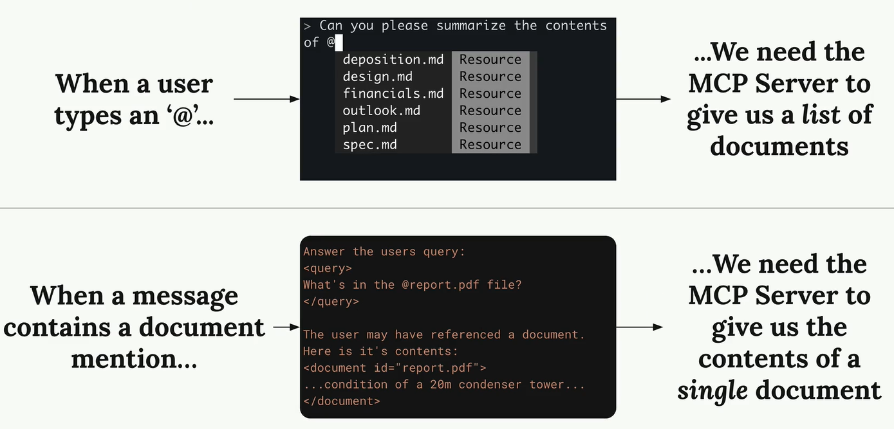

### 7.2 How Resources Work

Resources follow a request-response pattern. Your client sends a ReadResourceRequest with a URI, and the MCP server responds with the data. The URI acts like an address for the resource you want to access.

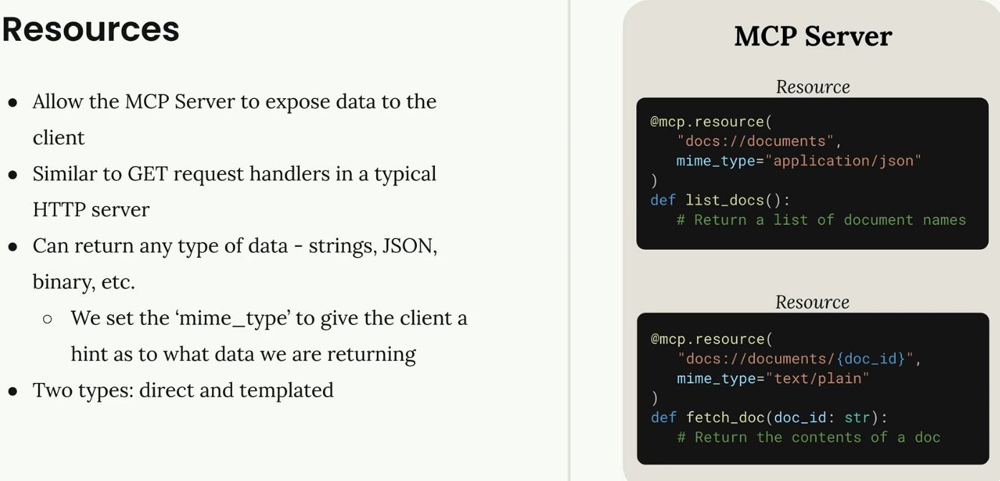

### 7.3 Types of Resources

There are two types of resources:

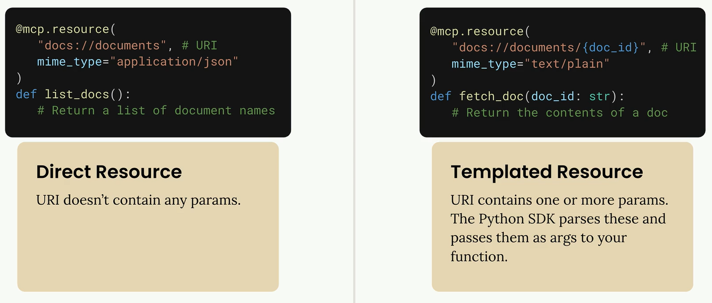

- Direct Resources: Static URIs that don't change, like docs://documents
- Templated Resources: URIs with parameters, like docs://documents/{doc_id}

For templated resources, the Python SDK automatically parses parameters from the URI and passes them as keyword arguments to your function.

**Implementing Resources**

Resources are defined using the @mcp.resource() decorator. Here's how to create both types:

### 7.4 Direct Resource
```python
@mcp.resource(
    "docs://documents",
    mime_type="application/json"
)
def list_docs() -> list[str]:
    return list(docs.keys())
```

2. Templated Resource (Fetch Document)
```python
@mcp.resource(
    "docs://documents/{doc_id}",
    mime_type="text/plain"
)
def fetch_doc(doc_id: str) -> str:
    if doc_id not in docs:
        raise ValueError(f"Doc with id {doc_id} not found")
    return docs[doc_id]
```

### 7.5 MIME Types

Resources can return any type of data - strings, JSON, binary, etc. The mime_type parameter gives clients a hint about what kind of data you're returning:

- application/json - Structured JSON data
- text/plain - Plain text content
- Any other valid MIME type for different data formats

The MCP Python SDK automatically serializes your return values. You don't need to manually convert to JSON strings.

### 7.6 Testing Resources

You can test your resources using the MCP Inspector. Run your server with:

```python
uv run mcp dev mcp_server.py
```

Then connect to the inspector in your browser. You'll see:


- Resources: Lists your direct/static resources
- Resource Templates: Shows templated resources that accept parameters

Click on any resource to test it and see the exact response structure your client will receive.

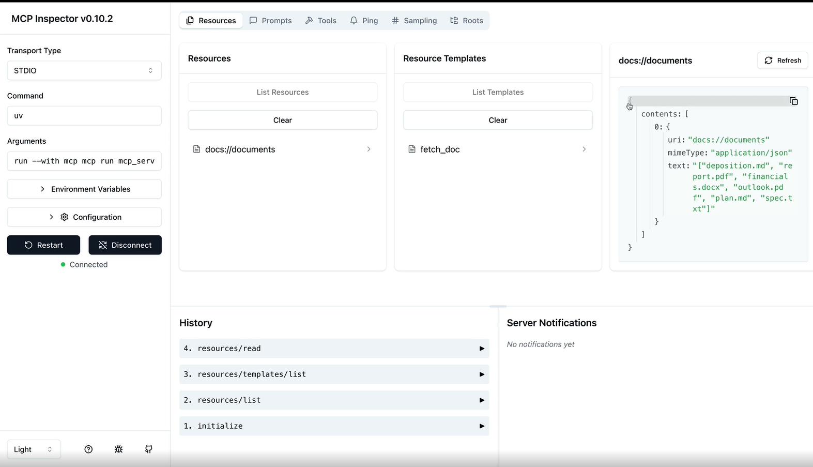

### Key Points

- Resources expose data, tools perform actions
- Use direct resources for static data, templated resources for parameterized queries
- MIME types help clients understand response format
- The SDK handles serialization automatically
- Parameter names in templated URIs become function arguments

Resources provide a clean way to make data available to MCP clients, enabling features like document mentions, file browsing, or any scenario where you need to fetch information from your server.

---

## 8. Accessing Resources

Resources in MCP allow your server to expose data that can be directly included in prompts, rather than requiring tool calls to access information. This creates a more efficient way to provide context to AI models like Claude.

### 8.1 Understanding Resource Requests

When you've defined resources on your MCP server, your client needs a way to request and use them. The client acts as a bridge between your application and the MCP server, handling the communication and data parsing automatically.

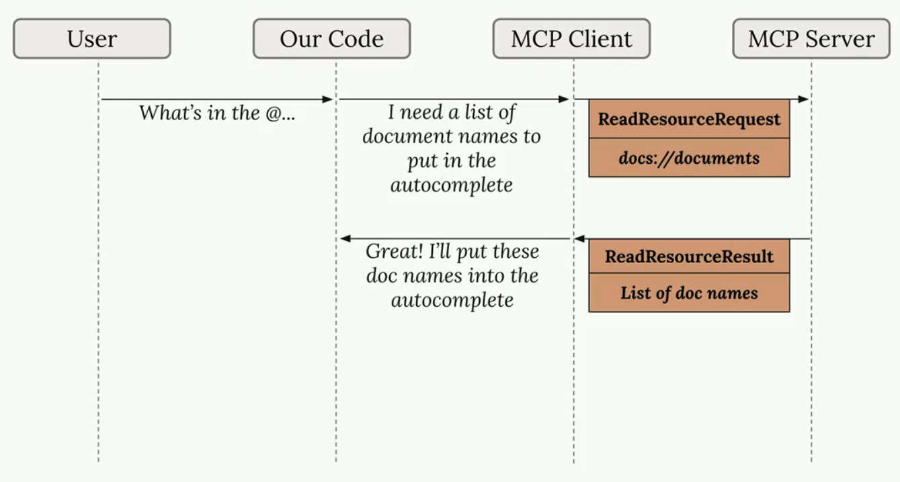

The flow is straightforward: when a user wants to reference a document (like typing "@report.pdf"), your application uses the MCP client to fetch that resource from the server and include its contents directly in the prompt sent to Claude.

**Implementing Resource Reading**

The core functionality requires a read_resource function in your MCP client. This function takes a URI parameter identifying which resource to fetch:

```python
async def read_resource(self, uri: str) -> Any:
    result = await self.session().read_resource(AnyUrl(uri))
    resource = result.contents[0]
The response from the MCP server contains a contents list. You typically only need the first element, which contains the actual resource data along with metadata like the MIME type.
```

### 8.2 Handling Different Content Types

Resources can return different types of content, so your client needs to parse them appropriately. The MIME type tells you how to handle the data:

```python
if isinstance(resource, types.TextResourceContents):
    if resource.mimeType == "application/json":
        return json.loads(resource.text)
    
    return resource.text
```

This approach ensures that JSON resources are properly parsed into Python objects, while plain text resources are returned as strings. The MIME type acts as your hint for determining the correct parsing strategy.

### 8.3 Required Imports

To make this work properly, you'll need these imports in your MCP client:

```python
import json
from pydantic import AnyUrl
```

The json module handles parsing JSON responses, while AnyUrl ensures proper type handling for the URI parameter.

### 8.4 Testing Resource Access 

Once implemented, you can test the functionality through your CLI application. When you type something like "What's in the @report.pdf document?", the system should:

- Show available resources in an autocomplete list
- Allow you to select a resource
- Fetch the resource content automatically
- Include that content in the prompt to Claude


The key advantage is that Claude receives the document content directly in the prompt, eliminating the need for tool calls to access the information. This makes interactions faster and more efficient.

### 8.5 Integration with Your Application

Remember that the MCP client code you write gets used by other parts of your application. The read_resource function becomes a building block that other components can call to fetch document contents, list available resources, or integrate resource data into prompts.

This separation of concerns keeps your code clean: the MCP client handles communication with the server, while your application logic focuses on how to use that data effectively.

---

## 9. Defining Prompts

Prompts in MCP servers let you define pre-built, high-quality instructions that clients can use instead of writing their own prompts from scratch. Think of them as carefully crafted templates that give better results than what users might come up with on their own.

### 9.1 Why Use Prompts?

Let's say you want Claude to reformat a document into markdown. A user could just type "convert report.pdf to markdown" and it would work fine. But they'd probably get much better results with a thoroughly tested prompt that includes specific instructions about formatting, structure, and output requirements.

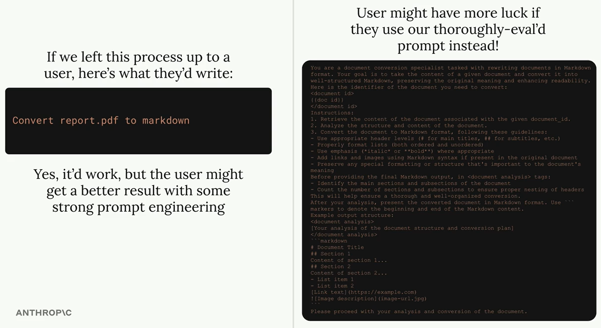

The key insight is that while users can accomplish these tasks on their own, they'll get more consistent and higher-quality results when using prompts that have been carefully developed and tested by the MCP server authors.

### 9.2 How Prompts Work

Prompts define a set of user and assistant messages that clients can use directly. When a client requests a prompt, your server returns a list of messages that can be sent straight to Claude.

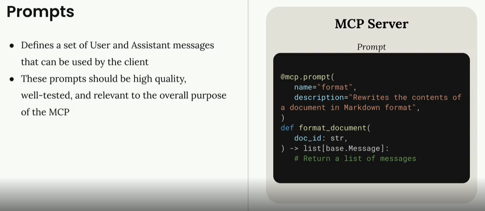

The basic structure looks like this:

- Define prompts using the @mcp.prompt() decorator
- Add a name and description for each prompt
- Return a list of messages that form the complete prompt
- These prompts should be high quality, well-tested, and relevant to your MCP server's purpose

### 9.3 Building a Format Command

Here's how to implement a document formatting prompt. First, you'll need to import the base message types:
```python
from mcp.server.fastmcp import base
```
Then define your prompt function:
```python
@mcp.prompt(
    name="format",
    description="Rewrites the contents of the document in Markdown format."
)
def format_document(
    doc_id: str = Field(description="Id of the document to format")
) -> list[base.Message]:
    prompt = f"""
Your goal is to reformat a document to be written with markdown syntax.

The id of the document you need to reformat is:

{doc_id}


Add in headers, bullet points, tables, etc as necessary. Feel free to add in extra formatting.
Use the 'edit_document' tool to edit the document. After the document has been reformatted...
"""
    
    return [
        base.UserMessage(prompt)
    ]
```

### 9.4 Testing Your Prompts

You can test prompts using the MCP Inspector. Navigate to the Prompts section, select your prompt, and provide any required parameters. The inspector will show you the generated messages that would be sent to Claude.

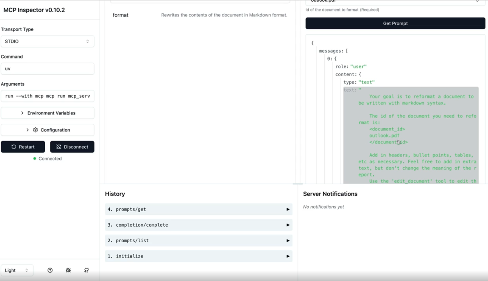

This lets you verify that your prompt interpolates variables correctly and produces the expected message structure before using it in a real application.

### 9.5 Best Practices

When creating prompts for your MCP server:

- Focus on tasks that are central to your server's purpose
- Write detailed, specific instructions rather than vague requests
- Test your prompts thoroughly with different inputs
- Include clear descriptions so users understand what each prompt does
- Consider how the prompt will work with your server's tools and resources

Remember that prompts are meant to provide value that users couldn't easily get on their own - they should represent your expertise in the domain your MCP server covers.

---

