# Anthropic Apps - Claude Code And Computer Use 
---

## Learning Objectives

By the end of this module, you will be able to:

- **Understand** Claude Code and Computer Use as powerful applications built by Anthropic
- **Set up and use** Claude Code in your development workflow
- **Leverage MCP servers** to extend Claude Code capabilities
- **Recognize patterns** that make these applications effective as AI agents
- **Apply effective workflows** when collaborating with Claude Code on projects
- **Integrate multiple MCP servers** to create a customized development environment
- **Use Claude Code** for test-driven development and code generation
- **Understand how** environmental interaction and tool integration power these applications

---

## 1. Anthropic Apps 

In this module, we'll explore two powerful applications built by Anthropic: Claude Code and Computer Use. These aren't just useful tools on their own - they're perfect examples of AI agents in action. By understanding how they work, you'll get a solid foundation for building your own agents later.

### 1.1 Our Plan

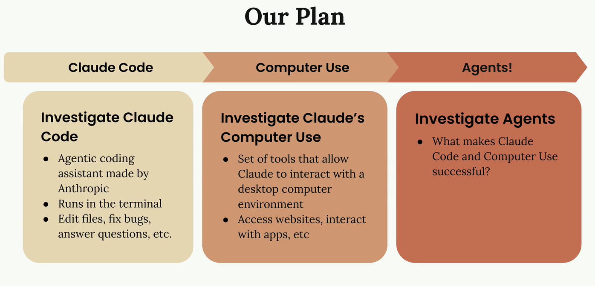

We'll follow a progression that builds your understanding step by step:

- Claude Code - Start with this agentic coding assistant that runs in your terminal
- Computer Use - Explore this set of tools that lets Claude interact with desktop applications
- Agents - Understand what makes these applications successful as agents

1. **Claude Code**
Claude Code is a terminal-based coding assistant that can help you with various programming tasks. Think of it as having Claude available right in your command line, ready to:

- Edit files and fix bugs
- Answer coding questions
- Help with development workflows

We'll walk through the complete setup process and then use Claude Code on a small sample project so you can see exactly how it operates in practice.

2. **Computer Use**
Computer Use takes Claude's capabilities much further. It's a collection of tools that allow Claude to interact with a full desktop computer environment. This means Claude can:

- Access websites and browse the internet
- Interact with desktop applications
- Perform tasks that require visual interface navigation

This dramatically expands what's possible compared to text-only interactions.

### 1.2 Why These Matter for Agents

Both Claude Code and Computer Use serve as excellent case studies for understanding agents. They demonstrate key principles that make agents effective:

- Tool integration and usage
- Multi-step task execution
- Environmental interaction
- Autonomous problem-solving

By examining these real-world implementations, you'll gain insights into what makes Claude Code and Computer Use successful, which will inform your own agent development work.

Let's start with the setup process for Claude Code in the next section.

---

## 2. Claude Code Setup

Claude Code is a terminal-based coding assistant that runs directly in your command line. Think of it as having Claude available right in your terminal to help with any coding task you're working on.

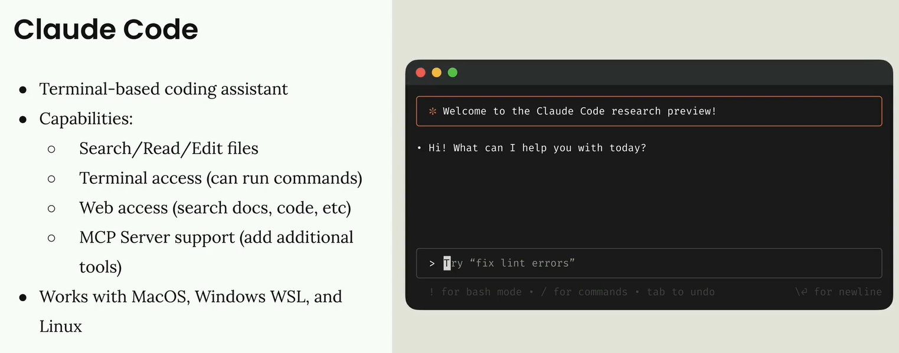

### 2.1 What Claude Code Can Do

Claude Code comes with a comprehensive set of tools to help with your development workflow:

- File operations - Search, read, and edit files in your project
- Terminal access - Run commands directly from the conversation
- Web access - Search documentation, fetch code examples, and more
- MCP Server support - Add additional tools by connecting MCP servers

The MCP integration is particularly powerful because it means you can extend Claude Code's capabilities by adding specialized tools for databases, APIs, or any other services you work with.

Claude Code works across MacOS, Windows WSL, and Linux, so you can use it regardless of your development environment.

### 2.2 Installation 

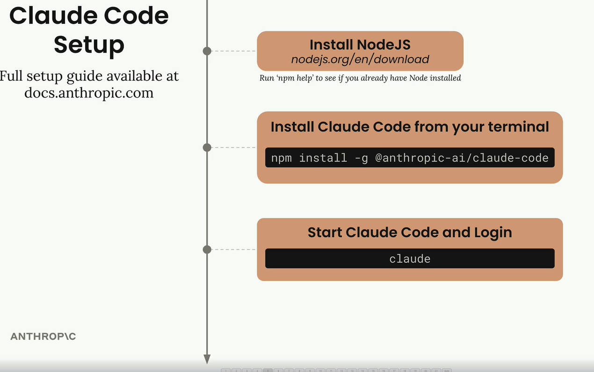

Getting Claude Code set up takes just three steps:

1. Install Node.js from nodejs.org/en/download (check if you already have it by running npm help in your terminal)
2. Install Claude Code with the command: npm install -g @anthropic-ai/claude-code
3. Start and login by running claude in your terminal

When you run the claude command for the first time, it will prompt you to log in to your Anthropic account. The full setup guide is available at docs.anthropic.com if you need more detailed instructions.

Once you're set up, you'll have Claude available directly in your terminal, ready to help with any coding project or task you're working on.

---

## 3. Claude Code In Action

Claude Code isn't just a tool for writing code - it's designed to work alongside you throughout every phase of a software project. Think of it as another engineer on your team who can handle everything from initial setup to deployment and support.

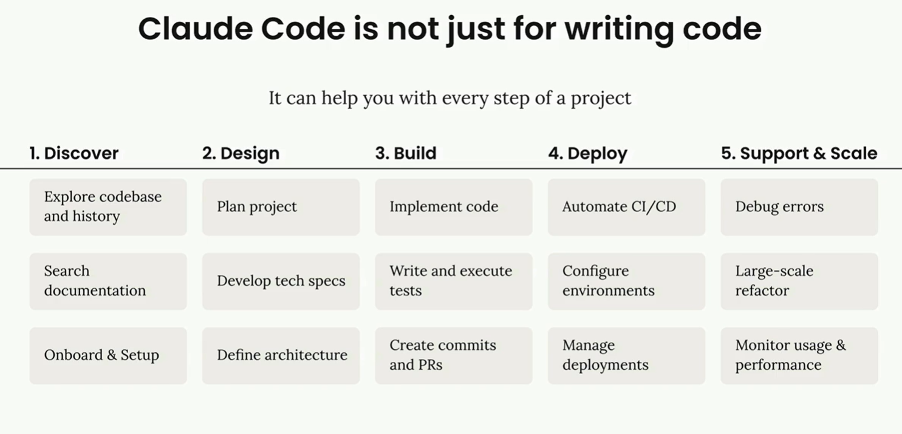

### 3.1 The /init Command

When you start working with Claude Code on a project, the first thing you'll want to do is run the /init command. This tells Claude to scan your entire codebase and understand your project's structure, dependencies, coding style, and architecture.

Claude summarizes everything it learns in a special file called CLAUDE.md. This file automatically gets included as context in all future conversations, so Claude remembers important details about your project.

You can have multiple CLAUDE.md files for different scopes:

- Project - Shared between all engineers working on the project
- Local - Your personal notes that aren't checked into git
- User - Used across all your projects

When running /init, you can add special directions for areas you want Claude to focus on. The generated file will include build commands, coding guidelines, and project-specific patterns that Claude should follow.

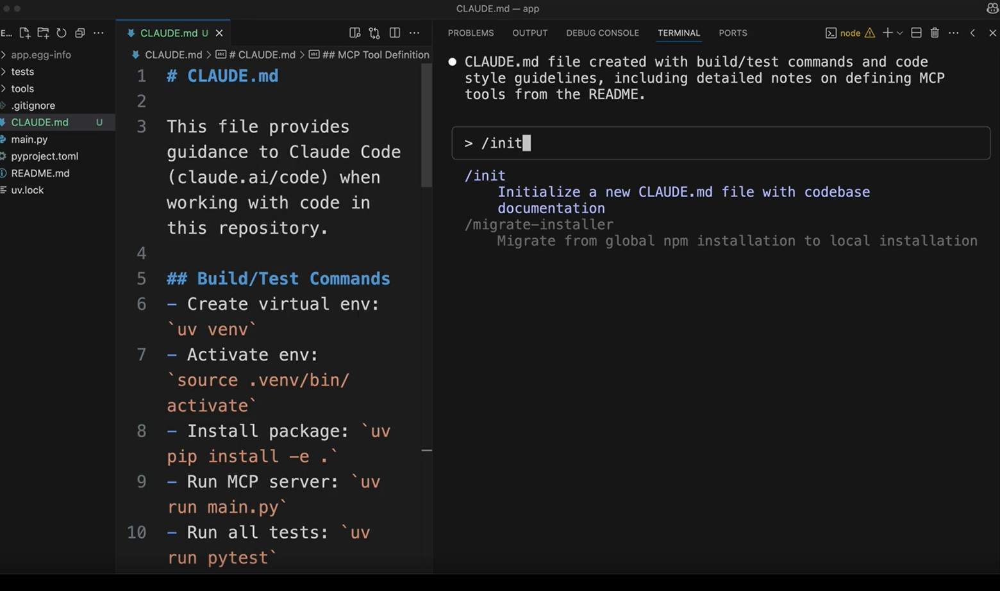

You can also quickly add notes to your CLAUDE.md file using the # command. For example, typing # Always use descriptive variable names will prompt you to add this guideline to your project, local, or user memory.

### 3.2 Common Workflows

Claude works best when you approach it as an effort multiplier. The more context and structure you provide, the better results you'll get. Here's the most effective workflow:

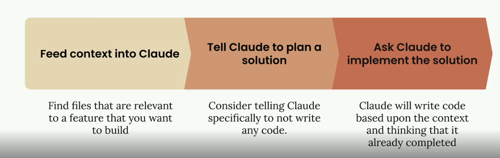

**Step 1: Feed Context into Claude**
Before asking Claude to build something, identify files in your codebase that are relevant to the feature you want to create. Ask Claude to read and analyze these files first. This gives Claude examples of your coding patterns and existing functionality it can build upon.

**Step 2: Tell Claude to Plan a Solution**
Instead of jumping straight to implementation, ask Claude to think through the problem and create a plan. Tell Claude specifically not to write any code yet - just focus on the approach and steps needed.

**Step 3: Ask Claude to Implement the Solution**
Once you have a solid plan, ask Claude to implement it. Claude will write code based on the context and planning work you've already done together.

### 3.3 Test-Driven Development Workflow

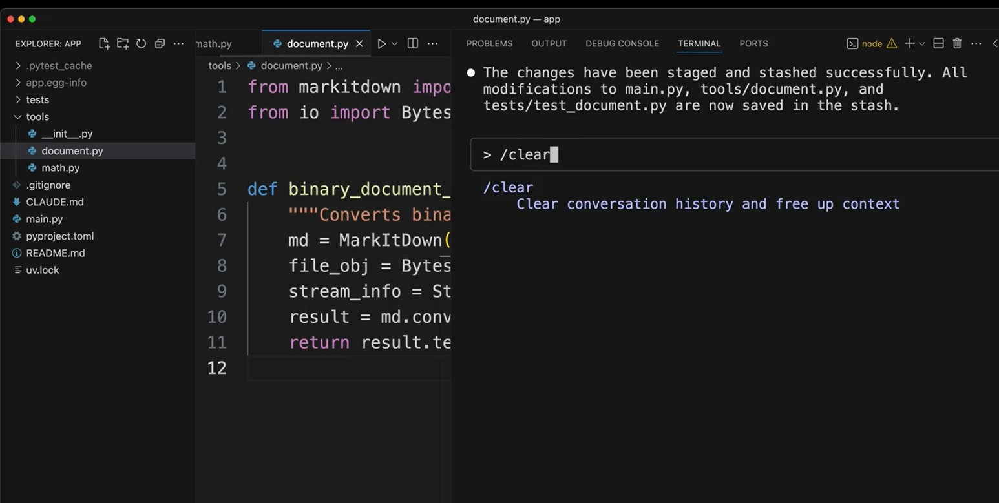

For even better results, you can use a test-driven approach:

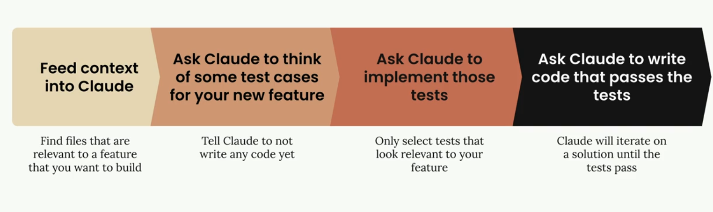

1. Feed context into Claude - Same as before, show Claude relevant files
2. Ask Claude to think of test cases - Have Claude brainstorm what tests would validate your new feature
3. Ask Claude to implement those tests - Select the most relevant tests and have Claude write them
4. Ask Claude to write code that passes the tests - Claude will iterate on the implementation until all tests pass

This approach often produces more robust code because Claude has clear success criteria to work toward.

### 3.4 Practical Example

Here's how these workflows look in practice. Let's say you want to add a document conversion tool to an existing project:

```
// First, ask Claude to read relevant files
> Read the math.py and document.py files

// Then ask for planning (not implementation)
> Plan to implement document_path_to_markdown tool:
1. Create a function that:
   - Takes a file path parameter
   - Validates the file exists  
   - Determines file type from extension
   - Reads binary data from file
   - Leverages existing binary_document_to_markdown function
   - Returns markdown string
2. Add appropriate documentation
3. Register the tool with MCP server
4. Add tests

// Finally, ask for implementation
> Implement the plan
```

Claude will then create the function, update the necessary files, write tests, and even run the test suite to verify everything works correctly.

### 3.5 Additional Commands

Claude Code includes several helpful commands:

- /clear - Clears conversation history and resets context
- /init - Scans codebase and creates CLAUDE.md documentation
- *# - Adds notes to your CLAUDE.md file*

Claude can also handle routine development tasks like staging and committing changes to git, running tests, and managing dependencies. Instead of switching between your editor and terminal, you can ask Claude to handle these tasks while you focus on the bigger picture.

The key to success with Claude Code is remembering that it's designed to be a collaborative partner, not just a code generator. The more context and structure you provide, the more effectively Claude can help you build and maintain your projects.

---

## 4. Enhancements with MCP servers

Claude Code has an MCP client built right into it, which means you can connect MCP servers to dramatically expand what Claude can do. This opens up some really powerful possibilities for customizing your development workflow.

### 4.1 How MCP Extends Claude

The Model Context Protocol allows Claude Code to connect to external services and tools through MCP servers. Instead of being limited to Claude's built-in capabilities, you can add custom functionality by connecting servers that provide specific tools, resources, or integrations.

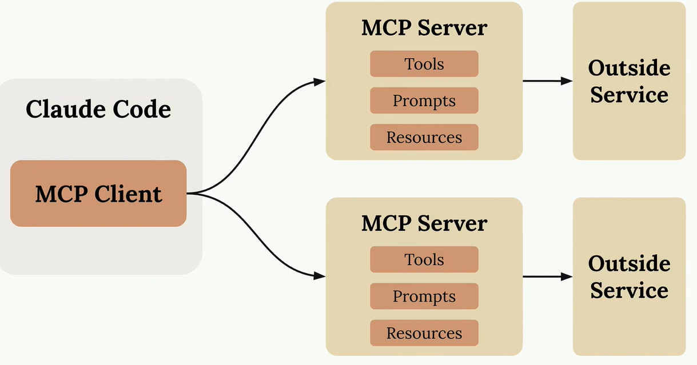

Each MCP server can expose different types of functionality to Claude through three main components: Tools (for taking actions), Prompts (for templates), and Resources (for accessing data).

### 4.2 Setting Up an MCP Server

Adding an MCP server to Claude Code is straightforward. You use the command line to register your server:
```
claude mcp add [server-name] [command-to-start-server]
```
For example, if you have a document processing server that starts with uv run main.py, you'd run:
```
claude mcp add documents uv run main.py
```
Once registered, Claude Code will automatically connect to your server when it starts up.

### 4.3 Example: Document Processing

A practical example is creating a tool that lets Claude read PDF and Word documents. By building an MCP server with a "document_path_to_markdown" tool, you can ask Claude to convert document contents to markdown format.

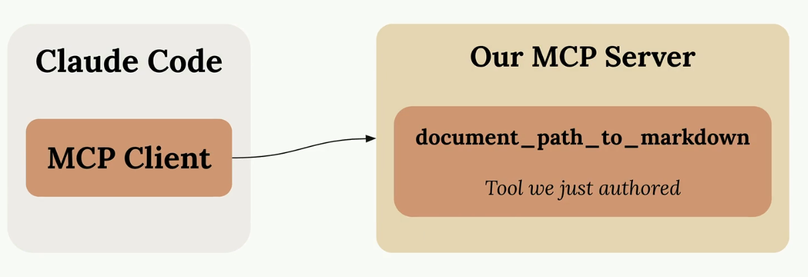

When you ask Claude to "Convert the tests/fixtures/mcp_docs.docx file to markdown", it will automatically use your custom tool to read the document and return the converted content.

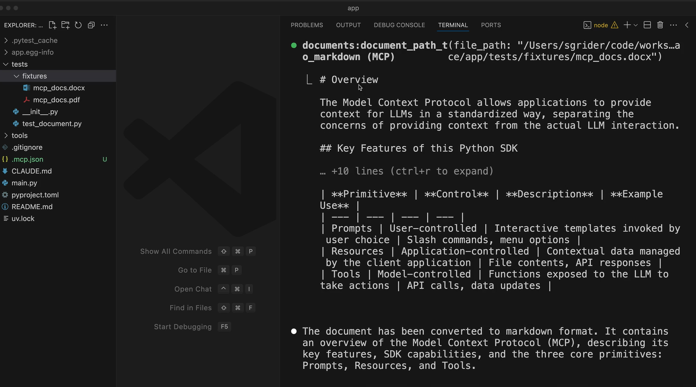

### 4.4 Popular MCP Integrations

The MCP ecosystem includes servers for many common development tools and services:

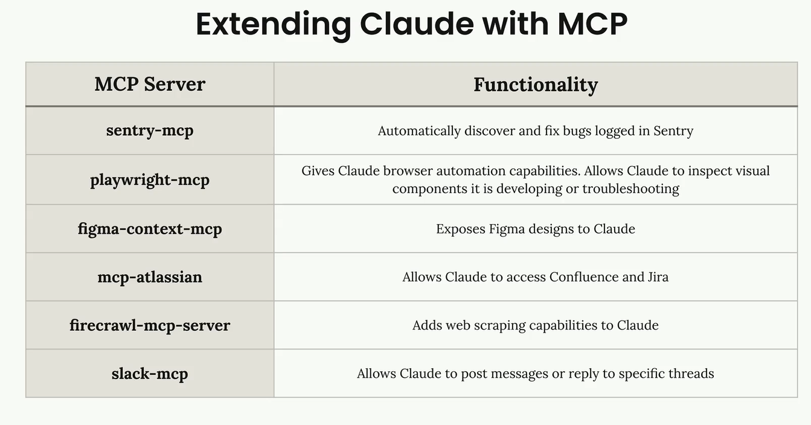

- sentry-mcp - Automatically discover and fix bugs logged in Sentry
- playwright-mcp - Gives Claude browser automation capabilities for testing and troubleshooting
- figma-context-mcp - Exposes Figma designs to Claude
- mcp-atlassian - Allows Claude to access Confluence and Jira
- firecrawl-mcp-server - Adds web scraping capabilities to Claude
- slack-mcp - Allows Claude to post messages or reply to specific threads

### 4.5 Building Your Development Workflow

The real power comes from combining multiple MCP servers that match your specific development process. You might set up:

- A Sentry server to fetch production error details
- A Jira server to read ticket requirements
- A Slack server to notify your team when work is complete
- Custom servers for your internal tools and APIs

This creates a development environment where Claude can seamlessly work with all the tools and services you already use, making it a much more powerful coding assistant tailored to your specific workflow.

---

