# Agents And Workflows 
---

## Learning Objectives

By the end of this guide, you will be able to:

- **Understand the difference** between workflows and agents, and when to use each approach
- **Identify and implement** workflow patterns including parallelization, chaining, and routing
- **Design effective agents** with appropriate tools and environmental inspection
- **Apply the Evaluator-Optimizer pattern** to iteratively improve AI-generated outputs
- **Recognize parallelization opportunities** to break down complex tasks into focused, parallel evaluations
- **Chain tasks sequentially** to handle complex prompts with multiple constraints more reliably
- **Route requests** to specialized processing pipelines based on input categorization
- **Implement environmental inspection** to ensure agents can observe and understand their actions
- **Make informed decisions** about whether workflows or agents are best suited for your use case

---

## 1. Agents And Workflows

Workflows and agents are strategies for handling user tasks that can't be completed by Claude in a single request. You've actually been creating both throughout this course - when you used tools and let Claude figure out how to complete tasks, that was an agent.

### 1.1 When to Use Workflows vs Agents

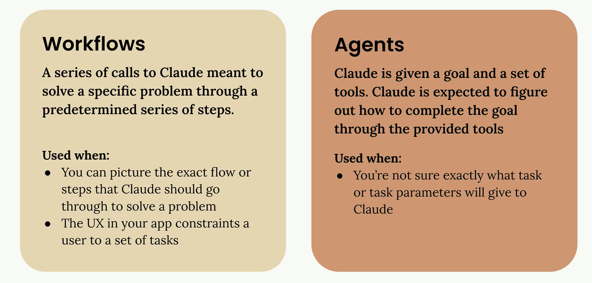

The decision comes down to how well you understand the task:

- Use workflows when you can picture the exact flow or steps that Claude should go through to solve a problem, or when your app's UX constrains users to a set of tasks
- Use agents when you're not sure exactly what task or task parameters you'll give to Claude

Workflows are a series of calls to Claude meant to solve a specific problem through a predetermined series of steps. Agents give Claude a goal and a set of tools, expecting Claude to figure out how to complete the goal through the provided tools.

### 1.2 Example: Image to CAD Workflow

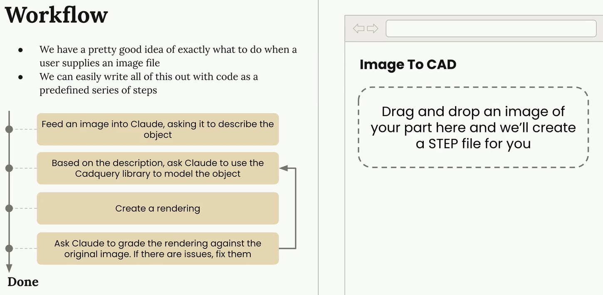

Let's look at a practical workflow example. Imagine building a web app where users drag and drop an image of a metal part, and you create a STEP file (an industry standard for 3D models) from it.

Since we have a pretty good idea of exactly what to do when a user supplies an image file, and we can easily write all of this out with code as a predefined series of steps, this makes a perfect workflow candidate.


Here's how the workflow breaks down:

1. Feed an image into Claude, asking it to describe the object
2. Based on the description, ask Claude to use the CadQuery library to model the object
3. Create a rendering
4. Ask Claude to grade the rendering against the original image. If there are issues, fix them

### 1.3 The Evaluator-Optimized Pattern

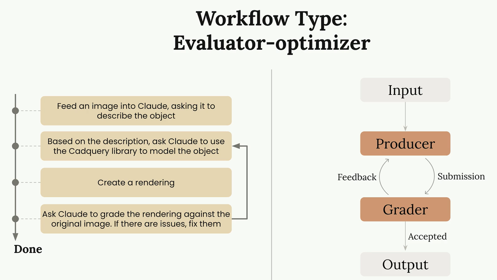

This modeling workflow is an example of an evaluator-optimizer pattern. Here's how it works:

- Producer: Takes input and creates output (Claude using CadQuery to model the part and create a rendering)
- Grader: Evaluates the output against some criteria
- Feedback loop: If the grader doesn't accept the output, feedback goes back to the producer for improvement
- Iteration: The cycle repeats until the grader accepts the output

### 1.4 Why Learn Workflow Patterns

The goal of identifying different workflows is to give you a set of repeatable recipes for implementing your own features. The Evaluator-Optimizer is one workflow pattern that has worked well for other engineers - consider using it in your own app!

Remember, identifying workflows doesn't inherently do anything for us - we still have to write the actual code to implement them. But these patterns have proven successful for many engineers, so they're worth understanding and applying to your own projects.

---

## 2. Parallelization Workflows

When building AI applications, you'll often encounter tasks that seem simple on the surface but become complex when you try to implement them effectively. Let's explore a powerful pattern called parallelization workflows that can help you break down complex tasks into manageable, focused pieces.

### 2.1 The Problem with Complex Single Prompts

Imagine you're building a material designer application where users upload images of parts and receive recommendations for the best material to use. Your first instinct might be to send the image to Claude with a simple prompt asking it to choose between metal, polymer, ceramic, composite, elastomer, or wood.

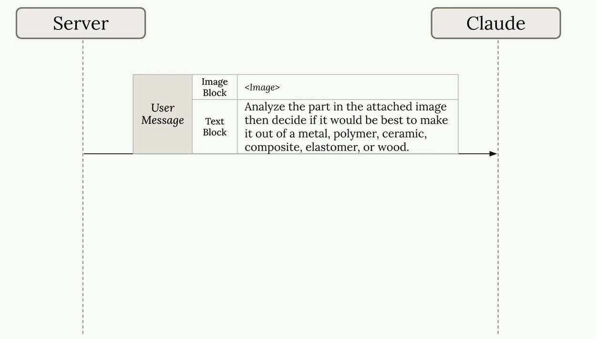

While this approach might work, you're asking Claude to do a lot of heavy lifting in a single request. Without specific criteria for each material type, the results won't be as reliable as they could be.

You might think to improve this by adding detailed criteria for each material into one massive prompt. But this creates a new problem - Claude has to juggle all these different considerations simultaneously, which can lead to confusion and suboptimal results.

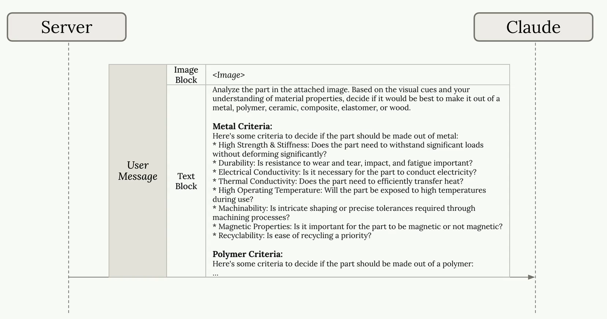

### 2.2 A Better Approach: Parallelization

Instead of cramming everything into one request, you can split the task into multiple parallel requests. Each request focuses on evaluating the part for a single material type with specialized criteria.

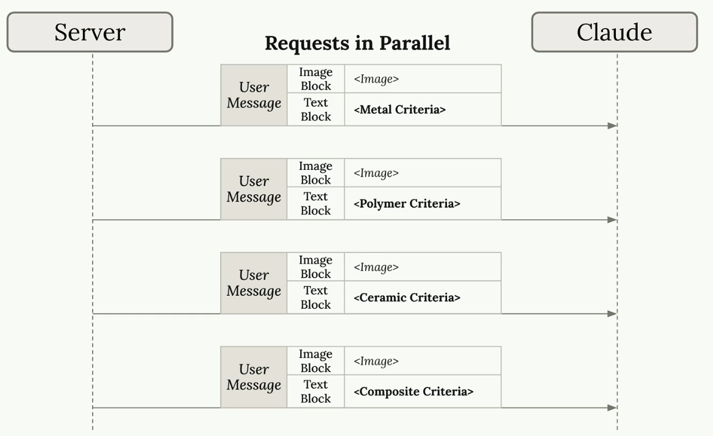

Here's how it works:

- Send the same image to Claude multiple times simultaneously
- Each request includes specialized criteria for one material (metal criteria, polymer criteria, ceramic criteria, etc.)
- Claude evaluates the part's suitability for each material independently
- Collect all the analysis results and feed them into a final aggregation step

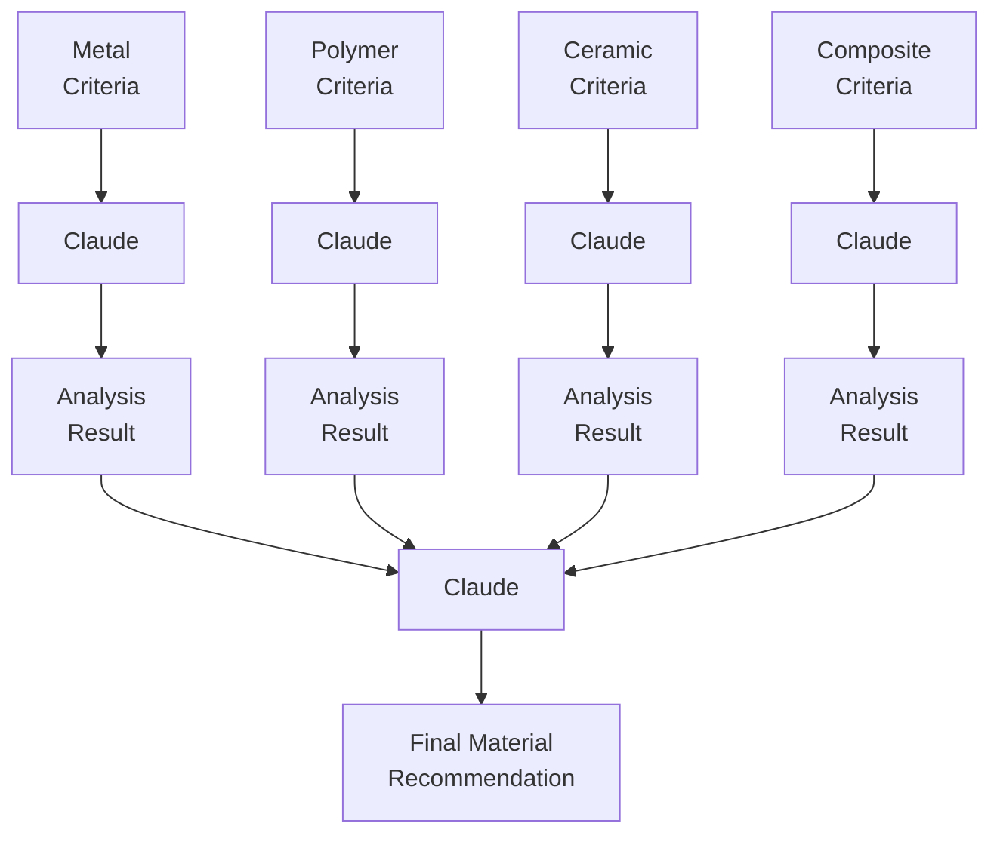
```mermaid
flowchart TD
    MetalCriteria["Metal<br/>Criteria"]
    PolymerCriteria["Polymer<br/>Criteria"]
    CeramicCriteria["Ceramic<br/>Criteria"]
    CompositeCriteria["Composite<br/>Criteria"]
    
    MetalClaude["Claude"]
    PolymerClaude["Claude"]
    CeramicClaude["Claude"]
    CompositeClaude["Claude"]
    
    MetalAnalysis["Analysis<br/>Result"]
    PolymerAnalysis["Analysis<br/>Result"]
    CeramicAnalysis["Analysis<br/>Result"]
    CompositeAnalysis["Analysis<br/>Result"]
    
    FinalClaude["Claude"]
    FinalRecommendation["Final Material<br/>Recommendation"]
    
    MetalCriteria --> MetalClaude --> MetalAnalysis
    PolymerCriteria --> PolymerClaude --> PolymerAnalysis
    CeramicCriteria --> CeramicClaude --> CeramicAnalysis
    CompositeCriteria --> CompositeClaude --> CompositeAnalysis
    
    MetalAnalysis --> FinalClaude
    PolymerAnalysis --> FinalClaude
    CeramicAnalysis --> FinalClaude
    CompositeAnalysis --> FinalClaude
    
    FinalClaude --> FinalRecommendation
```

The final step sends all the individual analysis results back to Claude with a request to compare them and make a final material recommendation.

### 2.3 How Parallelization Workflows Work

The parallelization pattern follows a simple structure:

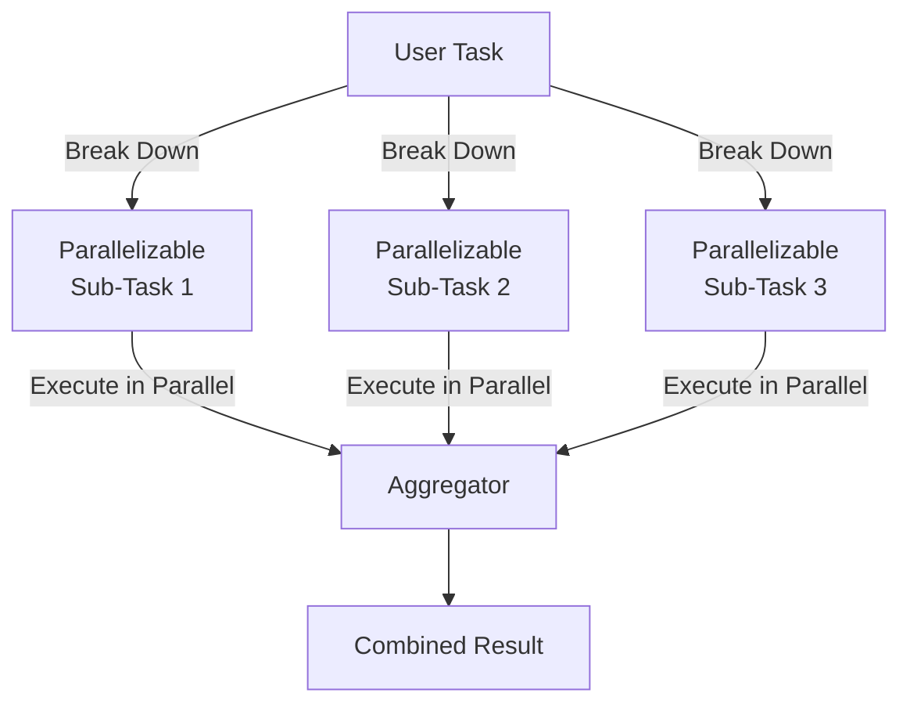
```mermaid
flowchart TD
    UserTask["User Task"]
    
    SubTask1["Parallelizable<br/>Sub-Task 1"]
    SubTask2["Parallelizable<br/>Sub-Task 2"]
    SubTask3["Parallelizable<br/>Sub-Task 3"]
    
    Aggregator["Aggregator"]
    
    FinalResult["Combined Result"]
    
    UserTask -->|Break Down| SubTask1
    UserTask -->|Break Down| SubTask2
    UserTask -->|Break Down| SubTask3
    
    SubTask1 -->|Execute in Parallel| Aggregator
    SubTask2 -->|Execute in Parallel| Aggregator
    SubTask3 -->|Execute in Parallel| Aggregator
    
    Aggregator --> FinalResult
```

- Split a single task into multiple sub-tasks - Break down the complex decision into focused, specialized evaluations
- Run the sub-tasks in parallel - Execute all evaluations simultaneously for faster processing
- Aggregate the results together - Combine the specialized analyses into a final decision
- The parallelized sub-tasks don't need to be identical - Each can have a specialized prompt, set of tools, or evaluation criteria

### 2.4 Benefits of This Approach

Parallelization workflows offer several key advantages:

1. Focused attention: Claude can concentrate on one specific aspect at a time rather than trying to balance multiple competing considerations simultaneously. This leads to more thorough and accurate analysis for each material type.

2. Easier optimization: You can improve and test the prompts for each material evaluation independently. If your metal analysis isn't working well, you can refine just that prompt without affecting the others.

3. Better scalability: Adding new materials to evaluate is straightforward - just add another parallel request. You don't need to rewrite existing prompts or worry about how the new criteria might interfere with existing ones.

4. Improved reliability: By breaking down the complex task, you reduce the cognitive load on the AI model and get more consistent, reliable results.

### 2.5 When to Use Parallelization

This pattern works well when you have a complex decision that can be broken down into independent evaluations. Look for situations where you're asking an AI to consider multiple criteria, compare several options, or make decisions that involve different domains of expertise.

The key is identifying tasks that can be meaningfully separated - each parallel sub-task should be able to operate independently and contribute a distinct piece of analysis to the final decision.

---

## 3. Chaining Workflows

Chaining workflows might seem obvious at first, but they're actually one of the most useful patterns you'll encounter when working with Claude. This approach becomes especially valuable when you're dealing with complex tasks or long prompts that Claude struggles to handle consistently.

### 3.1 What is Workflow Chaining?

### 3.1 What is Workflow Chaining?

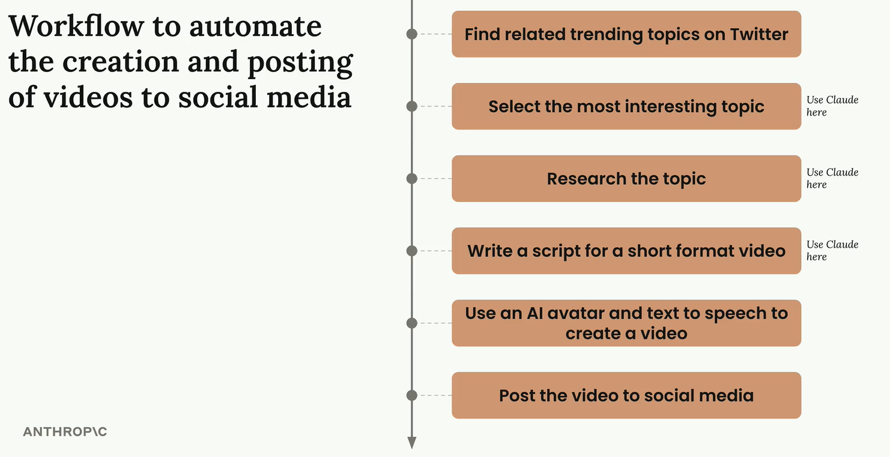

Here's a practical example: imagine you're building a social media marketing tool that creates and posts videos automatically. Rather than asking Claude to handle everything in one massive prompt, you could break it down like this:

- Find related trending topics on Twitter
- Select the most interesting topic (using Claude)
- Research the topic (using Claude)
- Write a script for a short format video (using Claude)
- Use an AI avatar and text-to-speech to create a video
- Post the video to social media

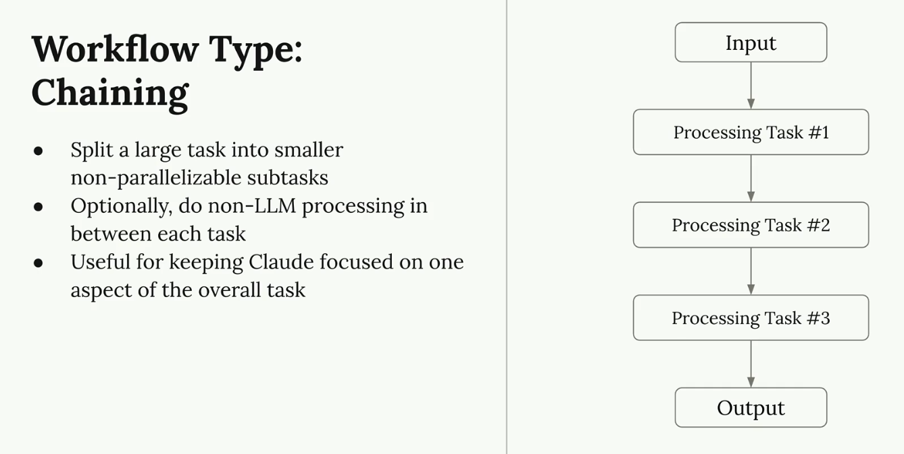

### 3.2 Why Chain Instead of One Big Prompt?

You might wonder why not just combine all the Claude tasks into a single prompt. The key benefit is focus - when you give Claude one specific task at a time, it can concentrate on doing that task well rather than juggling multiple requirements simultaneously.


### 3.3 The Long Prompt Problem

Here's where chaining becomes really valuable. You'll often encounter situations where you need Claude to write content with many specific constraints. Let's say you want Claude to write a technical article, and you specify that it should:

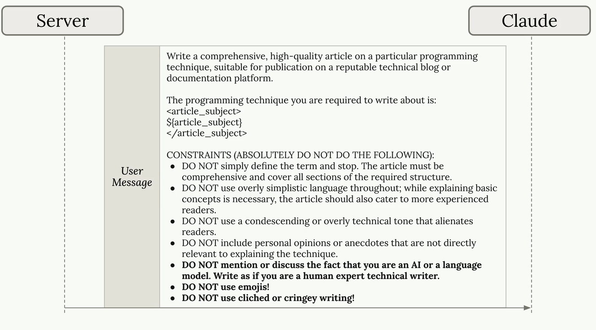

- Not mention that it's written by an AI
- Avoid using emojis
- Skip clichéd or overly casual language
- Write in a professional, technical tone

Even with all these constraints clearly stated, Claude might still produce content that violates some of your rules. You might get back an article that still uses emojis, mentions AI authorship, or sounds unprofessional

### 3.4 The Chaining Solution

Instead of fighting with one massive prompt, use a two-step chaining approach:

**Step 1:** Send your initial prompt and accept that the first result might not be perfect. Claude will generate an article, but it might violate some of your constraints.

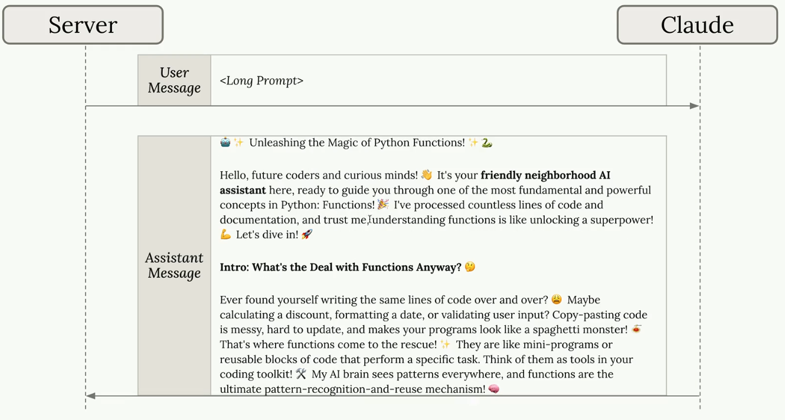

**Step 2:** Make a follow-up request that focuses specifically on fixing the issues. Provide the article Claude just wrote and give it targeted revision instructions:

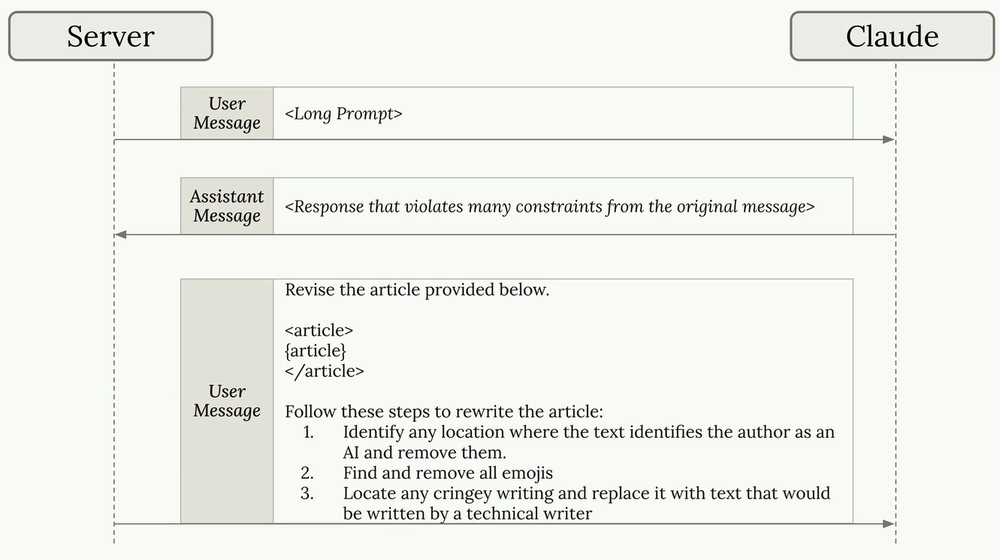

Revise the article provided below. Follow these steps to rewrite the article: 1. Identify any location where the text identifies the author as an AI and remove them 2. Find and remove all emojis 3. Locate any cringey writing and replace it with text that would be written by a technical writer
This approach works because Claude can focus entirely on the revision task rather than trying to balance content creation with constraint adherence.

### 3.5 When to Use Chaining

Chaining workflows are particularly useful when:

- You have complex tasks with multiple requirements
- Claude consistently ignores some constraints in long prompts
- You need to process or validate outputs between steps
- You want to keep each interaction focused and manageable

While chaining might seem like extra work, it often produces better results than trying to cram everything into a single prompt. The key is recognizing when a task is complex enough to benefit from being broken down into focused, sequential steps.

---

## 4. Routing Workflows 

Routing workflows solve a common problem in AI applications: different types of user requests need different handling approaches. Instead of using a one-size-fits-all prompt, you can categorize incoming requests and route them to specialized processing pipelines.

### 4.1 The Problem with Generic Prompts

Consider a social media marketing tool that generates video scripts from user topics. A user might enter "programming" or "surfing" as their topic, but these should produce very different types of content:

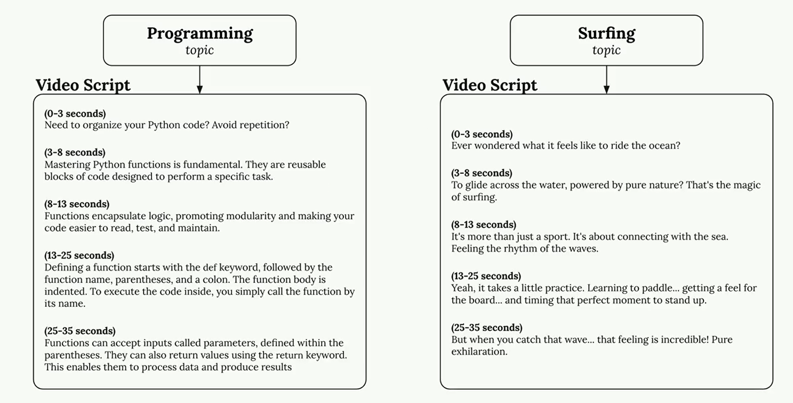

Programming topics call for educational content with clear explanations and definitions. Surfing topics work better with entertainment-focused scripts that emphasize excitement and visual appeal. A single generic prompt can't handle both effectively.

### 4.2 Setting Up Content Categories

The first step is defining the different types of content your application might need to generate. You might categorize requests into genres like:

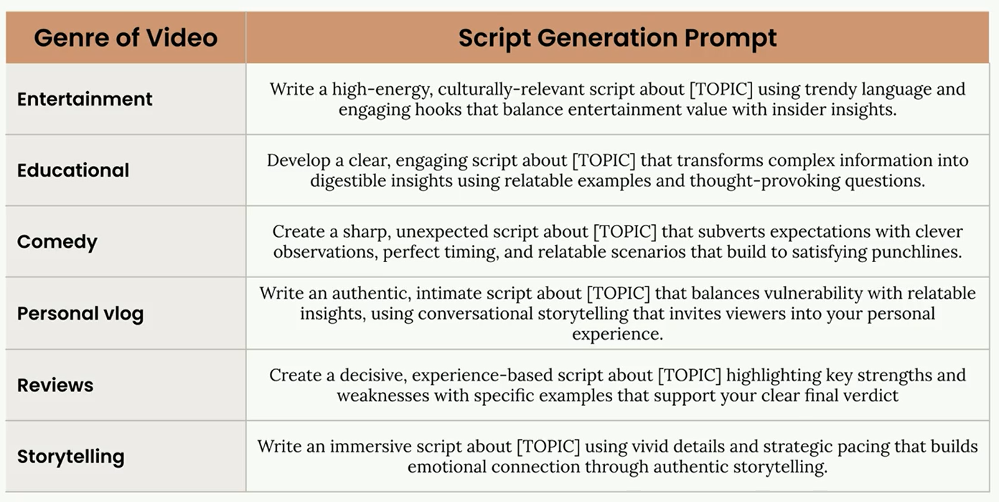

Each category gets its own specialized prompt template. For example, the educational prompt might ask Claude to "develop a clear, engaging script that transforms complex information into digestible insights using relatable examples and thought-provoking questions."

### 4.3 How Routing Works in Practice

The routing process happens in two steps:

Categorization - Send the user's topic to Claude with a request to categorize it into one of your predefined genres
Specialized Processing - Use the category result to select the appropriate prompt template and generate content

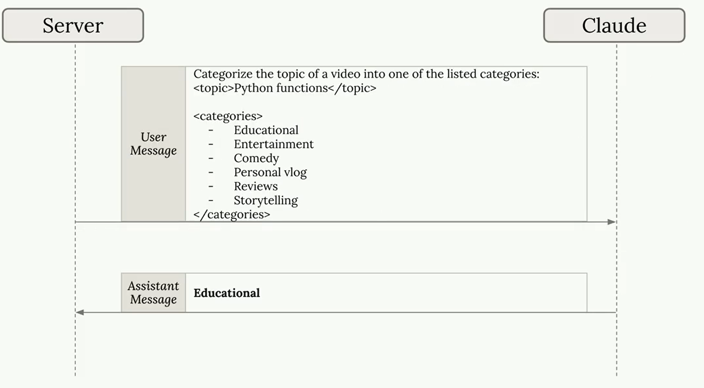

For example, if a user enters "Python functions" as their topic, you'd first ask Claude to categorize it:
```
Categorize the topic of a video into one of the listed categories:
<topic>Python functions</topic>

<categories>
- Educational
- Entertainment  
- Comedy
- Personal vlog
- Reviews
- Storytelling
</categories>
```

Claude responds with "Educational", so you then use the educational prompt template to generate the actual script content.

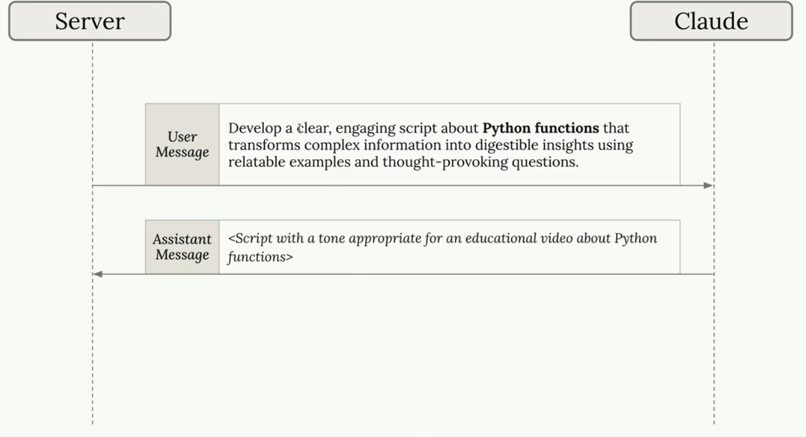

### 4.4 Routing Workflow Architecture

A routing workflow follows this pattern:

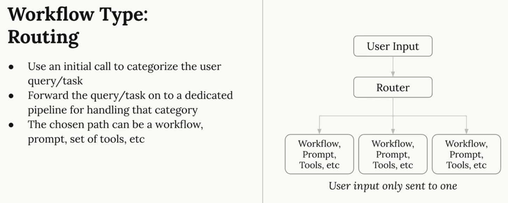

The key insight is that user input only goes to one specialized pipeline, not all of them. This allows each pipeline to be highly optimized for its specific use case.

### 4.5 When to Use Routing

Routing workflows work well when:

- Your application handles diverse types of requests that need different approaches
- You can clearly define categories that cover your use cases
- The categorization step can be handled reliably by Claude
- The performance benefit of specialized processing outweighs the overhead of the routing step

This pattern is especially valuable for customer service bots, content generation tools, and any application where the "right" response depends heavily on understanding the type of request being made.

---

## 5. Agents And Tools

Agents represent a shift from the structured workflows we've been working with. While workflows are perfect when you know the exact steps needed to complete a task, agents shine when you're not sure what those steps should be. Instead of defining a rigid sequence, you give Claude a goal and a set of tools, then let it figure out how to combine those tools to achieve the objective.

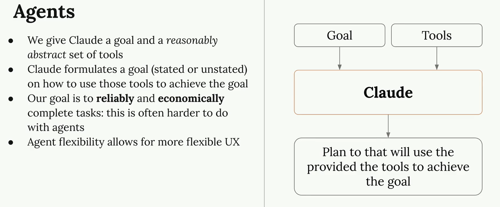

This flexibility makes agents attractive for building applications that need to handle varied, unpredictable tasks. You can create an agent once, ensure it works reasonably well, and then deploy it to solve a wide range of problems. However, this flexibility comes with trade-offs in reliability and cost that we'll explore later.

### 5.1 How Tools Make the Agent

The real power of agents lies in their ability to combine simple tools in unexpected ways. Consider a basic set of datetime tools:

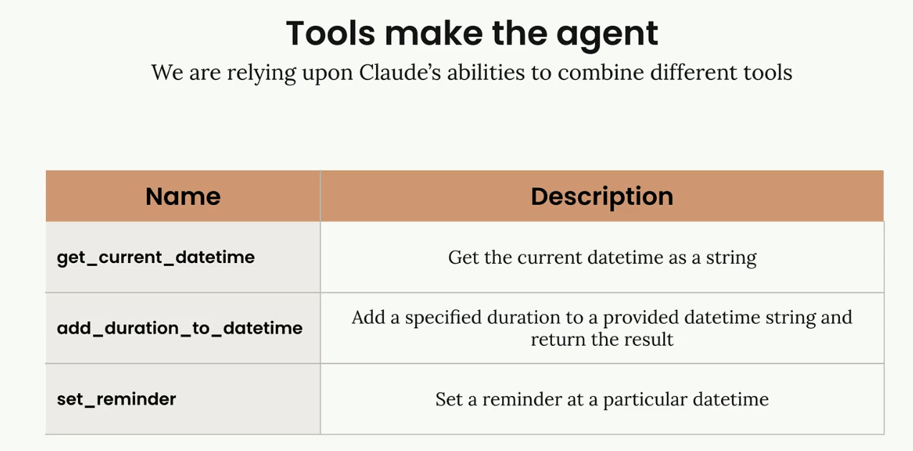

These tools seem simple individually, but Claude can chain them together to handle surprisingly complex requests:

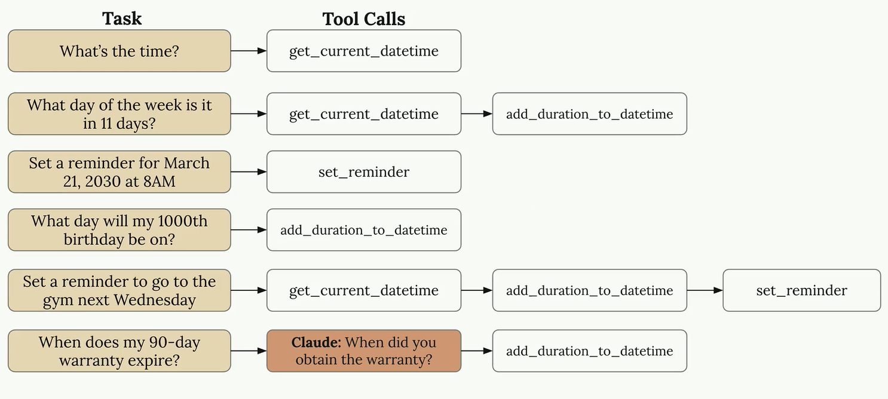

For "What's the time?", Claude simply calls get_current_datetime. But for "What day of the week is it in 11 days?", it chains get_current_datetime followed by add_duration_to_datetime. For setting a gym reminder next Wednesday, it might use all three tools in sequence.

Claude can even recognize when it needs more information. If you ask "When does my 90-day warranty expire?", it knows to ask when you purchased the item before calculating the expiration date.

### 5.2 Tools Should Be Abstract

The key insight for building effective agents is providing reasonably abstract tools rather than hyper-specialized ones. Claude Code demonstrates this principle perfectly.

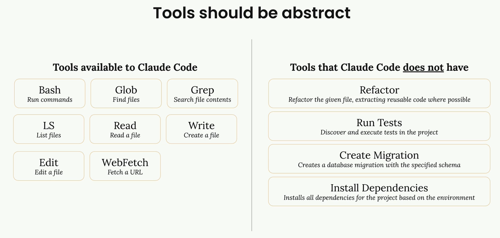

Claude Code has access to generic, flexible tools like:

- bash - Run any command
- read - Read any file
- write - Create any file
- edit - Modify files
- glob - Find files
- grep - Search file contents

It notably doesn't have specialized tools like "refactor code" or "install dependencies." Instead, Claude figures out how to use the basic tools to accomplish these complex tasks. This abstraction allows it to handle countless programming scenarios that the developers never explicitly planned for.

### 5.3 Best Practice: Combinable Tools

When designing agents, provide tools that Claude can combine in creative ways. For example, a social media video agent might include:

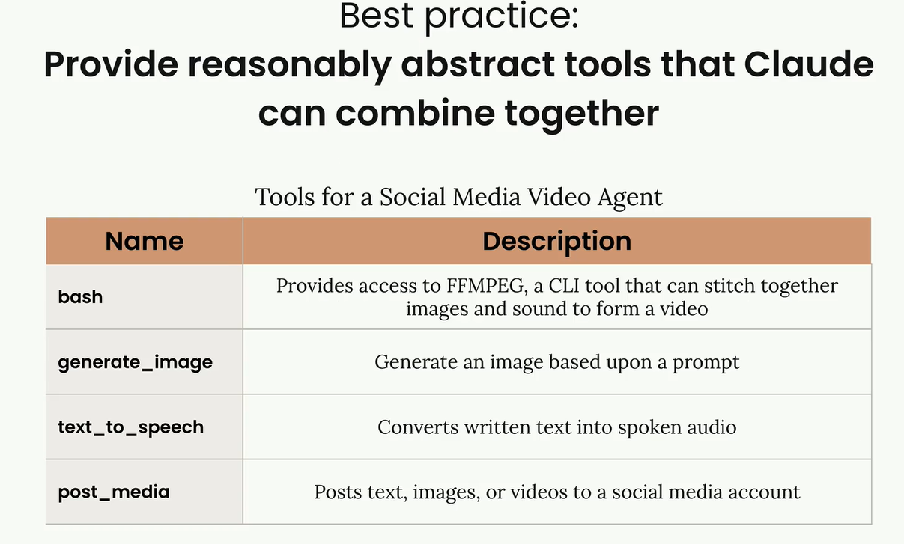

- bash - Access to FFMPEG for video processing
- generate_image - Create images from prompts
- text_to_speech - Convert text to audio
- post_media - Upload content to social platforms

This tool set enables both simple workflows (create and post a video) and more interactive experiences where the agent might generate a sample image first, get user approval, then proceed with video creation.

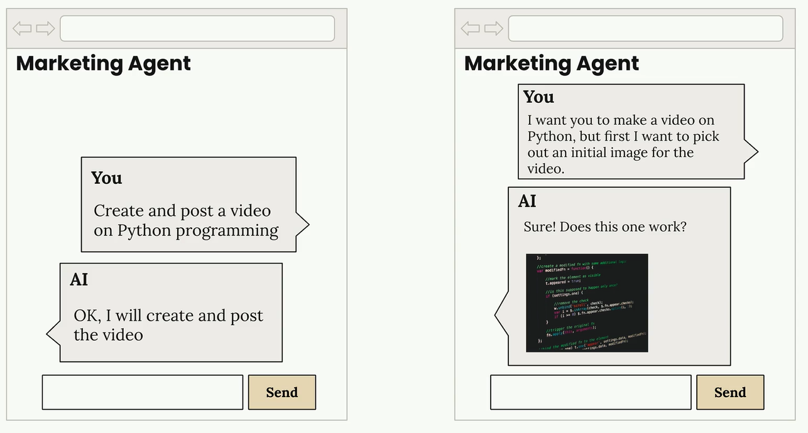

The agent can adapt its approach based on user feedback and preferences, something that would be difficult to achieve with a rigid workflow. This flexibility is what makes agents powerful for building dynamic, user-responsive applications.

---

## 6. Environmental Inspection

When building AI agents, one crucial concept often gets overlooked: environment inspection. Claude operates blindly - it needs to be able to observe and understand the results of its actions to work effectively.

### 6.1 Why Environment Inspection Matters

Think about how Claude works with computer use. Every time Claude performs an action like typing text or clicking a button, it immediately receives a screenshot to understand what happened. This isn't just a nice-to-have feature - it's essential.

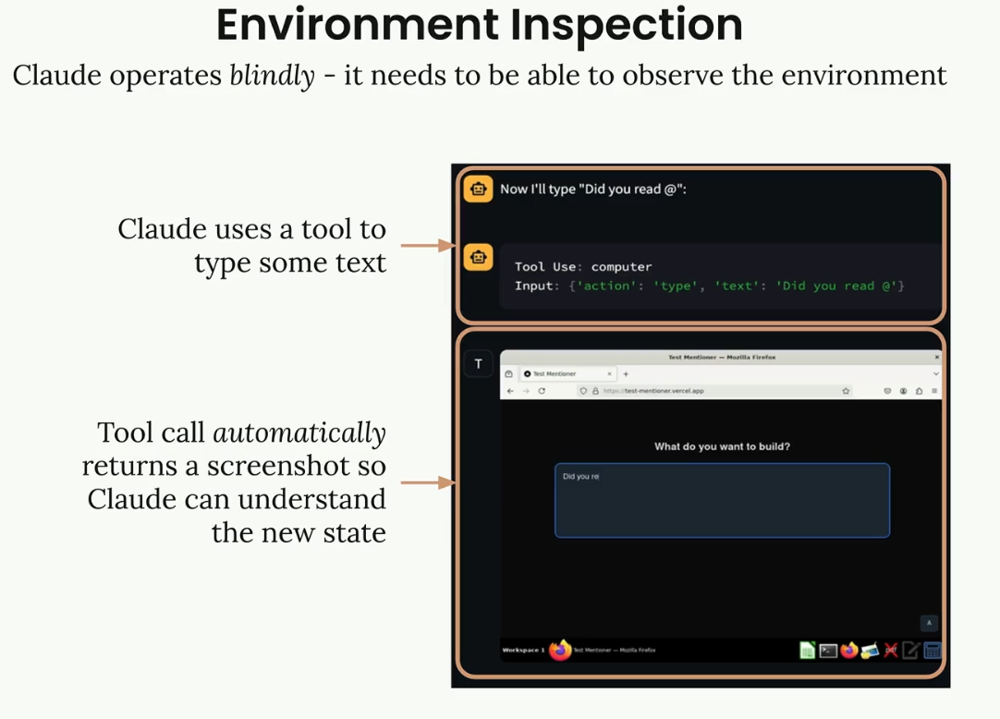

From Claude's perspective, clicking a button could navigate to a new page, open a menu, or trigger any number of changes. Without being able to see the results, Claude has no way to understand whether its action succeeded or what the new state of the environment looks like.

### 6.2 Reading Before Writing

This same principle applies to file operations. Before Claude can modify any file, it needs to understand the current contents. This might seem obvious, but it's a pattern you should always follow when building agents.

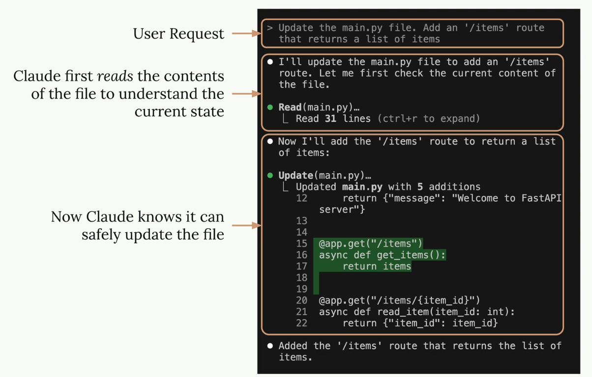

In the example above, when asked to add a new route to a Python file, Claude first reads the existing code to understand the current structure. Only then can it safely make the requested changes without breaking existing functionality.

### 6.3 System Prompts for Environment Inspection

You can guide Claude to inspect its environment through system prompts. For complex tasks like video generation, this becomes especially important.

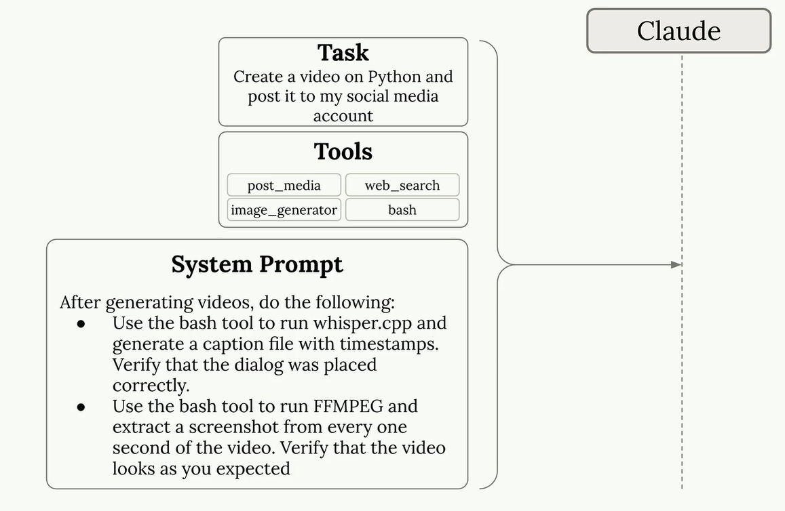

Consider a video creation agent that needs to:

- Generate video content using tools like FFmpeg
- Verify that audio dialogue is placed correctly
- Check that visual elements appear as expected

You might include system prompt instructions like:

- Use the bash tool to run whisper.cpp and generate caption files with timestamps to verify dialogue placement
- Use FFmpeg to extract screenshots from the video at regular intervals to visually inspect the output
- Compare the generated content against the original requirements

### 6.4 Benefits of Environment Inspection

When Claude can inspect its environment, several things improve:

- Better progress tracking - Claude can gauge how close it is to completing a task
- Error handling - Unexpected results can be detected and corrected
- Quality assurance - Output can be verified before considering a task complete
- Adaptive behavior - Claude can adjust its approach based on what it observes

### 6.5 Practical Implementation

When designing your own agents, always ask: "How will Claude know if this action worked?" Whether you're working with files, APIs, or user interfaces, provide tools and instructions that let Claude observe the results of its actions.

This might mean:

- Reading file contents before modifications
- Taking screenshots after UI interactions
- Checking API responses for expected data
- Validating generated content against requirements

Environment inspection transforms Claude from a blind executor of commands into an agent that can truly understand and adapt to its working environment.

---

## 7. Workflows v/s Agents 

When building AI-powered applications, you'll often need to choose between two different architectural approaches: workflows and agents. Each has distinct advantages and trade-offs that make them suitable for different scenarios.

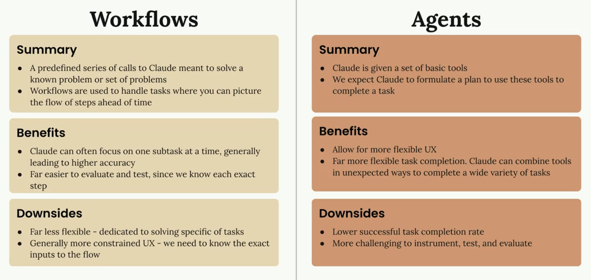

### 7.1 What Are Workflows?

Workflows are a predefined series of calls to Claude designed to solve a known problem or set of problems. You use workflows when you can picture the flow of steps ahead of time - essentially when you know the exact sequence needed to complete a task.

Think of workflows as breaking down a big task into much smaller, more specific subtasks. Each step focuses on a single area, which allows Claude to work more precisely.

### 7.2 What Are Agents?

With agents, Claude gets a set of basic tools and is expected to formulate a plan to use these tools to complete a task. Unlike workflows, you don't know exactly what tasks will be provided, so the system needs to be more adaptive.

Agents can creatively figure out how to handle a wide variety of challenges by combining tools in unexpected ways.

### 7.3 Benefits of Workflows

- Claude can focus on one subtask at a time, generally leading to higher accuracy
- Far easier to evaluate and test, since you know each exact step
- More predictable and reliable execution
- Better suited for solving specific, well-defined problems

### 7.4 Benefits of Agents

- Allow for more flexible user experience
- Far more flexible task completion - Claude can combine tools in unexpected ways to complete a wide variety of tasks
- Can handle novel situations that weren't anticipated during development
- Can ask users for additional input when needed

### 7.5 Downsides of Workflows

- Far less flexible - dedicated to solving specific types of tasks
- Generally more constrained user experience - you need to know the exact inputs to the flow
- Require more upfront planning and design work

### 7.6 Downsides of Agents

- Lower successful task completion rate compared to workflows
- More challenging to instrument, test, and evaluate since you often don't know - what series of steps an agent will execute
- Less predictable behavior

### 7.7 When to Use Each Approach

Your primary goal as an engineer is to solve problems reliably. Users probably don't care that you've built a fancy agent - they want a product that works consistently.

The general recommendation is to always focus on implementing workflows where possible, and only resort to agents when they are truly required. Workflows provide the reliability and predictability that most production applications need, while agents offer flexibility for scenarios where the exact requirements can't be predetermined.

Consider workflows when you have well-defined processes and agents when you need to handle unpredictable, varied user requests that require creative problem-solving.

